# Lab 1060: Day 2 Operations in an Enterprise Deployment of WebSphere Liberty on VMs


**Last updated:** March 2023

**Duration:** 60 minutes

Need support? Contact **Kevin Postreich, Yi Tang, Kevin Grigorenko**

## Introduction

Welcome to the lab on Day 2 Operations in an Enterprise Deployment of WebSphere Liberty on VMs. First, we’ll summarize WebSphere Liberty’s key day 2 operations capabilities, and then you’ll exercise some of these features in the lab.

## Key Day 2 Operations Capabilities

The phrase “Day 2 operations” refers to running, monitoring, and
investigating applications as compared to “Day 1” which is installation, configuration, and application deployment. If you’d like to learn more about a capability, follow the links in the items below.

**Features this lab will demonstrate:**

  - **Lab 1**: The [<span class="underline">monitor-1.0</span>
    feature](https://www.ibm.com/docs/en/was-liberty/nd?topic=environment-monitoring-monitor-10)
    gathers and exposes statistics about WebSphere Liberty such as
    thread pool utilization, response times, and more through
    [standardized Java
    MXBeans](https://docs.oracle.com/javase/8/docs/api/javax/management/MXBean.html).

    > Most commonly, this data is consumed through monitoring products such as  [Instana](https://www.ibm.com/docs/en/instana-observability/current?topic=technologies-monitoring-websphere-liberty);
however, a key differentiator to other application servers is that
 WebSphere Liberty also has basic visualization built-in [through the  Admin  Center](https://www.ibm.com/docs/en/was-liberty/nd?topic=center-monitoring-metrics-in-admin).

  - **Lab 2:** A key differentiator of WebSphere Liberty is its [slow   and hung request
    detection](https://www.ibm.com/docs/en/was-liberty/nd?topic=liberty-slow-hung-request-detection)
    available through the `requestTiming-1.0` feature.

    > You can specify a threshold for what the application stakeholders define as an excessively slow web request and Liberty watches requests and prints a stack trace and other details when a request exceeds such a threshold.

  - **Lab 3:** WebSphere Liberty has a rich set of logs which should be  monitored for warnings and errors. A key differentiator on top of this core logging is the [First Failure Data Capture](https://www.ibm.com/docs/en/was-liberty/nd?topic=liberty-generating-first-failure-data-capture-ffdc-records)
    (FFDC) capability that creates separate files with additional
    details when an exceptional or unhandled event occurs in the
    application or in the product itself.

  - **Lab 4:** WebSphere Liberty provides a
    [<span class="underline">`server dump`</span>
    feature](https://www.ibm.com/docs/en/was-liberty/core?topic=line-generating-liberty-server-dump-from-command)
    that may be executed during a problem to gather key state and logs and optional diagnostics such as thread dumps.

**OPTIONAL: If you finish early, the lab also has additional exercises:**

  - **Lab 5:** WebSphere Liberty has an optional [HTTP Access
    Log](https://www.ibm.com/docs/en/was-liberty/nd?topic=environment-http-access-logging)
    that prints a line in a standardized NCSA format for each HTTP
    request including the URL, response code and size, how long until
    Liberty sent back the first byte, how long to send the whole
    response, the remote client port, and more.

  - **Lab 6:** WebSphere Liberty has the option of integrating with a
    centralized logging solution either through a [JSON log output
    format](https://www.ibm.com/docs/en/was-liberty/nd?topic=liberty-logging-trace)
    (e.g. [to Elastic
    Stack](https://www.ibm.com/docs/en/was-liberty/nd?topic=environment-analyzing-logs-elastic-stack)
    and similar solutions) or a [Logstash
    connector](https://www.ibm.com/docs/en/was-liberty/nd?topic=collector-using-logstash-version-10).

## Accessing the environment

If you are doing this lab as part of an instructor led workshop (virtual or face to face), an environment has already been provisioned for you.
The instructor will provide the details for accessing the lab
environment.

Otherwise, you will need to reserve an environment for the lab. You can obtain one here. Follow the on-screen instructions for the “**Reserve now**” option.

KLP: TBD LINK TO ENV RESERVATION

The lab environment contains two (2) Linux VMs.


A Published Service is configured to provide access to the **server0**
VM through the noVNC interface for the lab environment.

1.  Access the lab environment from your web browser.

    a. When the environment is provisioned, right-mouse click on the
 **Published Service** link/ Then select “**Open link in New Tab**”
 from the context menu.
 
    
 
    b. Click on the **"vnc.html"** link to open the lab environment
 through the **noVNC** interface.
 
    
 
    c. Click the **Connect** button
 
    
 
    d. Enter the password as: **passw0rd**. Then click the **Send
 Credentials** button to access the lab environment.
 
    **Note:** That is a numeric zero in passw0rd
 
    

2.  Login to the **server0** VM using the credentials below:
    
      - User ID: **techzone**
    
      - Password: **IBMDem0s\!**

### Tips for working in the lab environment

1.  You can use your Browsers **zoom in** and **zoom out** options to  resize the virtual desktop to fit your screen.

    The examples below are using Firefox and Chrome browsers.

    - Firefox example:

    

    - Chrome example:

    

2.  You can copy / paste text from the lab guide into the lab
    environment using the clipboard in the noVNC viewer.

    a. Copy the text from the lab guide that you want to paste into the lab environment
 
    b. Click the **Clipboard** icon and **paste** the text into the noVNC  clipboard
 
    
 
    c. Paste the text into the VM, such as to a terminal window, browser  window, etc.
 
    d. Click on the **clipboard** icon again to close the clipboard
 
    **NOTE:** Sometimes pasting into a Terminal window in the VM does not  work consistently. In this case you might try again or paste the text  into a **Text Editor** in the VM, and then paste it into the Terminal  window in the VM.

3.  An alternative to using the noVNC Copy / Paste option, you may
    consider opening the lab guide in a web browser inside of the VM.
    Using this method, you can easily copy / paste text from the lab
    guide without having to use the noVNC clipboard.

## Clone the GitHub repo for this workshop

This lab requires artifacts that are stored in a GitHub repository. Run the command below to clone the repository to the local VM used for the lab.

1.  Clone the GitHub repo that contains lab artifacts needed for the lab  if you have not already done so in a previous lab in this series.

    a.  Open a new terminal window on the “**server0.gym.lan**” VM

    

    b.  Clone the GitHub repository required for the lab

        git clone https://github.com/IBMTechSales/liberty_admin_pot.git

    c.  Navigate to the lab-scripts directory in the cloned repo

        cd ~/liberty_admin_pot/lab-scripts

    d.  Add the “execute” permissions to the lab-scripts directories and
    shell scripts

        chmod -R 755 ./ |

## Ensure the Liberty Collective is deployed

This lab requires a Liberty Collective, and the application servers
which host the applications used in the lab to be members of the Liberty collective. **The learning module for creating the Liberty collective is “Lab\_1020”**.

In this section you will ensure that a Liberty administrative collective is available, and the application servers are deployed to the collective.

<table>
<tbody>
<tr class="odd">
<td></td>
<td><p><strong>IMPORTANT: Please read!</strong></p>
<p>If you have completed the <strong>Lab 1020</strong> or <strong>Lab 1030</strong> of this series, you have already created the Liberty collective and deployed the application servers to the collective.</p>
<p>In other words, you can skip <strong>this section</strong> of the lab and continue with <strong>Lab 1</strong> below if you have already completed Lab 1020 or Lab 1030 in this series.</p>
<p>The Admin Center ULR is: <a href="https://server0.gym.lan:9491/adminCenter">https://server0.gym.lan:9491/adminCenter</a></p>
<p>The Admin Center credentials are: <strong>admin</strong> / <strong>admin</strong></p></td>
</tr>
</tbody>
</table>

### If you have not completed lab 1020 or lab 1030, the following steps provide a “Fast path” to creating the Liberty collective required for this lab, “lab 1060”. 

1.  Run the command below to ensure a Liberty collective is created:

        /home/techzone/liberty_admin_pot/lab-scripts/deployCollective.sh

    The **deployCollectve.sh** script will do the following:

    - If the Controller already exists, the script will ABORT, as a
    collective already exists

    - If the Controller does NOT exist, it will be created

    - Build and produce a Liberty Server package to deploy to Liberty application servers

    - Create two Liberty Servers, “appServer1” and “appServer2”, deploy  the server package, and join the servers to the Liberty Collective

    - Configure Dynamic Routing in the Collective Controller


2.  Once the script completes, access the Admin Center. Enter the login  credentials as: **admin** / **admin**

        https://server0.gym.lan:9491/adminCenter

    **Note:** If you see the “Warning: Potential Security Risk Ahead”,  click **Advanced..-\>Accept Risk and Continue** to continue.
 
    The Liberty collective Admin Center page is displayed.
 
    

3.  Click the **Explore** icon

    
 
    The collective resource list is displayed, and you can see that you  have three servers.
 
    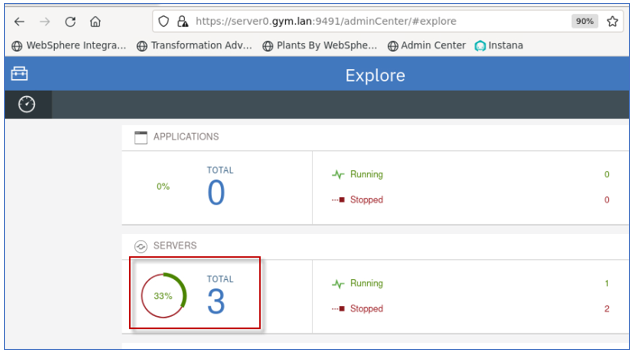

4.  Click the **Servers** list to see the three servers, appServer1,
    appServer2, and CollectiveController

    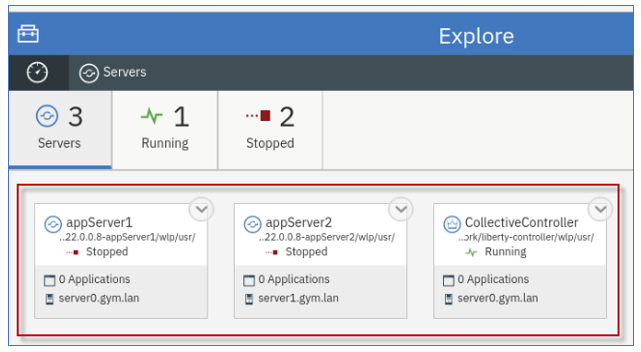

    **AVOID TROUBLE\!**

    If you ran the “**deployCollectve.sh**” command, and it ended with the following information, as illustrated in the screen shot below, it means that the script detected the Collective Controller has already been created. Therefore, the scripts existed and displayed the URL to the Admin Center.

    Go to the **Admin Center URL** and verify that the collective contains the two collective members, “appServer1” and “appServer2” as illustrated above.

    **Troubleshooting\!**

    If the Admin Center app cannot run, or the two application servers are not part of the collective, then manual cleanup of the collective is required, and you should contact the lab instructor.

    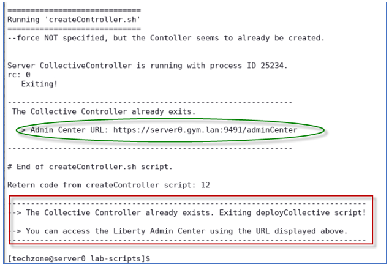

5.	Ensure the application database is started

        docker start db2_demo_data

6.  **Start** the Liberty servers “**appServer1**” and a**ppServer2**” if they are not already running

    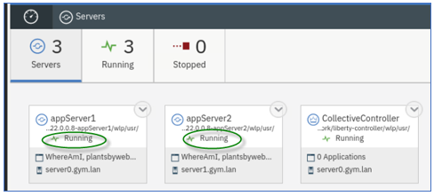

## Lab 1: Enable and visualize monitoring data

This lab demonstrates how to enable the
[`monitor-1.0` feature](https://www.ibm.com/docs/en/was-liberty/nd?topic=environment-monitoring-monitor-10) andvisualize it through the Admin Center. Note that enabling
monitor-1.0 may have an overhead of up to a few percent although this
may be minimized by [filtering to specific statistics, if
needed](https://www.ibm.com/docs/en/was-liberty/nd?topic=10-multiple-components-monitoring).

This lab contains the following activities:

1.  Configure the `monitor-1.0` feature in WebSphere Liberty

2.  Visualize monitored statistics in the Admin Center

3.  Summary

### Part 1: Configure the monitor-1.0 feature in WebSphere Liberty

For monitoring statistics to be produced, the Liberty `monitor-1.0`
feature is required in a Liberty server’s configuration. This feature enables the collection of monitoring statistics which can then be consumed by clients such as the Admin Center.

You will add this feature to the Liberty servers using an automation
script that adds the configuration for the monitor-1.0 feature via a
Liberty server override XML file named monitor.xml and punches a hole in the firewall for appServer2’s HTTPS port so that the Admin Center can poll the statistics data.

1.  Run the following command to copy the `monitor.xml` to `appServer1`:

        /home/techzone/liberty_admin_pot/lab-scripts/applyOverrides.sh -n appServer1 -v 22.0.0.8 -h server0.gym.lan MONITOR

2.  Run the following command to copy the `monitor.xml` to `appServer2`:

        /home/techzone/liberty_admin_pot/lab-scripts/applyOverrides.sh -n appServer2 -v 22.0.0.8 -h server1.gym.lan MONITOR

The Liberty monitor feature is now configured for `appServer1` and
`appServer2`.

### Part 2: Visualize monitored statistics in the Admin Center

1.  Login to the **Admin Center** using credentials: **`admin`** /
    **`admin`**.

    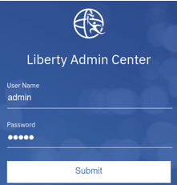

2.  Click the `Explore` icon to display the servers, applications, and hosts in the Collective.

    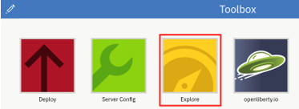

3.  Click the `Total` box in the `Servers` row.

    

4.  Click on the `appServer1` header.

    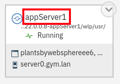

5.  Click on the `Monitor` button.

    

6. Exercise appServer1 a little bit by going to
    <https://server0.gym.lan:9441/PlantsByWebSphere/> and clicking 5
    pages or more.

    **Note:** DO NOT click on the `Accessories` tab or its products yet as that will be featured in the next lab.

7.  The `Monitor` page shows the default statistics for the entire
    application server:

    

8.  The [default statistics](https://www.ibm.com/docs/en/was-liberty/nd?topic=center-monitoring-metrics-in-admin) are:
    
      - **Used Heap Memory**: Java heap usage. Note that most modern
        garbage collectors are generational meaning that trash tends to
        accumulate in old regions and is cleaned up less often thus
        leading to a common sawtooth pattern. In some cases, the rise on
        such a tooth might look like a leak, but may not be.
    
      - **Loaded Classes:** The total number of loaded and unloaded
        classes.
    
      - **Active JVM Threads:** The number of live, total, and peak
        threads. Note that this shows all threads, not just the Default
        Executor threads.
    
      - **CPU Usage:** Average CPU utilization for the process.

9.  Click the “**pencil button”** in the top right to edit the displayed statistics:

    

10. Click the **`+`** buttons to the right of `Thread Pool`, `Connection Pool`, and `Sessions`

    Note that it's expected that the `+` button won't turn into a checkbox when you click on Connection Pool and Sessions; these will become checked after one of the subsequent steps below.

    

11. **Close** the metrics side bar:

    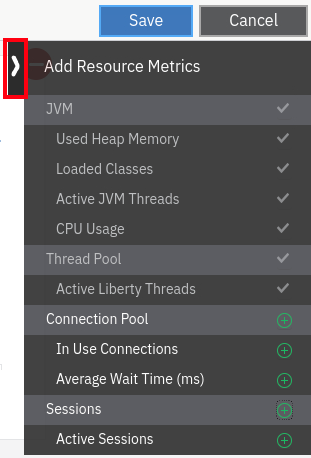

12. Scroll down to the new statistics boxes and select the data sources to monitor

    a. For the `In Use Connections` and `Average Wait Time (ms)` boxes, use the `Select data sources...` dropdown to select
    `jdbc/PlantsByWebSphereDataSource`.

    > **Note** that if you want to view multiple data sources, it’s
 generally better to create multiple boxes and choose one data source  per box instead of checking the All box as it’s harder to interpret aggregated statistics.

    

13. Scroll down to the `Active Sessions` box and use the `Select
    sessions...` dropdown to select `default_host/PlantsByWebSphere`.

    > **Note:** As above, if you want to view sessions for multiple
  applications, it’s generally better to create separate boxes.
 
     

14. Click the `Save` button at the top right to make the box selections  permanent:

    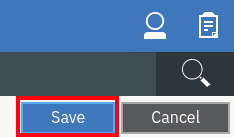

15. This completes the section on **server-level statistics**.

    The available statistics are limited but generally these statistics are the most important for 80% or more of monitoring situations. For more detailed monitoring, use monitoring products such as [Instana](https://www.ibm.com/docs/en/instana-observability/current?topic=technologies-monitoring-websphere-liberty).
 

    Next, you will view **application-level statistics**.

16. Click on `Applications` on the left side:

    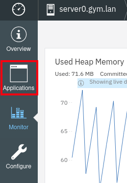

17. Click on the `plantsbywebsphere` box title:

    

18. Click on the `Monitor` button on the left:

    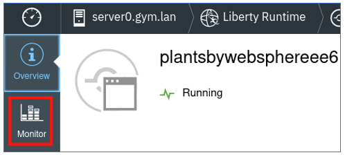

19. By default, there are boxes for `Request Count` which is the total number of HTTP requests, and `Average Response Time (ns)` which is the average response time in nanoseconds.

 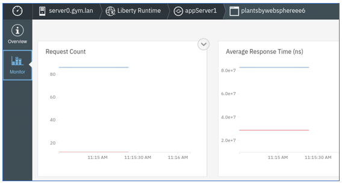
 
 As with server-level statistics, available **application-level
 statistics** in the Admin Center are limited but generally these
 statistics are the most important for 80% or more of monitoring
 situations.
 
 For more detailed monitoring, use monitoring products such as
 [Instana](https://www.ibm.com/docs/en/instana-observability/current?topic=technologies-monitoring-websphere-liberty).


### Summary

This lab demonstrated how to enable the monitor-1.0 feature in
application servers in a collective and monitor core statistics about the application server JVMs and their applications through the Admin Center.

The built-in visualization capabilities of the Admin Center are very
basic by design; for more advanced monitoring, products such as
[Instana](https://www.ibm.com/docs/en/instana-observability/current?topic=technologies-monitoring-websphere-liberty)
are generally recommended.


## Lab 2: Slow and hung request detection

This lab demonstrates how to enable and use the [slow and hung request detection](https://www.ibm.com/docs/en/was-liberty/nd?topic=liberty-slow-hung-request-detection)
feature.

Note that enabling requestTiming-1.0 may have a large overhead in high volume environments and ideally its overhead should be measured in a test environment before applying to production; if the overhead is too high, test with request sampling through the
[<span class="underline">`sampleRate`</span>
attribute](https://www.ibm.com/docs/en/was-liberty/nd?topic=configuration-requesttiming).

This lab contains the following activities:

1.  Configure the `requestTiming-1.0` feature in WebSphere Liberty

2.  Exercise a long web request and review the captured diagnostics

3.  Summary

### Part 1: Configure the `requestTiming-1.0` feature in WebSphere Liberty

To detect slow and hung requests, the Liberty `requestTiming-1.0` feature is required in a Liberty server’s configuration. In addition to enabling the feature, the feature must be configured with a [<span class="underline">`requestTiming`</span>](https://www.ibm.com/docs/en/was-liberty/nd?topic=configuration-requesttiming)
element that specifies the thresholds and other configuration. This lab will be using the following:


The key configuration is the `slowRequestThreshold` which specifies the time after which a request is considered to be “slow” and diagnostics are printed to Liberty logs.

In general, this value must be decided with application stakeholders
based on service level agreements.

Note that if a high volume of requests starts to exceed this threshold, there will be some overhead of printing diagnostics to the logs, in which case you can consider increasing the threshold or the `sampleRate`.

The difference between the slow and hung thresholds is that if the hung threshold is exceeded, then Liberty will gather 3 thread dumps, one minute apart for more in-depth diagnostics. This will not be demonstrated in this lab, but it is generally advised to configure this threshold.

You will add this feature to the Liberty servers using an automation
script that adds the configuration via a Liberty server override XML
file named `requestTiming.xml`.

1.  Run the following command to copy the `requestTiming.xml` to
    `appServer1`:

        /home/techzone/liberty_admin_pot/lab-scripts/applyOverrides.sh -n appServer1 -v 22.0.0.8 -h server0.gym.lan TIMING

2.  Run the following command to copy the `requestTiming.xml` to
    `appServer2`:

        /home/techzone/liberty_admin_pot/lab-scripts/applyOverrides.sh -n appServer2 -v 22.0.0.8 -h server1.gym.lan TIMING

The Liberty `requestTiming` feature is now configured for `appServer1` and `appServer2`.


### Part 2: Exercise a long web request and review the captured diagnostics

We have built-in a simulated delay of “**5 seconds”** into the
PlantsByWebSphere application when clicking any product in the
“**Accessories**” category. You will exercise this delay and then
review the diagnostics produced by `requestTiming`.

1.  Go to the PlantsByWebSphere application on appServer1 in your
    browser: <https://server0.gym.lan:9441/PlantsByWebSphere/>

2.  Click on the `Accessories` category:

    

3.  Click on any of the products such as the `Birdfeeder`:

    

4.  Notice that part of the web page paints but it is still waiting for  the whole response for about **5 seconds**:

    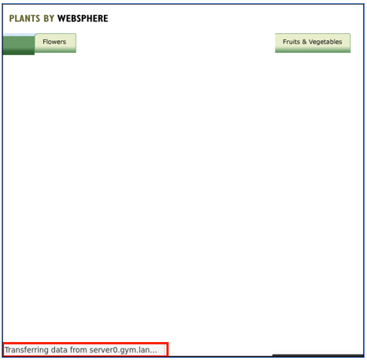

5.  After the response completes, use the `gedit Text Editor` and open the liberty `messages.log` file.

        gedit /home/techzone/lab-work/liberty-staging/22.0.0.8-appServer1/wlp/usr/servers/appServer1/logs/messages.log

6.  Search the log for the first instance of the `TRAS0112W` message. For example:

    > **Tip:** Use “**Cntl-f**” key combination to open the “Search bar” in the editor
 
    

1.  There are three portions of a slow request warning:

    **TRAS0112W**: Request AAB3PkzwQZ9_AAAAAAAAADj has been running on **thread 00000045** for at least **2001.972ms**. The following stack trace shows what this thread is currently running.

    1.  The first line of the warning shows the time of the warning
    (e.g. 3/14/23 13:36:50:226 EDT) and how long it has been running at  the time it was detected (e.g. 2001.972ms): `[3/14/23 13:36:50:226 EDT]`

    2.  The next set of lines are the **stack trace** at the time the
    threshold was exceeded.

    > **Tip:** This is normally what is sent to the development team to find the cause.

    In the following example, `ShoppingBean.getPriceInfo` causing a `sleep` is the cause of the delay: 

    

    3.  After the stack, there is a **table of events of leading up to the slow request** including components such as database queries, how long they took, and the SQL query.

        In some cases, the contributors to the slow down occurred sometime before what is represented by the stack above.
 
        In our example, there were SQL queries, but they did not contribute to the slowdown (\~2ms), so the stack is the most likely suspect:

        **The following table shows the events that have run during this request.**

        | **Duration** | **Operation**                                                                                                                                                                                                                                                                                                                  |
        | ------------ | ------------------------------------------------------------------------------------------------------------------------------------------------------------------------------------------------------------------------------------------------------------------------------------------------------------------------------ |
        | 2004.102ms   | websphere.servlet.service | PlantsByWebSphere | FacesServlet                                                                                                                                                                                                                                                                   |
        | 0.012ms      | websphere.session.getAttribute | qFR7TreEc2Xp-OjMkZd-OF5 | oam.Flash.SCOPE.-emgzpag4dKEEPMESSAGESLIST                                                                                                                                                                                                                          |
        | 0.010ms      | websphere.session.getAttribute | qFR7TreEc2Xp-OjMkZd-OF5 | javax.faces.request.charset                                                                                                                                                                                                                                         |
        | 2.327ms      | websphere.datasource.psExecuteQuery | jdbc/PlantsByWebSphereDataSource | SELECT t0.category, t0.cost, t0.description, t0.heading, t0.image, t0.imgbytes, t0.isPublic, t0.maxThreshold, t0.minThreshold, t0.name, t0.notes, t0.pkginfo, t0.price, t0.quantity FROM APP.INVENTORY t0 WHERE t0.inventoryId = ? optimize for 1 row |
        | 0.019ms      | 019ms websphere.session.getAttribute | qFR7TreEc2Xp-OjMkZd-OF5 | javax.faces.request.charset                                                                                                                                                                                                                                   |
        | 0.038ms      | websphere.session.setAttribute | qFR7TreEc2Xp-OjMkZd-OF5 | javax.faces.request.charset                                                                                                                                                                                                                                         |


8.  **Close** the editor

    In a real-world scenario, sending all the above components to the
 development team for them to review would be the most common next
 step.

### Summary

This lab demonstrated how to enable slow and hung request detection
which is a key differentiator compared to other application server
runtimes.

This `requestTiming-1.0` feature is an easy way to find when web requests exceed thresholds defined by the application team and service level agreements.

When such a request is detected, detailed information is printed in
Liberty logs including the time, the stack trace, and a set of events on that request leading up to the threshold being exceeded.


## Lab 3: Review logs for warnings and errors

One of the first steps in reviewing day 2 issues is to review logs with a focus on warnings and errors both from the application and Liberty itself. Any errors your users are experiencing are often reflected in these logs.

In addition, Liberty also offers First Failure Data Capture (FFDC) logs for rare events that may be a sign of other problems.

This lab contains the following activities:

1. Stop the database

2. Exercise the PlantsByWebSphere application which will fail

3. Review the Liberty logs

4. Summary


### Part 1: Stop the database

1.  The first step is to stop the database to simulate a catastrophic
    application dependency failure:

        docker stop db2_demo_data

### Part 2: Exercise the PlantsByWebSphere application which will fail

Next, exercise the application to simulate a user error:

1.  Go to the PlantsByWebSphere application at
    <https://server0.gym.lan:9441/PlantsByWebSphere/>

2.  Click the `Flowers` button:

    

3.  Your browser will show an **HTTP 500 error**:


### Part 3: Review the Liberty logs

1.  Open the `gedit Text Editor` and view the Liberty log file:

        gedit /home/techzone/lab-work/liberty-staging/22.0.0.8-appServer1/wlp/usr/servers/appServer1/logs/messages.log

    **Note:** if this file was already open in the editor, you may need to click the “Reload” button in the top right to reload the file.

2.  Search for `CNTR0020E` in the log and scroll up. (**Use Cntl-f**) to open the search field in the editor.

    a.  In the first box example below, you should find an `FFDC exception` since Liberty treats the inability to get a database connection as something very concerning.

    b.  In the second box example below, you should find the same exception that the browser received.

    The error includes information from the database driver about why the connection attempt failed and this would normally be reviewed by the application team or database administrator.

    c.  In addition, the error shows a `stack trace` leading up to the part of the application driving the error and that would normally be reviewed by the application team.

    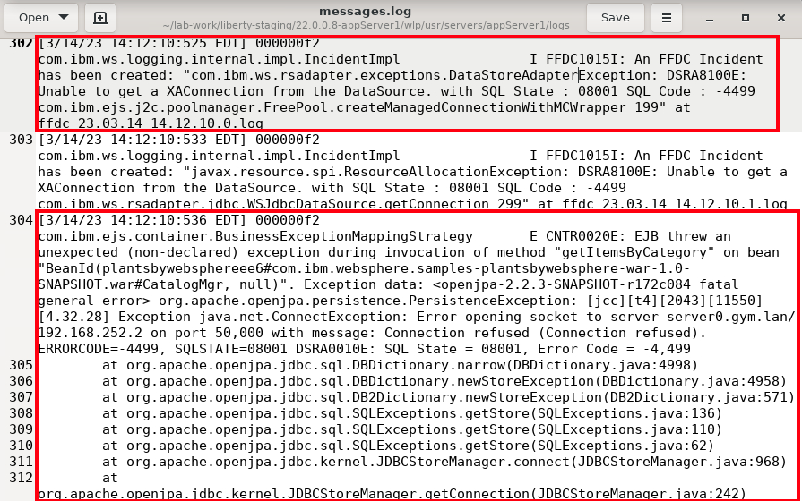

  - The `FFDC log` noted in the first message will be found in the
    `logs/ffdc/` directory and may be useful to the developer for
    additional information.

  - Instead of manually searching logs, one common thing to do is to
    search for ” E ” (a space, the capital letter `E` and a space) which are any errors, and ” W ” for warnings.

  - It’s also worth noting that the `messages.log` and `FFDC` files are for Liberty and application issues, but there is also a `console.log` file which shows `C/C++ stdout/stderr` messages from components such as the  Java Virtual Machine itself. 
  
    Most commonly, this will include warnings and errors from the JVM such as OutOfMemoryErrors. One common thing to do for IBM Java and IBM Semeru Runtimes JVMs is to search for the phrase JVM which are JVM messages and look for message codes ending with `W` or `E`.


3.  Start the database again for future labs:

        docker start db2_demo_data

### Summary

This lab demonstrated how to simulate an application error by stopping the database and reviewing the Liberty `messages.log` to find warnings and errors showing details about the error. In general, always review Liberty messages.log for errors and warnings (`E` and `W`, respectively), reviewing any FFDC logs, and console.log for JVM messages ending in `W` and `E`.

## Lab 4: Liberty server dump

If you’re having a problem, particularly a performance, hang or high CPU problem, one of the most common things to do is to gather one or more thread dumps and the state of Liberty.

A thread dump is a textual output of all threads and what they’re doing in the JVM. In general, a thread dump is cheap (pauses the JVM for only a few hundred milliseconds), small (generally less than a few MB), and low risk.

Liberty offers a [<span class="underline">server
dump</span>](https://www.ibm.com/docs/en/was-liberty/core?topic=line-generating-liberty-server-dump-from-command)
utility which gathers other useful state about the Liberty process as
well as requesting a thread dump.

In other words: if you’re having a problem, and you’re not sure what to do, `server dump` with a `thread dump` is your best bet. If you’re not sure how to analyze, consider opening an IBM support case.

This lab demonstrates how to gather a `server dump` and review its output.

### Part 1: Gather the server dump

1.  Run the following command to start the Liberty `server dump`:

        /home/techzone/lab-work/liberty-staging/22.0.0.8-appServer1/wlp/bin/server dump appServer1 --include=thread

2.  Once the command completes, it shows the path to the dump ZIP; for  example:

    

3.  Open the `File Manager` program and navigate to the above directory. Double click on the dump ZIP to extract it:

    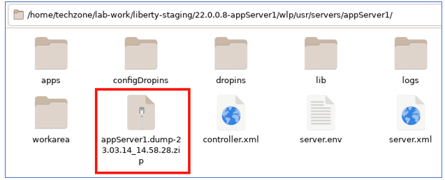

4.  This will open a new `File Manager` window with the newly extracted folder highlighted. Double click on that folder:

    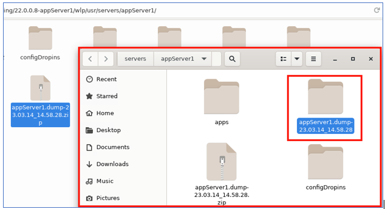

5.  This will include all Liberty logs and configuration as well as a
    thread dump (`javacore\*.txt` file) and a `dump_*` folder with
    additional Liberty introspections.

> 

6.  You can double click the `javacore*.txt` file to review the thread  stacks (search for `Thread Details` for the start of the stacks), or use a free graphical tool such as the [IBM Thread and Monitor Dump Analyzer](https://www.ibm.com/support/pages/ibm-thread-and-monitor-dump-analyzer-java-tmda) (TMDA).

7.  You would normally send these files to the development team for
    review or open a support case with IBM support.

### Summary

This lab demonstrated how to gather a Liberty `server dump` along with a `thread dump`. If you’re having a problem with Liberty, and you’re not sure what to do, this is the best place to start. If you’re having trouble reviewing the output, consider opening an IBM support case. In addition, it’s often valuable to gather the IBM Performance MustGather
([Linux](https://www.ibm.com/support/pages/mustgather-performance-hang-or-high-cpu-issues-websphere-application-server-linux),
[AIX](https://www.ibm.com/support/pages/mustgather-performance-hang-or-high-cpu-issues-websphere-application-server-aix),
[z/OS](https://www.ibm.com/support/pages/mustgather-gathering-data-hang-or-performance-problem-zos),
[Windows](https://www.ibm.com/support/pages/mustgather-performance-hang-or-high-cpu-issues-windows),
etc.).

## Lab Summary

This lab summarized and demonstrated the key differentiators and
capabilities of Liberty day 2 operations:

1.  Consider using the `monitor-1.0` feature to produce statistics that can be consumed by the Admin Center, or more commonly with
    monitoring products such as Instana.

2.  Consider using the `requestTiming-1.0` feature to watch for web
    requests that exceed an application defined threshold and print
    diagnostic information.

3.  During a problem, review Liberty’s `messages.log` for errors,
    warnings, and `FFDCs`, and review `console.log` for JVM errors and  warnings.

4.  If you’re having a problem and you’re not sure what to do,
    particularly if it’s a performance, hang or high CPU problem,
    consider gathering `server dump` with `--include=thread`.

If you have completed early, here are a few more labs:

## Lab 5: HTTP Access Log

This lab demonstrates how to enable and use the [HTTP Access
Log](https://www.ibm.com/docs/en/was-liberty/nd?topic=environment-http-access-logging).
This log is relatively verbose as it prints one line for each HTTP
request; however, this may be useful for diagnosing issues, historical
analysis, capacity planning, and more. When it comes to day 2
operations, the log is particularly useful to understand the time and
number of HTTP errors, detailed response times, whether slowdowns are
likely to be within/behind Liberty or in front, and more. Note that in
high volume environments, the overhead of the HTTP Access Log may be up
to about 2%.

This lab contains the following activities:

1.  Configure `accessLogging` in WebSphere Liberty

2.  Exercise a web request and review the access log output

3.  Summary

### Part 1: Configure accessLogging in WebSphere Liberty

Unlike the labs above, accessLogging does not need an additional feature to be enabled; instead, configuration just needs to be added to the httpEndpoint element. Normally, the httpEndpoint element is self-closing with a /\> at the end; for example:

```html 
<httpEndpoint id="defaultHttpEndpoint"

httpPort="9084"

httpsPort="9446"

host="*" \>
```

The `accessLogging` element is a child of `httpEndpoint`, so the element must first be converted from self-closing to non-self-closing by replacing /\> with \> and adding a closing element:

```html
<httpEndpoint id="defaultHttpEndpoint"

httpPort="9084"

httpsPort="9446"

host="*" >

</httpEndpoint>
```

Now that `httpEndpoint` can accept child elements, we can add the
`accessLogging` element; for example:

```html
<httpEndpoint id="defaultHttpEndpoint"

httpPort="9084"

httpsPort="9446"

host="*" >

    <accessLogging filepath="${server.output.dir}/logs/http_access.log" maxFileSize="100" maxFiles="4" logFormat="%h %u %t \&quot;%r\&quot; %s %b %D %{R}W %{remote}p %p" />

</httpEndpoint>
```

There are [many different
options](https://openliberty.io/docs/latest/access-logging.html#_http_access_log_format)
that may be specified in the logFormat attribute. Some highlights from
the ones we’re using:

  - **`%t`:** This is the time the request arrived. This means that lines  in the file are often out-of-order because the line is printed when  the request finishes.

  - **`%r`:** This is the first line of the request which includes the  URL.

  - **`%s`:** This is the HTTP response status code. It’s often useful to search these for codes greater than 400 and/or 500.

  - **`%b`**: This is the size of the HTTP response body. This may be
    useful to understand why large downloads might be slow.

  - **`%D`:** This is the total time processing the request and response  in microseconds. This includes network time so a slow response time  does not necessarily mean Liberty or something behind Liberty is slow.

  - **`%{R}W`:** This is the time processing the request until the first bytes of the response is sent back. This often approximates the response time of Liberty and whatever is behind Liberty. If there is a large difference between this and `%D`, then there may be a network slowdown in front of Liberty (or at the client), although this is not always the case.

  - **`%{remote}p`:** The ephemeral port of the client. This can be used to correlate to network captures.

You will manually add this configuration:

1.  Open `gedit Text Editor` and open the file:

        gedit /home/techzone/lab-work/liberty-staging/22.0.0.8-appServer1/wlp/usr/servers/appServer1/configDropins/overrides/memberOverride.xml

2.  Replace this element:

```html
 <httpEndpoint id="defaultHttpEndpoint"
 
 httpPort="9081"
 
 httpsPort="9441" host="*" />
 ```

 With:
 
 ```html
 <httpEndpoint id="defaultHttpEndpoint"
 
 httpPort="9081"
 
 httpsPort="9441" host="*">
 
     <accessLogging filepath="${server.output.dir}/logs/http_access.log" maxFileSize="100" maxFiles="4" logFormat="%h %u %t &quot;%r&quot; %s %b %D %{R}W %{remote}p %p" />
 
 </httpEndpoint>
```

3.  Click `Save`. The configuration will be automatically reloaded.


### Part 2: Exercise a web request and review the access log output

1.  Open your browser and go to
    <https://server0.gym.lan:9441/PlantsByWebSphere/promo.jsf>

2.  Click on the `Accessories` category:

    

3.  Click on any of the products such as the `Birdfeeder`:

    

4.  After the response completes in about 5 seconds, open `gedit Text Editor` and open the `http_access.log` file:

        gedit /home/techzone/lab-work/liberty-staging/22.0.0.8-appServer1/wlp/usr/servers/appServer1/logs/http_access.log

5.  Search for `shopping.jsf` and you’ll find a line such as:

    ```
    192.168.252.2 - [20/Mar/2023:14:59:18 -0400] "POST /PlantsByWebSphere/shopping.jsf HTTP/1.1" 200 17366 5121420 49745 56318 9441
    ```

6.  Here are some highlights from the above line:
    
    1.  The IP address `192.168.252.2` sent a `POST` request to
        `/PlantsByWebSphere/shopping.jsf` that arrived in Liberty at
        `20/Mar/2023:14:59:18 -0400`.
    
    2.  Liberty responded with an `HTTP 200` (success) and sent back
        17,366 bytes of a response body.
    
    3.  In total, the request took 5,121,420 microseconds or 5,121
        milliseconds, or 5.1 seconds.
    
    4.  Liberty sent back the first response bytes after 49,745
        microseconds or 49.7 milliseconds, which suggests relatively
        fast processing in the initial processing of the request.
    
    5.  In some cases, such a difference would suggest a potential
        network or other issue in front of Liberty; however, in this
        case, since Liberty flushed part of its response before
        performing more processing (and hitting a 5 second sleep that we  diagnosed in a previous lab), this is a good example where a difference between `%D`and `%{R}W` can still be caused by a problem inside Liberty.

### Summary

In summary, if the overhead of the HTTP Access Log is acceptable, it is usually worth enabling it for diagnostic insights as well as helping understand what users are doing for capacity planning and historical analysis. 

For example, arrival rates, throughput, and average and maximum response times may be calculated to get a clear understanding of user behavior throughout the day. There are various options to control the formatting of each line in the output that provide different information about the request and response.

## Lab 6: Enabling JSON logs

WebSphere Liberty has the option of integrating with a centralized
logging solution either through a [JSON log output
format](https://www.ibm.com/docs/en/was-liberty/nd?topic=liberty-logging-trace)
using com.ibm.ws.logging.message.format (e.g. [to Elastic
Stack](https://www.ibm.com/docs/en/was-liberty/nd?topic=environment-analyzing-logs-elastic-stack)
and similar solutions) or a [Logstash
connector](https://www.ibm.com/docs/en/was-liberty/nd?topic=collector-using-logstash-version-10).

JSON logging is useful for centralizing logging and analytics and it’s
used particularly often in cloud environments, so it is worth
considering starting to get used to it in enterprise collective
environments.

This lab contains the following activities:

1.  Configure WebSphere Liberty to output messages in JSON format

2.  Exercise a web request and review the output

3.  Summary

### Part 1: Configure WebSphere Liberty to output messages in JSON format

When enabling JSON log output, what’s generally done is to send messages
(and potentially other things) to stdout/stderr (most commonly output to
console.log) and then this is processed into the centralized logging
environment. In container environments, stdout/stderr is already managed
by components and it’s just a matter of connecting that to centralized
logging.

1.  Since logging configuration is processed so early, we will configure  it in a new file called `bootstrap.properties` instead of `server.xml`.

2.  First touch this file to create it as an empty file:

        touch ~/lab-work/liberty-staging/22.0.0.8-appServer1/wlp/usr/servers/appServer1/bootstrap.properties

3.  Open `gedit Text Editor` and open the `botstrap.properties` file:

        gedit /home/techzone/lab-work/liberty-staging/22.0.0.8-appServer1/wlp/usr/servers/appServer1/bootstrap.properties

4.  Add the following lines to the bootstrap.properties file:

    ```
    com.ibm.ws.logging.console.log.level=INFO
 
    com.ibm.ws.logging.console.format=JSON
 
    com.ibm.ws.logging.message.source=message,accessLog,ffdc,audit
    ```

5.  Click **`Save`**


    - What this has configured is that the console.log will now receive  all messages greater or equal to `INFO`, HTTP access log entries (if configured), FFDCs, and audit events. This is in addition to any C/C++ stdout/stderr output such as from the JVM itself.

6.  Te server must be **restarted** to pick up this change
    
    a.  Go to the `Admin Center` and in the **`Explore` view**, click the drop  down on `appServer1`, and click `Restart`.


### Part 2: Exercise a web request and review the console log output

1.  Open your browser and go to
    <https://server0.gym.lan:9441/PlantsByWebSphere/promo.jsf>

2.  Open `gedit Text Editor` and open the `console.log` file:

        gedit /home/techzone/lab-work/liberty-staging/22.0.0.8-appServer1/wlp/usr/servers/appServer1/logs/console.log

3.  You will see that the output is different than the previous
    `console.log` format and most messages are in `JSON format`, for
    example:

    

4.  This format is not designed to be read by humans but instead
    ingested by centralized logging solutions.


### Summary

In summary, WebSphere Liberty supports sending message and other output in JSON format for ingestion by centralized logging solutions. JSON is a structured format that can be easily parsed programmatically. 

Many in the industry are moving towards centralized logging for easier searching, management, log retention, and more. Cloud environments such as RedHat OpenShift make it relatively easy to configure centralized logging.

## Additional Day 2 Operations and Capabilities

Optionally, review other common day 2 operations and capabilities:


* A key differentiator of WebSphere Liberty is its [auto-tuning main thread pool](https://www.ibm.com/docs/en/was-liberty/nd?topic=tuning-liberty) that dynamically changes the maximum thread pool size to try to maximize throughput. In most cases, this means that an administrator does not need to specify nor tune the main application thread pool. Note that other pools such as [database connection pools](https://www.ibm.com/docs/en/was-liberty/core?topic=liberty-configuring-connection-pooling-database-connections), web service client pools and others do not auto-tune as those are backend resources out of the control of Liberty, so they must still be tuned.
* WebSphere Liberty has a rich set of [configuration capabilites](https://www.ibm.com/docs/en/was-liberty/nd?topic=tools-creating-editing-your-server-environment-files) through XML files and variables (`server.xml`, etc.), Java options files (`jvm.options`), and environment variables (`server.env` or through the process environment). Most WebSphere Liberty configuration changes may be done dynamically, [by default](https://www.ibm.com/docs/en/was-liberty/nd?topic=manually-controlling-dynamic-updates).
* An optional [servlet response cache](https://www.ibm.com/docs/en/was-liberty/nd?topic=features-web-response-cache-10) that takes significant effort to configure but may have a dramatic return on investment in reduced server utilization and improved response times.
* [MicroProfile Metrics](https://www.ibm.com/docs/en/was-liberty/nd?topic=environment-monitoring-microprofile-metrics) to produce the same statistics as `monitor-1.0` but exposed through a Prometheus-style `/metrics` HTTP endpoint for consumption by Prometheus or custom scripts.
* [Distributed tracing](https://www.ibm.com/docs/en/was-liberty/nd?topic=environment-enabling-distributed-tracing) to monitor the flow of JAX-RS web service calls through a web of Liberty processes.
* Consider grouping Liberty servers running the same application into [Liberty clusters](https://www.ibm.com/docs/en/was-liberty/nd?topic=clusters-configuring-liberty-server-cluster) for easier management.
* Consider the [auto scaling features](https://www.ibm.com/docs/en/was-liberty/nd?topic=collectives-setting-up-auto-scaling-liberty) to dynamically scale the number of Liberty servers based on CPU and memory.
* [Dynamic routing rules](https://www.ibm.com/docs/en/was-liberty/nd?topic=collectives-routing-rules-liberty-dynamic-routing) in a collective may be used to route requests to specific servers, redirect requests, or reject requests. This includes the capability of handling multiple editions of an application and [routing a percentage of requests](https://www.ibm.com/docs/en/was-liberty/nd?topic=collectives-configuring-routing-rules-liberty-dynamic-routing) to certain editions, for example.
* Consider using [maintenance mode](https://www.ibm.com/docs/en/was-liberty/nd?topic=collectives-maintenance-mode) for clusters during diagnostics or maintenance operations.
* Consider using [health policies](https://www.ibm.com/docs/en/was-liberty/nd?topic=collectives-configuring-health-management-liberty) to capture diagnostics and perform other operations based on different conditions.
* If a performance, hang, or high CPU issue is observed in production, consider running the IBM Performance MustGather ([Linux](https://www.ibm.com/support/pages/mustgather-performance-hang-or-high-cpu-issues-websphere-application-server-linux), [AIX](https://www.ibm.com/support/pages/mustgather-performance-hang-or-high-cpu-issues-websphere-application-server-aix), [z/OS](https://www.ibm.com/support/pages/mustgather-gathering-data-hang-or-performance-problem-zos), [Windows](https://www.ibm.com/support/pages/mustgather-performance-hang-or-high-cpu-issues-windows), etc.).
* The most common performance tuning that needs to be done is to change the maximum Java heap size (`-Xmx` or `-XX:MaxRAMPercentage`), the maximum Java nursery size (`-Xmn`), and maximum pool sizes such as database connection pools. In particular, it's generally advisable to enable [verbose garbage collection](https://www.ibm.com/docs/en/mon-diag-tools?topic=types-verbose-garbage-collection); if the proportion of time spent in garbage collection is greater than ~10%, then tuning of the maximum heap or nursery is likely needed. Use the free [IBM Garbage Collection and Memory Visualizer](https://www.ibm.com/support/pages/garbage-collection-and-memory-visualizer) (GCMV) to [calculate](https://publib.boulder.ibm.com/httpserv/cookbook/Major_Tools-Garbage_Collection_and_Memory_Visualizer_GCMV.html#Major_Tools-Garbage_Collection_and_Memory_Visualizer_GCMV-Analysis) this percentage.
* Flexible diagnostic trace capabilities with the option of using a [binary output format](https://www.ibm.com/docs/en/was-liberty/nd?topic=overview-binary-logging) for reduced overhead.
* Consider integrating the [WebSphere Automation product](https://www.ibm.com/docs/en/ws-automation) that helps with server inventory, security patching, and automatic memory leak detection and diagnosis.
* To review OutOfMemoryErrors, use the free [Eclipse Memory Analyzer Tool (MAT) with DTFJ and IBM Extensions](https://www.ibm.com/support/pages/eclipse-memory-analyzer-tool-dtfj-and-ibm-extensions).
* If running WebSphere Liberty on [IBM Java](https://www.ibm.com/docs/en/sdk-java-technology/8?topic=SSYKE2_8.0.0/welcome/welcome_javasdk_version.htm) or [IBM Semeru Runtimes](https://developer.ibm.com/languages/java/semeru-runtimes/):
    * A [shared class cache](https://www.eclipse.org/openj9/docs/shrc/) to improve startup time.
    * Various [garbage collection policies](https://www.eclipse.org/openj9/docs/gc/) for different workloads.
    * Richer [thread dumps](https://www.eclipse.org/openj9/docs/dump_javadump/) to help diagnose many types of issues. Use the free [IBM Thread and Monitor Dump Analyzer](https://www.ibm.com/support/pages/ibm-thread-and-monitor-dump-analyzer-java-tmda) (TMDA) to graphically review thread dumps.
    * [Method tracing](https://www.eclipse.org/openj9/docs/xtrace/) to take diagnostic actions on method entry or exit, or to time method calls.
    * A [dump engine](https://www.eclipse.org/openj9/docs/xdump/) to gather diagnostics on various events such as large object allocations, thrown or caught exceptions, etc.
    * A [JITServer](https://www.eclipse.org/openj9/docs/jitserver/) to separate Just-In-Time compilation into a separate process and share compiled code across processes.
    * The [IBM Java Health Center](https://www.ibm.com/docs/en/mon-diag-tools?topic=monitoring-diagnostic-tools-health-center) sampling profiler available in IBM Java 8 and IBM Semeru Runtimes 11 on z/OS to investigate Java CPU usage and lock contention.
    * For richer memory analysis, consider enabling and configuring core dumps (e.g. [core and file ulimits](https://publib.boulder.ibm.com/httpserv/cookbook/Operating_Systems.html#core-dumps-and-ulimits), [`kernel.core_pattern` truncation settings](https://publib.boulder.ibm.com/httpserv/cookbook/Troubleshooting-Troubleshooting_Java.html#ensure-core-piping-is-configured-properly-or-disabled-on-linux), etc.) after reviewing the [security](https://publib.boulder.ibm.com/httpserv/cookbook/Operating_Systems.html#core-dump-security-implications), [disk](https://publib.boulder.ibm.com/httpserv/cookbook/Operating_Systems.html#core-dump-disk-implications) and [performance](https://publib.boulder.ibm.com/httpserv/cookbook/Operating_Systems.html#performance-implications-of-non-destructive-core-dumps) risks.
* Gather basic operating system metrics such as CPU, memory, disk, and network utilization, saturation, and errors.
* Gather operating system logs and watch for warnings and errors.
* Monitor for common network issues such as TCP retransmissions.
* Monitor the web server's access and error logs for warnings and errors.
* Monitor the web server's utilization with tools such as [mod_mpmstats](https://publib.boulder.ibm.com/httpserv/ihsdiag/ihs_performance.html) and [mod_status](https://publib.boulder.ibm.com/httpserv/manual24/mod/mod_status.html).
* For newer applications, advanced capabilities for [fault tolerance](https://www.ibm.com/docs/en/was-liberty/nd?topic=liberty-improving-microservice-resilience-in) such as automatic retries, circuit breakers, fallbacks, and bulkheads. In addition, [health checks](https://www.ibm.com/docs/en/was-liberty/nd?topic=liberty-performing-microprofile-health-checks) may be enabled using readiness and liveness probes.
* Review [performance tuning guidance](https://www.ibm.com/docs/en/was-liberty/nd?topic=tuning-liberty) and the [WebSphere Performance Cookbook](https://publib.boulder.ibm.com/httpserv/cookbook/).
* When running in a container environment such as OpenShift:
    * Consider deploying applications using the [WebSphere Liberty Operator](https://www.ibm.com/docs/en/was-liberty/base?topic=operator-websphere-liberty-overview) and use capabilities such as the [WebSphereLibertyTrace](https://www.ibm.com/docs/en/was-liberty/base?topic=resources-webspherelibertytrace-custom-resource) and [WebSphereLibertyDump](https://www.ibm.com/docs/en/was-liberty/base?topic=resources-webspherelibertydump-custom-resource) custom resources.
    * [Enable JSON logging](https://github.com/WASdev/ci.docker#logging) and publish native logs of pods to [OpenShift centralized logging](https://docs.openshift.com/container-platform/latest/logging/cluster-logging-deploying.html) using, most commonly, [EFK](https://github.com/OpenLiberty/open-liberty-operator/blob/main/doc/observability-deployment.adoc#how-to-analyze-open-liberty-logs), and then search logs in the Kibana log viewer. Optionally install [sample Kibana dashboards](https://github.com/WASdev/sample.dashboards) that summarize application log events and statistics.
    * Consider enabling [application monitoring integrated with and Grafana](https://www.ibm.com/docs/en/was-liberty/nd?topic=operator-monitoring-applications-red-hat-openshift).
    * If you have `cluster-admin` permissions, use the [MustGather: Performance, hang, or high CPU issues with WebSphere Application Server on Linux on Containers](https://www.ibm.com/support/pages/mustgather-performance-hang-or-high-cpu-issues-websphere-application-server-linux-containers) during performance, hang, and high-CPU issues.
* You may connect the [JConsole monitoring tool](https://docs.oracle.com/javase/8/docs/technotes/guides/management/jconsole.html) built into Java and access Liberty enabled with the `monitor-1.0` feature through the [localConnector-1.0](https://www.ibm.com/docs/en/was-liberty/core?topic=jmx-configuring-local-connection-liberty) and/or [restConnector-2.0](https://www.ibm.com/docs/en/was-liberty/core?topic=jmx-configuring-secure-connection-liberty) features; however, note that JConsole has connection complexities and limited capabilities and Admin Center is often enough for basic statistics visualization.
