# 1005: Asesor de Transformación


**Última actualización:** marzo de 2023

**Duración:** 45 minutos

¿Necesitas ayuda? Contacta con **Kevin Postreich, Yi Tang.**

## Introducción

**IBM Cloud Transformation Advisor** (Transformation Advisor) es una herramienta de modernización de aplicaciones que se comercializa a través de IBM WebSphere Hybrid Edition.

Transformation Advisor se utiliza para ayudar a modernizar sus aplicaciones Java y trasladarlas a Liberty en máquinas virtuales y, opcionalmente, a Liberty en plataformas basadas en Kubernetes.

Transformation Advisor determina la complejidad de sus aplicaciones, identifica los cambios necesarios en las aplicaciones, estima el costo de desarrollo para una migración a Liberty y genera informes y artefactos de implementación que pueden ayudarlo a actualizar las aplicaciones y trasladarlas al entorno de destino.

La herramienta Transformation Advisor proporciona el siguiente valor:

- Identificar los modelos de programación Java EE en la aplicación.

- Determinar la complejidad de las aplicaciones enumerando un inventario de alto nivel del contenido y la estructura de cada aplicación.

- Resaltar el modelo de programación Java EE y las diferencias de la API de WebSphere entre los tipos de perfil de WebSphere

- Identificar las diferencias de implementación de la especificación Java EE que podrían afectar la aplicación

- generar aceleradores para implementar la aplicación en Liberty y contenedores en un entorno de destino.

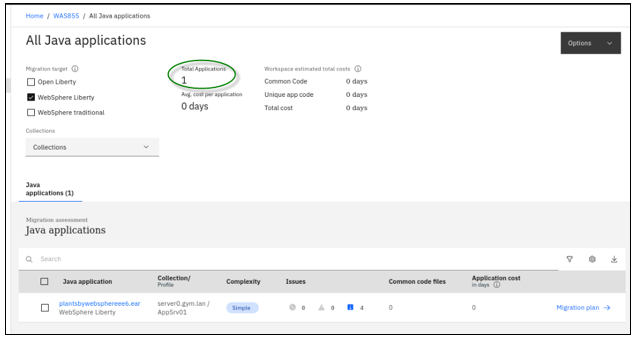

## **Accediendo al entorno**

Si realiza este laboratorio como parte de un taller impartido por un instructor (virtual o presencial), ya se le ha proporcionado un entorno. El instructor le proporcionará los detalles para acceder al laboratorio.

De lo contrario, deberá reservar un entorno para el laboratorio. Puede obtenerlo aquí. Siga las instrucciones en pantalla para la opción " **Reservar ahora** ".

KLP: ENLACE A DETERMINAR PARA LA RESERVA DE ENV

El entorno de laboratorio contiene dos (2) máquinas virtuales Linux.


Se configura un servicio publicado para proporcionar acceso a la VM **server0** a través de la interfaz noVNC para el entorno de laboratorio.

1. Acceda al entorno de laboratorio desde su navegador web.

    a. Una vez aprovisionado el entorno, haga clic con el botón derecho en el enlace **"Servicio publicado"** . A continuación, seleccione " **Abrir enlace en una nueva pestaña** " en el menú contextual.

    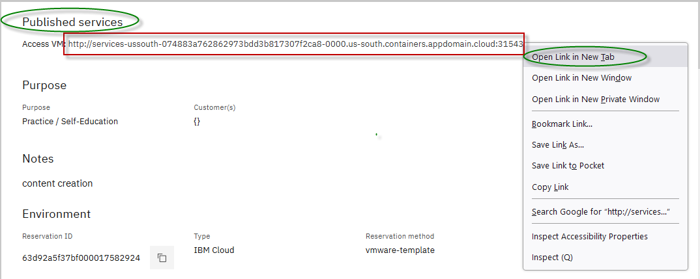

    b. Haga clic en el enlace **"vnc.html"** para abrir el entorno de laboratorio a través de la interfaz **noVNC** .

    

    c. Haga clic en el botón **Conectar**

    

    d. Ingrese la contraseña: **passw0rd** . Luego, haga clic en el botón **"Enviar credenciales"** para acceder al entorno de laboratorio.

    **Nota:** Ese es un cero numérico en passw0rd

    

2. Inicie sesión en la máquina virtual **server0** utilizando las credenciales a continuación:

    - ID de usuario: **techzone**

    - Contraseña: **IBMDem0s!**

## Consejos para trabajar en el entorno de laboratorio

1. Puede cambiar el tamaño del área visible utilizando las opciones **de configuración de noVNC** para cambiar el tamaño del escritorio virtual para que se ajuste a su pantalla.

    a. Desde la máquina virtual del entorno, haga clic en el **icono de giro** en el panel de control noNC para abrir el menú.

    

    b. Para aumentar el área visible, haga clic en `Settings > Scaling Mode` y configure el valor en `Remote Resizing`

    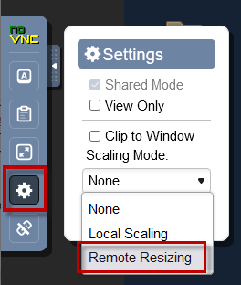

2. Puede copiar/pegar texto de la guía de laboratorio en el entorno de laboratorio utilizando el portapapeles en el visor noVNC.

    a. Copie el texto de la guía de laboratorio que desea pegar en el entorno de laboratorio.

    b. Haga clic en el icono **del Portapapeles** y **pegue** el texto en el portapapeles de noVNC.

    

    c. Pegue el texto en la máquina virtual, como en una ventana de terminal, una ventana del navegador, etc.

    d. Haga clic en el icono **del portapapeles** nuevamente para cerrarlo.

    > **NOTA:** A veces, pegar en una ventana de Terminal en la VM no funciona de manera consistente.

    > En este caso, puedes intentarlo nuevamente, o abrir otra ventana de terminal e intentarlo nuevamente, o pegar el texto en un **editor de texto** en la máquina virtual y luego pegarlo en la ventana de terminal en la máquina virtual.

3. Como alternativa a la opción "Copiar y pegar" de noVNC, puede considerar abrir la guía de laboratorio en un navegador web dentro de la máquina virtual. Con este método, puede copiar y pegar fácilmente texto de la guía de laboratorio sin tener que usar el portapapeles de noVNC.

<br>

## Laboratorio: Asesor de Transformación

Este laboratorio demuestra el uso de Transformation Advisor para **la modernización del entorno de ejecución a Liberty** . Utiliza la aplicación PlantsByWebSphere, que se origina en WebSphere ND V8.5.5.

Muestra el valor de utilizar Transformation Advisor (TA) para evaluar aplicaciones Java locales e identificar el esfuerzo necesario para migrar la aplicación a Liberty.

También explorará los aceleradores de implementación que TA genera para ayudar a implementar y ejecutar aplicaciones Java en Liberty en máquinas virtuales y plataformas basadas en Kubernetes.

**<span class="underline">Este laboratorio contiene las siguientes actividades:</span>**

- Clonar el repositorio git en la máquina virtual, que contiene los artefactos necesarios para el laboratorio

- Revise la aplicación WebSphere existente utilizada en el escenario

- Utilice Transformation Advisor para recopilar datos sobre la configuración del servidor y de la aplicación WebSphere bajo evaluación.

- Utilice Transformation Advisor para evaluar la idoneidad de la solicitud para Liberty

- Explore los artefactos del acelerador de implementación generados por Transformation Advisor que optimizan la configuración y la implementación de la aplicación en WebSphere Liberty

## Clonar el repositorio de GitHub para este taller

Este laboratorio requiere artefactos almacenados en un repositorio de GitHub. Ejecute el siguiente comando para clonar el repositorio en la máquina virtual local utilizada para el laboratorio.

1. Clonar el repositorio de GitHub que contiene los artefactos de laboratorio necesarios para el laboratorio.

    a. Abra una nueva ventana de terminal en la máquina virtual “ **server0.gym.lan** ”.

    

    b. Clonar el repositorio de GitHub necesario para el laboratorio.

    ```
    git clone https://github.com/IBMTechSales/liberty_admin_pot.git
    ```

    c. Navegue al directorio “lab-scripts” en el repositorio clonado.

    ```
    cd ~/liberty_admin_pot/lab-scripts
    ```

    d. Agregue los permisos de "ejecución" a los directorios de scripts de laboratorio y a los scripts de shell.

    ```
    chmod -R 755 ./
    ```

## **Parte 1: Revise la aplicación local WebSphere “PlantsByWebSphere” que se utiliza para el escenario de modernización de Liberty Runtime**

En esta sección, echará un vistazo rápido al entorno actual de WebSphere Application Server y a la aplicación PlantsByWebSphere implementada en el entorno local de WebSphere Application Server (WAS) en la máquina virtual.

1. Inicie la aplicación PlantsByWebSphere con la base de datos DB2, que se ejecuta en un contenedor Docker local

    Para iniciar la base de datos DB2 en el contenedor:

    a. Abra una nueva ventana de terminal

    

    b. En la ventana de terminal, ejecute el siguiente comando para iniciar la base de datos DB2. Luego, use el comando " **docker ps** " para verificar que el contenedor de la base de datos esté en ejecución.

    ```
    docker start db2_demo_data

    docker ps
    ```

    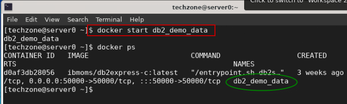

2. Iniciar WebSphere Application Server

    En la máquina virtual de escritorio, tiene un servidor WebSphere Application Server (WAS) local que aloja la aplicación PlantsByWebSphere. Para iniciar el servidor WAS:

    Desde la ventana del terminal, emita el siguiente comando para iniciar el servidor WAS.

    ```
    /opt/IBM/WebSphere/AppServer85515/bin/startServer.sh tWAS_85515_server
    ```

    El servidor de aplicaciones WebSphere está listo cuando aparece el mensaje que indica que el servidor está “ **abierto para comercio electrónico”** , como se ilustra a continuación:

    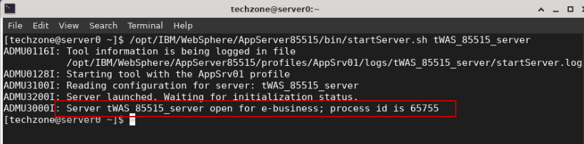

3. Acceda a la consola de administración de WebSphere para ver la aplicación implementada.

    a. Abra el navegador **Firefox** en la máquina virtual.

    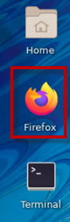

    b. Desde el navegador Firefox, haga clic en el marcador **Consola de soluciones integradas de WebSphere** para iniciar la consola WAS. O bien, inicie la consola de administración de WAS mediante la URL:

    ```
    https://localhost:9043/ibm/console/
    ```

    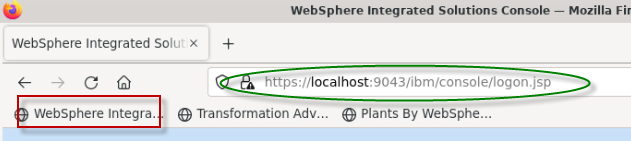

    c. Si ve el mensaje **Advertencia: Riesgo potencial de seguridad** , haga clic **en Avanzado** &gt; **Aceptar el riesgo y continuar** .

    d. En la página de inicio de sesión **de la consola de administración de WAS** , ingrese el ID de usuario y la contraseña de administrador de WebSphere como: **wsadmin** / **wsadmin** y haga clic en **Iniciar sesión** .

    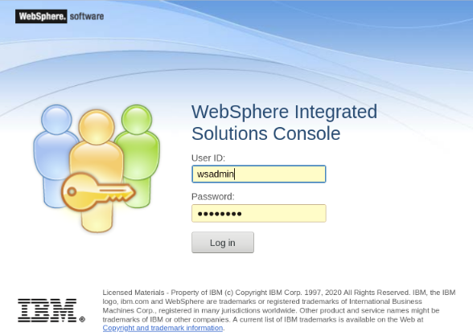

    e. En la página **Consola WAS** , haga clic en **Aplicaciones** -&gt; **Aplicación &gt; Tipos** -&gt; **Aplicaciones empresariales de WebSphere** para ver las aplicaciones implementadas.

    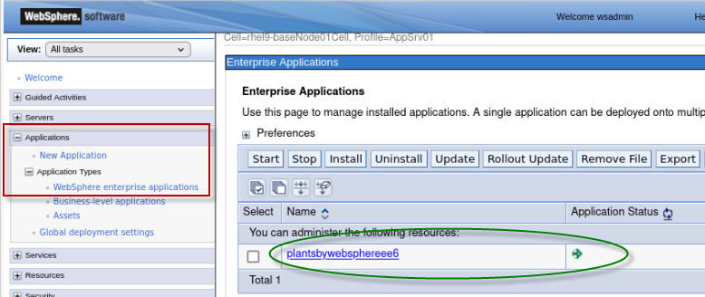

    En la lista **de aplicaciones empresariales** , puede ver que la aplicación PlantsByWebSphere está implementada y en estado " **en ejecución** ", como lo indica el ícono VERDE Iniciado.

    A continuación, ejecutará rápidamente la aplicación PlantsByWebSphere desde el navegador Firefox para asegurarse de que funcione como se espera.

4. Inicie y pruebe la aplicación PlantsByWebSphere

    a. Desde el navegador Firefox, abra una **nueva** pestaña del navegador.

    b. Haga clic en el marcador " **Plantas de WebSphere** " o introduzca la siguiente URL en el navegador:

    ```
    http://server0.gym.lan:9080/PlantsByWebSphere
    ```

    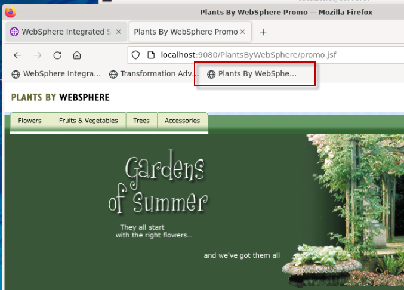

    c. Haga clic en la pestaña “ **Flores** ”, que recuperará el catálogo de flores de la base de datos DB2.

    Si se muestra la lista de Flores, la aplicación está funcionando como se espera en el entorno de WebSphere Application Server.

    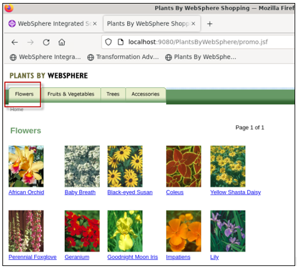

5. **Cerrar** el navegador

En la siguiente sección del laboratorio, utilizará Transformation Advisor para acelerar la “Modernización del tiempo de ejecución” del tradicional WebSphere Application Server al Liberty Application Server moderno, rentable, de tamaño adecuado y habilitado para la nube.

Transformation Advisor está autorizado para su uso a través del producto IBM WebSphere Hybrid Edition, al igual que todas las ediciones de WebSphere Liberty.

## Parte 2: Recopilador de datos y paquete de migración de Transformation Advisor

En esta sección del laboratorio, usted:

- Utilice la utilidad recopiladora de datos de Transformation Advisor para recopilar datos de aplicaciones y configuración del servidor de aplicaciones WebSphere que actualmente ejecuta la aplicación PlantsByWebSphere

- Utilice Transformation Advisor para realizar un análisis rápido y obtener información valiosa para determinar la viabilidad y el esfuerzo necesarios para migrar la aplicación PlantsByWebSphere al entorno de ejecución moderno de Liberty.

    - En este laboratorio, no se requieren cambios en el código de la aplicación para ejecutar la aplicación PlantsByWebSphere en WebSphere Liberty.

- Descargue los artefactos de implementación de Liberty generados por Transformation Advisor para facilitar una rápida configuración e implementación de la aplicación PlantsByWebSphere en WebSphere Liberty que se ejecuta en la máquina virtual.

### Acceda a Transformation Advisor mediante la instalación local

Transformation Advisor se puede instalar en un clúster RedHat OpenShift existente o de manera local en una máquina virtual en contenedores Docker.

Puede probar Transformation Advisor – Local usted mismo registrándose para una prueba gratuita de 90 días: [http://ibm.biz/cloudta-trial](http://ibm.biz/cloudta-trial)

En este entorno de laboratorio, hemos preinstalado Transformation Advisor – Local, que se ejecuta en contenedores Docker.

1. Inicie el **Asesor de Transformación** utilizando los siguientes comandos:

    ```
    cd /home/techzone/transformation-advisor-local-3.4.0

    ./launchTransformationAdvisor.sh
    ```

    Espere a que Transformation Advisor se inicialice y muestre la lista del menú de acciones.

2. Escriba **5** y presione **Entrar** para iniciar el **Asesor de Transformación** .

    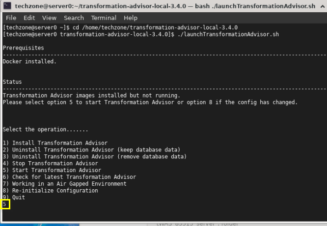

3. Tras unos instantes, se iniciará la aplicación **Transformation Advisor** . Haga clic con el botón derecho en el enlace URL de la aplicación y seleccione **"Abrir enlace"** para abrirla en una ventana del navegador web.

    La URL se muestra en la salida del comando TA: [http://server0.gym.lan:3000](http://server0.gym.lan:3000)

    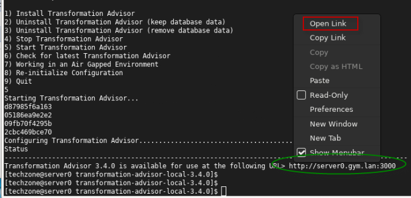

    Esta página de inicio **de Transformation Advisor** se muestra en el navegador web.

    

En la siguiente sección, usará la interfaz de usuario del Asesor de Transformación para descargar la **utilidad del recopilador de datos** para el entorno de WebSphere Application Server. En este laboratorio, WebSphere se ejecuta en la máquina virtual Linux.

### **Descargar la utilidad Transformation Advisor Data Collector**

Ahora que Transformation Advisor está en ejecución, descargará su utilidad Data Collector que se ejecutará en WebSphere Application Server para recopilar datos de configuración del servidor y de la aplicación para su análisis y evaluación para modernizar el entorno de ejecución a Liberty.

Para evaluar aplicaciones Java locales, debe ejecutar **la utilidad Recopilador de datos de Transformation Advisor** en el entorno del servidor de aplicaciones. Esta extraerá la aplicación y la configuración del entorno.

Utilice los siguientes pasos para descargar la utilidad de recopilación de datos del Transformation Advisor

1. Desde la página de inicio de Transformation Advisor, cree un **nuevo espacio de trabajo**

    a. Haga clic en el botón **Crear nuevo**

    b. Ingrese el nombre del espacio de trabajo como **WAS855** y luego haga clic en el botón **Crear.**

    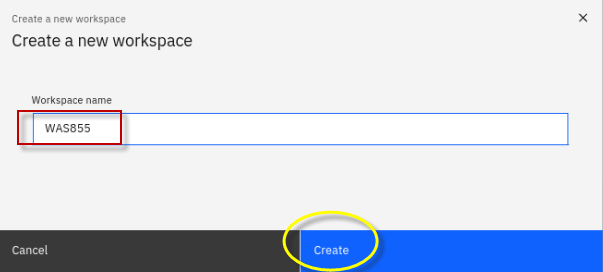

    <table>
    <tbody>
    <tr class="odd">
    <td></td>
    <td>
    <p><strong>Información:</strong></p>
    <p>Un espacio de trabajo es un área designada que albergará las recomendaciones de migración proporcionadas por **Transformation Advisor** desde su entorno de servidor de aplicaciones. Puede nombrarlas y organizarlas como desee, ya sea por aplicación empresarial, ubicación o equipos.</p>
    </td>
    </tr>
    </tbody>
    </table>

    Una vez creado el espacio de trabajo, tendrá opciones para **descargar** la utilidad Recopilador de datos o **cargar** un archivo de datos existente en TA para su análisis.

    

2. Haga clic en el botón **Descargar** para descargar el recopilador de datos para Linux

    

3. En la página de descargas, puede descargar la utilidad de recopilación de datos según el sistema operativo de origen para su entorno WebSphere. También muestra cómo usar la utilidad de línea de comandos para recopilar datos de aplicaciones y configuración de servidores WebSphere, WebLogic y Tomcat.

    a. Dado que WebSphere se ejecuta en la máquina virtual de laboratorio, que es el sistema operativo Linux, haga clic en **Descargar Linux** para obtener la utilidad.

    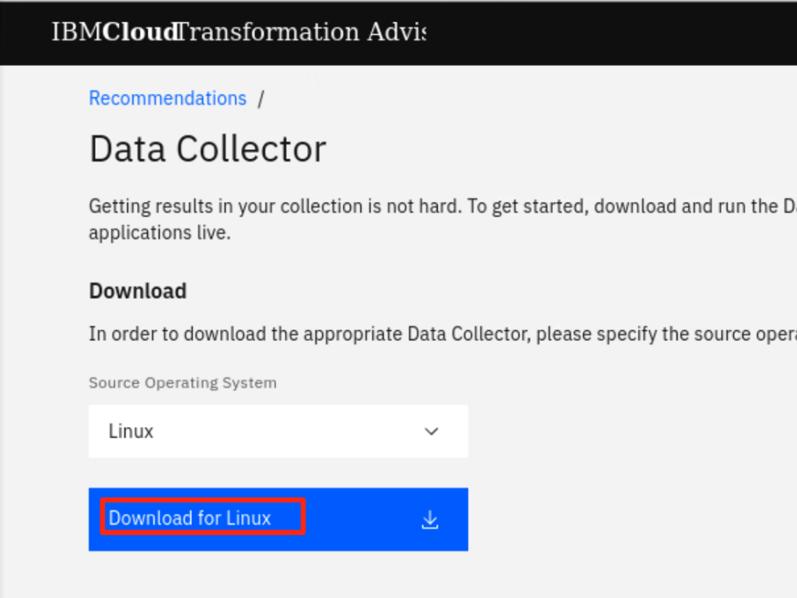 datos generados por "md-type="image"&gt;

    b. En el navegador Firefox, una vez finalizada la descarga, verá el archivo en la carpeta " **Descargas** ".

    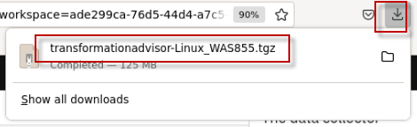

    **Nota:** El archivo comprimido de la utilidad Data Collector se guardará como:

    / **inicio/techzone/Descargas/transformationadvisor-Linux_WAS855.tgz**

### **Ejecute la utilidad Recopilador de datos de Transformation Advisor**

Después de descargar la utilidad Data Collector comprimida, es necesario descomprimirla y ejecutarla en un servidor de aplicaciones WebSphere (WAS) para recopilar todos los datos de las aplicaciones implementadas y su configuración desde el servidor WAS.

Ahora, ejecutemos el recopilador de datos.

1. Regrese a la ventana del terminal y navegue al directorio **/home/techzone/Downloads** y vea su contenido con los comandos:

    ```
    cd /home/techzone/Downloads/

    ls -l | grep transformationadvisor
    ```

    Puede ver el archivo de utilidad de recopilación de datos descargado llamado “ **transformationadvisor-Linux_WAS855.tgz** ”

    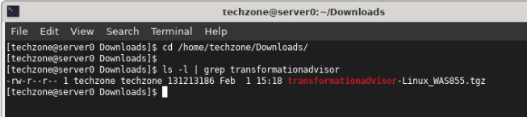

2. Cree un nuevo directorio y extraiga la utilidad recopiladora de datos al nuevo directorio, utilizando los siguientes comandos:

    ```
    mkdir ~/Student/lab_1005

    tar xvfz transformationadvisor-Linux_WAS855.tgz --directory ~/Student/lab_1005
    ```

    La utilidad del recopilador de datos se extraerá a:

    "/inicio/techzone/Estudiante/laboratorio_1005/asesor-de-transformaciones-3.4.0"

3. Verifique que el recopilador de datos se haya extraído al directorio de destino:

    ```
    ls -l /home/techzone/Student/lab_1005/transformationadvisor-3.4.0
    ```

    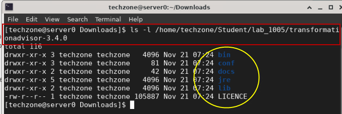

    **Nota:** En este punto, el recopilador de datos está listo para ejecutarse en un entorno WebSphere.

4. Regrese a la interfaz de usuario de Transformation Advisor en el navegador web para ver la sección “ **Ejecutar la herramienta** ”, que muestra el comando para ejecutar en el entorno de WebSphere.

    a. Desde la página **Recopilador de datos** , desplácese hacia abajo hasta la sección " **Ejecutar herramienta** ".

    El comando recopilador de datos que se ejecutará se basa en las selecciones **de dominio** y **tipo de análisis** que realice en esta sección.

    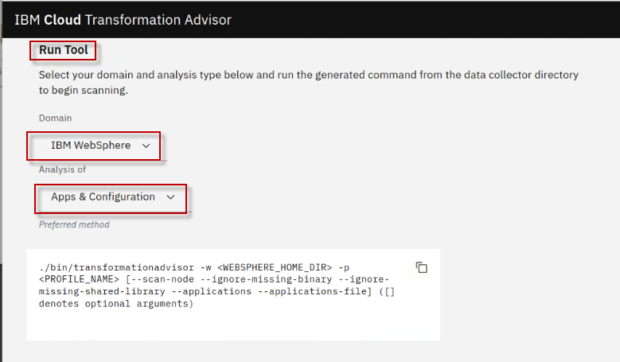

5. Seleccione el dominio **IBM WebSphere** .

    **Nota:** El comando de la herramienta recopiladora de datos cambia según esta selección.

    

6. Seleccione el tipo de análisis de “ **Aplicaciones y configuración** ”

    Al seleccionar **Aplicaciones y configuración** se garantiza que se recopilen los datos de la aplicación y los datos de configuración del servidor.

    Los datos de configuración del servidor son extremadamente útiles en Transformation Advisor para generar artefactos de implementación en el paquete de migración, que exploraremos más adelante en el laboratorio.

    

7. Ejecute el comando del recopilador de datos que se muestra a continuación, que se basa en las opciones seleccionadas.

    ```
    cd /home/techzone/Student/lab_1005/transformationadvisor-3.4.0/

    bin/transformationadvisor -w /opt/IBM/WebSphere/AppServer85515 -p AppSrv01
    ```

    <table>
    <tbody>
    <tr class="odd">
    <td></td>
    <td>
    <p><strong>Consejo:</strong></p>
    <p>La opción <strong>-w</strong> es el directorio de instalación de WebSphere Application Server.<br> La opción <strong>-p</strong> es el nombre del “perfil” de WebSphere del que se recopilarán los datos </p>
    </td>
    </tr>
    </tbody>
    </table>

8. Escriba el número “ **1”** para aceptar el acuerdo de licencia y presione **Enter** , como se ilustra a continuación.

    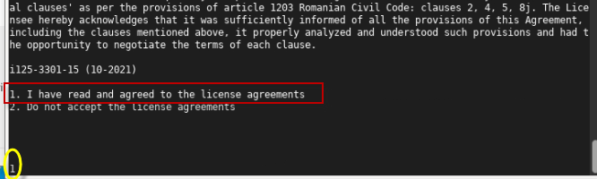

    Este proceso tarda tiempo en completarse, dependiendo de cuántas aplicaciones estén implementadas en el servidor de aplicaciones WebSphere.

    Cuando el recopilador de datos finalice, indicará lo siguiente:

    - Estado: **Terminado**
    - Análisis de configuración: **Completado**
    - Nombre del perfil: **AppSrv01**
    - Solicitudes completadas: **1**
    - Progreso: **100%**

    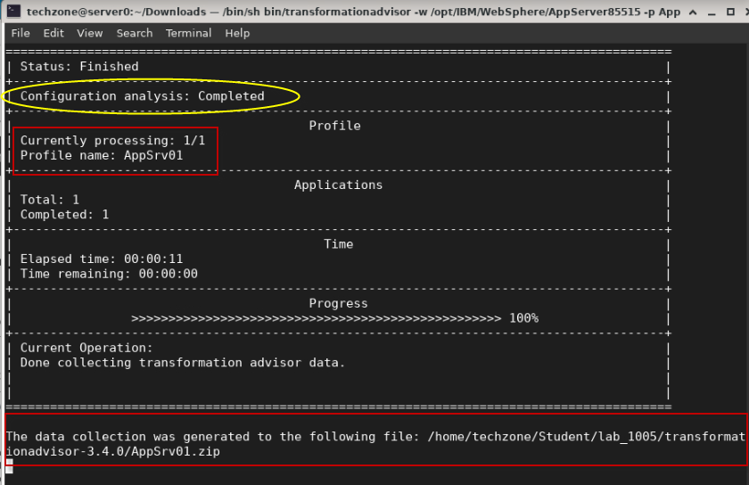

    Cuando se completa la utilidad de recopilación, se muestran los siguientes mensajes.

    > **La recopilación de datos se generó en el siguiente archivo: /home/techzone/Student/lab_1005/transformationadvisor-3.4.0/AppSrv01.zip**
    >
    > **Gracias por subir sus datos. Puede acceder a la interfaz de usuario de la aplicación para realizar un análisis más detallado.**

    Los datos de su solicitud se recopilan y se guardan en el archivo “ **AppSrv01.zip** ”.

    En general, si su servidor de aplicaciones y **Transformation Advisor** están en la misma infraestructura de red, los datos recopilados se cargarán automáticamente en **Transformation Advisor** para que pueda ver los resultados del análisis.

    De lo contrario, deberá cargar manualmente los datos en **Transformation Advisor** antes de poder ver los resultados.

### **Subir la recopilación de datos a Transformation Advisor**

En esta sección, cargará el archivo zip de recopilación de datos “ **AppSrv01.zip** ” desde el entorno de WebSphere para su análisis.

1. Regrese a la página del Asesor de Transformación en el navegador web, haga clic en “ **Tipo de carga de trabajo** ”

    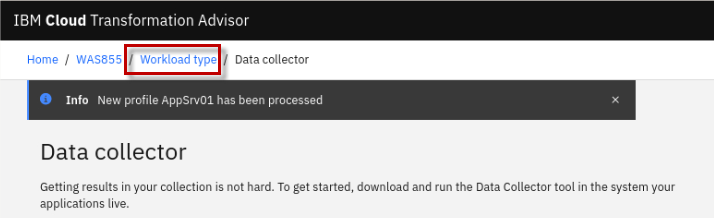

    Una vez que la recopilación de datos se haya cargado en Transformation Advisor, se le redirigirá nuevamente a la vista “ **Todas las aplicaciones Java** ” de Transformation Advisor.

2. Opcionalmente, cambie el tamaño de la ventana del navegador Firefox y reduzca el tamaño del texto, para poder proporcionar una vista óptima de los resultados del análisis de Transformation Advisor.

    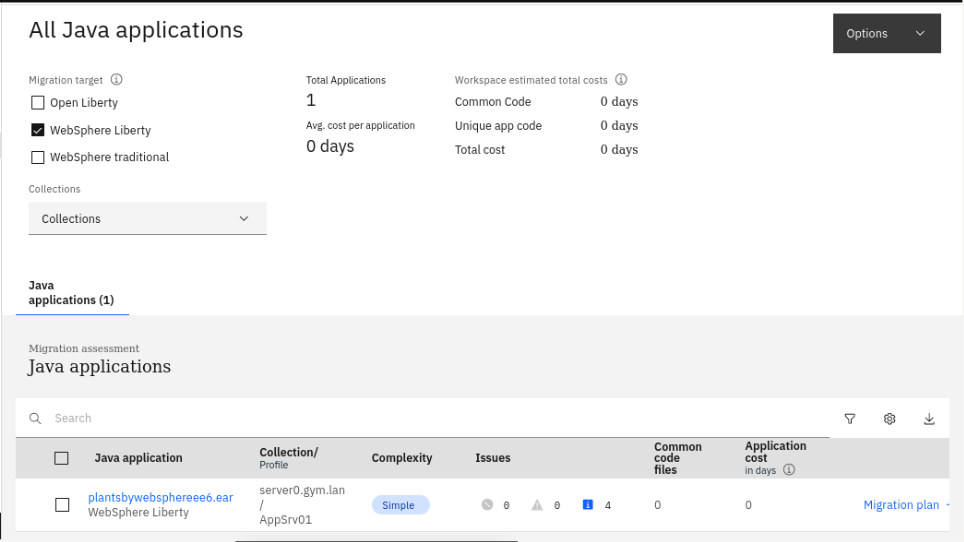

3. Revise la **información de resumen del espacio de trabajo** en la parte superior de la página.

    Observe que la página muestra " **Todas las aplicaciones Java** " del perfil de WebSphere Application Server llamado **AppSrv01** . En este caso, solo se muestra una aplicación: " **plantsbywebsphereee6.ear** ".

    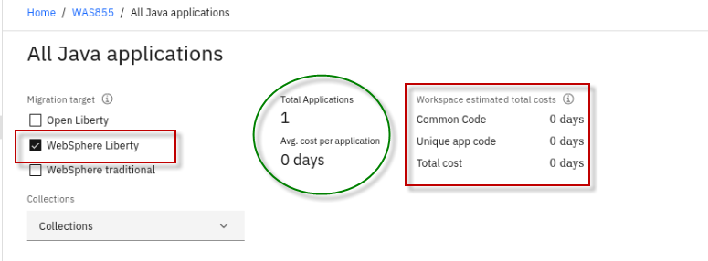

    Los siguientes detalles están incluidos en el “ **resumen del espacio de trabajo** ” ubicado en la parte superior de la página.

    - **Destino de migración:** La selección predeterminada es " **WebSphere Liberty** " como el destino de migración más óptimo. Sin embargo, también puede ver los detalles del análisis de Open Liberty y WebSphere tradicional.

    - **Total de aplicaciones** : el número total de aplicaciones en el espacio de trabajo.

    - **Costo promedio por aplicación** : la cantidad promedio de días de esfuerzo de desarrollo necesarios para migrar una aplicación al destino WebSphere Liberty.

    - **Código común** : el costo total para migrar todo el código común en el espacio de trabajo a la plataforma de destino.

    - **Código de aplicación único** : el costo total para migrar todo el código de aplicación único (código que no se comparte entre aplicaciones) en el espacio de trabajo a la plataforma de destino.

    - **Costo total** : el costo total para migrar todas las aplicaciones y el código común en el espacio de trabajo a la plataforma de destino.

    En la siguiente sección, utilizará Transformation Advisor y realizará una revisión rápida del análisis de datos de la aplicación que se recopilaron para la aplicación “ **PlantsByWebSphere** ”.

## Parte 3: Evaluación rápida de la aplicación PlantsByWebSphere

El objetivo de **la modernización del tiempo de ejecución** de la aplicación PlantsByWebSphere es poder implementar y ejecutar la aplicación en WebSphere Liberty para aprovechar los numerosos beneficios del tiempo de ejecución del moderno servidor de aplicaciones Liberty.

La primera información que obtendrá de Transformation Advisor es la complejidad general requerida para modernizar el entorno de ejecución de Liberty para la aplicación específica que se está evaluando.

En esta sección, realizará una revisión rápida de los resultados del análisis de la aplicación **plantsbywebsphereee6.ear** para obtener una comprensión clara del esfuerzo de desarrollo para modernizar el entorno de ejecución a WebSphere Liberty para la aplicación PlantsByWebSphere.

1. Asegúrese de estar en la página “ **Todas las aplicaciones Java** ” en Transformation Advisor.

    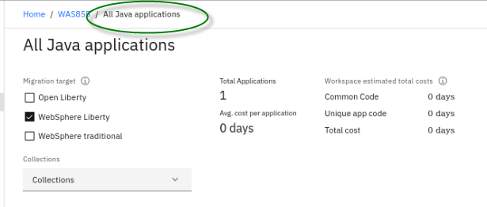

2. Asegúrese de que “ **WebSphere Liberty** ” sea el único destino de migración seleccionado

    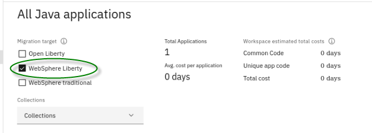

3. En la sección **"Aplicaciones Java"** , ubique **plantsbywebsphereee6.ear** que es la única aplicación que fue analizada por el recopilador de datos.

    Analicemos el resumen de la aplicación con una explicación de las columnas de datos según la ilustración de **plantsbywebsphereee6.ear** a continuación:

    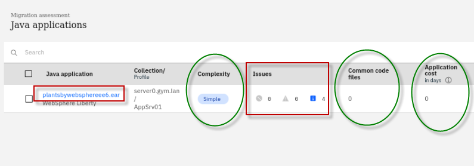

    - Complejidad: **Simple**

        La complejidad indica qué tan compleja considera Transformation Advisor que sería esta aplicación si la migrara a WebSphere Liberty.

        La complejidad puede ser “Simple”, “Moderada” o “Compleja”.

        **Simple** significa que no habrá ningún cambio de código para modernizar el entorno de ejecución de WebSphere Liberty.

        **Moderado** significa que podrían requerirse algunos cambios en el código de la aplicación, pero los cambios son bien conocidos y se gestionan fácilmente.

        **Complejo** significa que el código de la aplicación debe cambiar, generalmente debido al hecho de que la aplicación utiliza API que no están disponibles en Liberty y, por lo tanto, el código de la aplicación debe refactorizarse utilizando diferentes API que sean compatibles con Liberty.

    - **Problemas** : 4 Problemas de información

        La cantidad y la gravedad de los posibles problemas con la migración de la aplicación.

        Se detectaron cuatro problemas de información en la aplicación PlantsByWebSphere. Estos problemas suelen indicar dependencias externas y configuraciones que deben tenerse en cuenta, como la seguridad, las bases de datos y las consideraciones al migrar la aplicación a contenedores.

    - **Archivos de código común** : 0 archivos de código común descubiertos entre las aplicaciones en el espacio de trabajo

        El número de archivos de código común que utiliza esta aplicación. Un archivo se considera común si pertenece a una biblioteca compartida o lo utiliza al menos otra aplicación.

    - **Costo de la aplicación en días** : 0 días de esfuerzo de desarrollo ( **no se requieren cambios en el código de la aplicación** )

        Proporciona una estimación en días para el esfuerzo de desarrollo para realizar la migración solo para esta aplicación.

        En este ejemplo, si desea modernizar el entorno de ejecución de Java a WebSphere Liberty para la aplicación plantbywebsphereee6.ear, el nivel de complejidad es **Simple** , lo que indica que no es necesario cambiar el código de la aplicación antes de poder trasladarlo a WebSphere Liberty.

        La aplicación no tiene dependencias, no contiene código común conocido ni archivos de biblioteca compartidos. Presenta cuatro problemas menores (de nivel informativo).

        **Nota:** El esfuerzo de desarrollo estimado es de **"cero días"** porque no se requiere ningún cambio de código.

    

4. Haga clic en el enlace **plantbywebsphereee6.ear** para ampliar los resultados del análisis y acceder a varios informes de evaluación.

    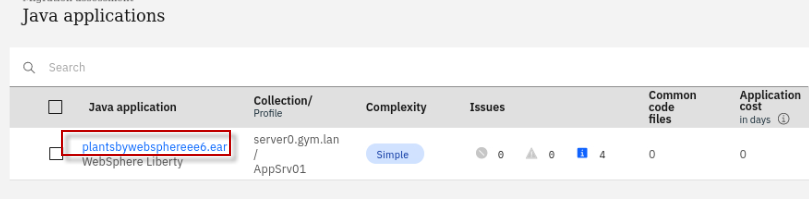

5. Desplácese hasta la parte inferior de la página y haga clic en el enlace **Informe de tecnología** ; esto abre una nueva ventana del navegador y muestra el informe de tecnología.

    

    El **informe de tecnología** enumera todas las tecnologías Java que utiliza la aplicación y si estas tecnologías son compatibles con una plataforma WebSphere específica, desde Liberty para Java en IBM Cloud hasta WebSphere tradicional para z/OS.

    Se utiliza para determinar si una edición particular de WebSphere es adecuada para una aplicación en los distintos entornos de ejecución de destino.

    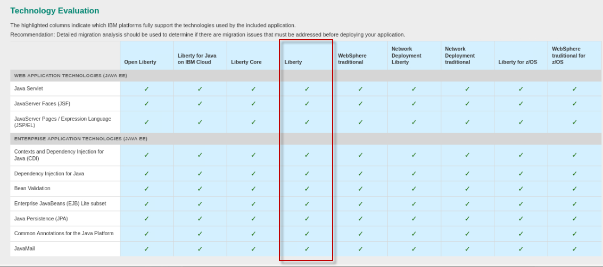

    <table>
    <tbody>
    <tr class="odd">
    <td></td>
    <td>
    <p><strong>Consejo:</strong></p>
    <p>Tenga en cuenta que las API utilizadas en la aplicación PlantsByWebSphere están 100 % disponibles en WebSphere Liberty, lo que demuestra que la aplicación es un candidato adecuado para la modernización del tiempo de ejecución a WebSphere Liberty.</p>
    </td>
    </tr>
    </tbody>
    </table>

6. **Cierre** la pestaña Informe de tecnología de aplicación en el navegador Firefox.

7. Regresar a la vista “ **Todas las aplicaciones Java** ” en Transformation Advisor

    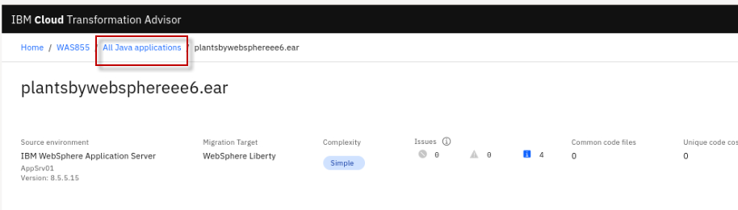

    A partir de este análisis rápido que revisó anteriormente, aprendió que la aplicación PlantsByWebSphere es adecuada para la modernización del tiempo de ejecución a WebSphere Liberty.

    En la siguiente sección, explorará y descargará los artefactos de implementación que Transformation Advisor generó para facilitar la implementación de la aplicación PlantsByWebSphere en WebSphere Liberty.

    Luego, en un laboratorio separado, aprovechará estos artefactos de implementación mientras implementa la aplicación PlantsByWebSphere en WebSphere Liberty que instalará en la VM.

## Parte 4: Explore y descargue el paquete de migración para la aplicación PlantsByWebSphere

Transformation Advisor muestra detalles sobre el **plan de migración** que generó para acelerar la migración de WebSphere tradicional a WebSphere Liberty.

El plan de migración incluye un **conjunto** de diversos artefactos, según las necesidades de la aplicación para acelerar la creación, configuración e implementación de una aplicación en máquinas virtuales o contenedores.

Ahora, exploremos rápidamente el **plan de migración** de la aplicación PlantsByWebSphere para ver los artefactos que Transformation Advisor creó para acelerar la implementación de la aplicación en el entorno de ejecución de destino de WebSphere Liberty.

1. Asegúrese de estar en la vista “ **Todas las aplicaciones Java** ” en Transformation Advisor, que muestra la lista de resumen de aplicaciones Java

    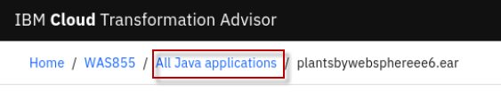

2. Asegúrese de que solo esté seleccionado el destino de migración **de WebSphere Liberty**

    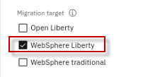

3. Haga clic en el enlace **Plan de migración** ubicado junto a la aplicación **plantsbywebsphereee6.ear** , que mostrará su **plan de migración** para el entorno de ejecución de destino de WebSphere Liberty.

    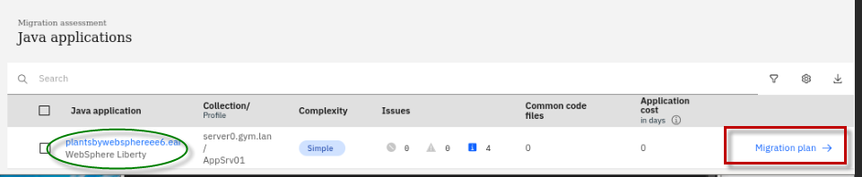

4. Se muestra la página del Plan de Migración

    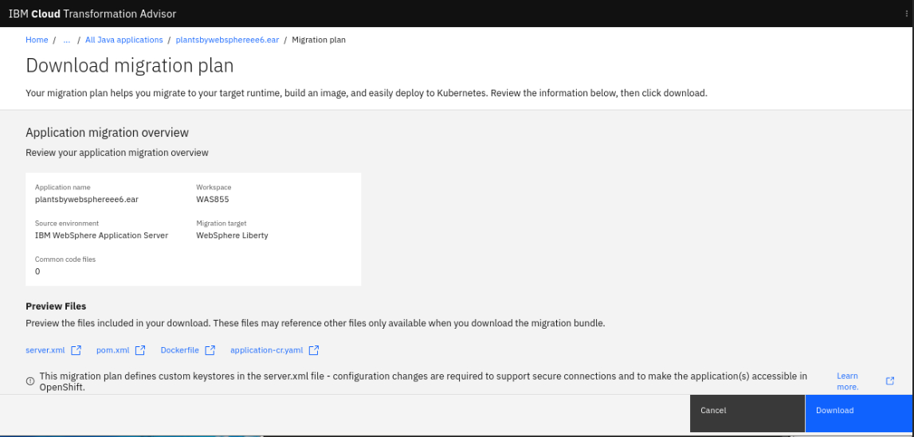

5. Desplácese hacia abajo hasta la sección **"Archivos de vista previa"** del plan de migración. Observe los archivos generados por Transformation Advisor para acelerar la compilación y la implementación de la aplicación en Liberty.

    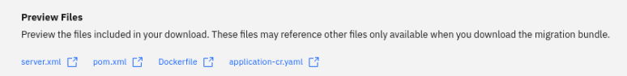

    Para acelerar la modernización de las aplicaciones, los artefactos producidos por Transformation Advisor incluyen:

    - **server.xml** : la configuración para el servidor Liberty
    - **pom.xml** : Construye la aplicación usando Maven
    - **Aplicación CR** : recurso personalizado para la aplicación que se implementará en OpenShift a través del operador Open Liberty
    - **Dockerfile** : crea la imagen de Docker para la aplicación

    El usuario puede elegir **descargar** los artefactos como un paquete de migración.

6. Desplácese hacia abajo y revise las " **Dependencias de la aplicación** ". Luego, expanda la aplicación **"plantsbywebsphereee6.ear"** .

    El Asesor de Transformación detectó dos bibliotecas de bases de datos DB2 como dependencias necesarias para la aplicación PlantsByWebSphere. Durante el proyecto de migración, deberá recopilar las bibliotecas necesarias y colocarlas en la ruta de bibliotecas de Liberty.

    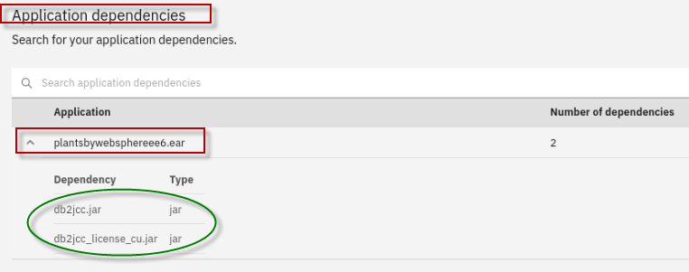

7. Haga clic en el botón **Descargar** para descargar el paquete de artefactos al sistema de archivos local en la VM server0.gym.lan.

    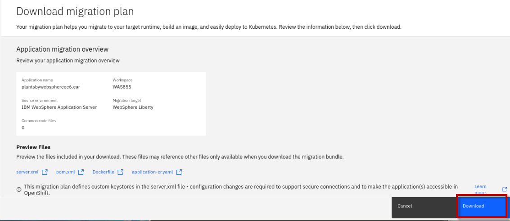

    El paquete de migración denominado “ **plantsbywebsphereee6.ear_migrationBundle.zip”** se descargará en el directorio **/home/techzone/Downloads** .

    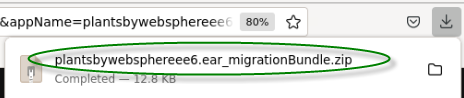

8. Descomprima los artefactos del paquete de migración en una nueva carpeta en la máquina virtual server0.gym.lan

    a. Desde una ventana de terminal, ejecute los siguientes comandos para descomprimir el paquete de migración en un nuevo directorio llamado " **pbw** - **bundle** ":

    ```
    mkdir /home/techzone/Student/lab_1005/pbw-bundle

    cd /home/techzone/Student/lab_1005/pbw-bundle

    unzip ~/Downloads/plantsbywebsphereee6.ear_migrationBundle.zip -d ~/Student/lab_1005/pbw-bundle

    ls -l
    ```

    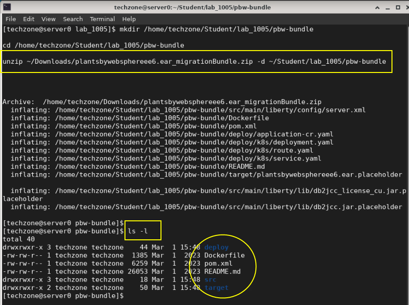

**¡Felicitaciones!** Ha evaluado con éxito la aplicación PlantsByWebSphere y ha determinado que es apta para su implementación en un entorno de ejecución moderno de WebSphere Liberty Server.

Ha descargado los artefactos del acelerador de implementación generados por Transformation Advisor, que acelerarán la configuración y la implementación de PlantsByWebSphere en Liberty.

Los siguientes pasos, que se detallan en el siguiente laboratorio; “ **Lab_1010-Modernización del tiempo de ejecución** ”, son:

- Instalar WebSphere Liberty mediante el método de instalación de archivo

- Crear un nuevo servidor WebSphere Liberty

- Configure el servidor WebSphere Liberty utilizando los aceleradores de implementación generados por Transformation Adviser, es decir, el archivo “ **server.xml** ”.

- Implementar la aplicación PlantsByWebSphere en WebSphere Liberty

## **Resumen**

En este laboratorio, aprendió a evaluar la aplicación Java existente utilizando Transformation Advisor.

Descargó los aceleradores de implementación generados por Transformation Advisors del paquete de migración que aceleran la compilación, la configuración y la implementación de una aplicación en Liberty.

Transformation Advisor acelera la migración de aplicaciones a Liberty y ayuda a minimizar errores y riesgos, al tiempo que acelera el tiempo para obtener valor.

**¡Felicidades!**

**Has completado con éxito el laboratorio “Asesor de Transformación”**
