# Laboratorio 1010: Modernice su entorno de ejecución a WebSphere Liberty


**Última actualización:** marzo de 2023

**Duración:** 60 - 90 minutos

¿Necesitas ayuda? Contacta con **Kevin Postreich, Yi Tang.**

## Introducción

**Modernizar el entorno de ejecución** se refiere a trasladar una aplicación a un entorno de ejecución Java moderno con la menor cantidad de esfuerzo.

**WebSphere Liberty** es un servidor de aplicaciones Java rápido, dinámico y fácil de usar, ideal para aplicaciones monolíticas y aplicaciones nativas de la nube.

WebSphere Liberty se basa en el proyecto de código abierto Open Liberty. Liberty ofrece tiempos de inicio extremadamente rápidos, no requiere reiniciar el servidor para implementar los cambios y es fácil de configurar con un archivo de configuración XML simple y legible.

La modernización del entorno de ejecución permite integrar la aplicación en WebSphere Liberty con el mínimo esfuerzo. El objetivo es lograr eficiencia y agilidad basadas en las propuestas de valor de WebSphere Liberty, minimizando al máximo los cambios en el código de la aplicación.

Un punto importante de la “modernización del tiempo de ejecución” es que la aplicación en sí no se “moderniza” a una arquitectura más nueva, como los microservicios.** Como tal, la aplicación permanece prácticamente sin cambios y, al mismo tiempo, logra resultados comerciales significativos con un riesgo limitado.

El siguiente diagrama muestra el flujo de decisiones de alto nivel donde se utiliza IBM Cloud Transformation Advisor para analizar aplicaciones existentes y se toma la decisión de trasladar la aplicación monolítica a WebSphere Liberty en máquinas virtuales.

Este laboratorio demuestra **la modernización del entorno de ejecución** . Utiliza la aplicación PlantsByWebSphere, que se originó en WebSphere ND V8.5.5.

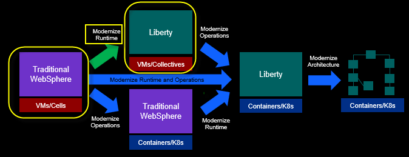

Después de modernizar el entorno de ejecución a WebSphere Liberty en máquinas virtuales, la empresa está bien posicionada para contenerizar la aplicación para implementaciones basadas en la nube de Kubernetes, si es necesario implementar una estrategia de contenedorización.

**Una breve descripción general de "¿Por qué modernizar mi entorno de ejecución a Liberty?"**

Antes de adentrarnos en el aspecto práctico de la modernización del entorno de ejecución a WebSphere Liberty, demos un paso atrás y comprendamos por qué es importante modernizar el entorno de ejecución a Liberty y cómo aporta valor y eficiencia significativos a su negocio.

Para su referencia, aquí encontrará un artículo completo sobre el gran valor de WebSphere Liberty. Pero repasemos algunos de los puntos clave en este breve resumen.

**Lea el artículo completo** : [ibm.biz/6ReasonsWhyLiberty](https://ibm.biz/6ReasonsWhyLiberty)

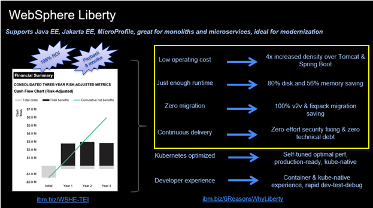

### Bajos costos operativos

Liberty e IBM Semeru Java están diseñados para ser extremadamente eficientes en términos de memoria y disco, a la vez que ofrecen un rendimiento líder en la industria. Como resultado, se puede lograr un ahorro significativo de costos utilizando Liberty y Semeru Java basado en OpenJ9.

Dado que Liberty utiliza menos memoria y espacio en disco que cualquier otro entorno de ejecución de Java, puede implementar más aplicaciones Java de Liberty, utilizando menos recursos físicos, lo que representa un gran ahorro de costos para su negocio.

Esto es igualmente beneficioso para la eficiencia de las aplicaciones monolíticas y de las aplicaciones nativas de la nube.

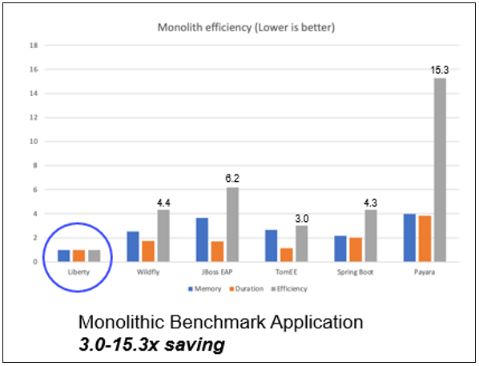

### Tiempo de ejecución justo: el tamaño adecuado para su aplicación específica

Liberty es un **entorno de ejecución totalmente modular** que te permite elegir las capacidades que necesitas para tu aplicación. Con Liberty, tienes un único entorno de ejecución y un único enfoque para desarrollar e implementar aplicaciones que escalan desde pequeños microservicios hasta monolitos empresariales modernos y cualquier entorno intermedio.

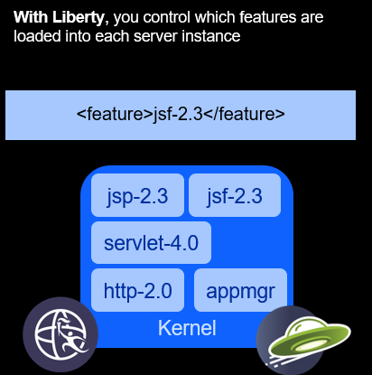

### Migración cero

Con los servidores de aplicaciones tradicionales, y de hecho con cualquier otro entorno de ejecución, se requiere la migración del código de la aplicación cuando se actualiza a versiones más nuevas del entorno de ejecución.

La migración de una versión a otra es un proceso complejo debido a los cambios de configuración, los cambios en el comportamiento del entorno de ejecución y la eliminación de obsolescencias. Esto conlleva migraciones costosas con escasos beneficios perceptibles para la empresa. Como resultado, no es raro que las migraciones tarden desde meses hasta más de un año en completarse.

Liberty es diferente. Su arquitectura de migración cero permite que el comportamiento de la configuración se mantenga entre versiones.

El comportamiento de las funciones no se modifica ni se eliminan. Esto significa que un servidor y una aplicación que funcionaban en Liberty hace años siguen funcionando y seguirán funcionando en el futuro, sin cambios.

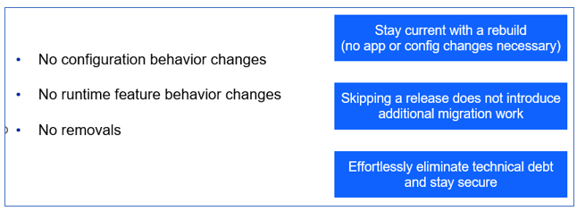

### Entrega continua: bajo mantenimiento, cero deuda técnica

Debido al **modelo de características** de Liberty y a la arquitectura **de migración cero** , Liberty sigue un modelo de entrega de flujo único.

Solo hay una versión de Liberty, por lo que no es necesario actualizarla. Además, cada nueva versión reinicia el período de soporte de 5 años, por lo que no se necesitan extensiones.

Simplemente instale los nuevos fixpacks para obtener las últimas mejoras de rendimiento, funciones y correcciones de errores. Después, simplemente dirija sus servidores Liberty existentes desde la última instalación de Liberty, eliminando así los problemas de gestión de la deuda técnica.

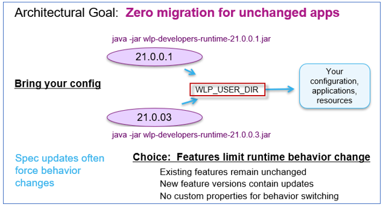

## **Accediendo al entorno**

Si realiza este laboratorio como parte de un taller impartido por un instructor (virtual o presencial), ya se le ha proporcionado un entorno. El instructor le proporcionará los detalles para acceder al laboratorio.

De lo contrario, deberá reservar un entorno para el laboratorio. Puede obtenerlo aquí. Siga las instrucciones en pantalla para la opción " **Reservar ahora** ".

KLP: ENLACE A DETERMINAR PARA LA RESERVA DE ENV

El entorno de laboratorio contiene dos (2) máquinas virtuales Linux.


Se configura un servicio publicado para proporcionar acceso a la VM **server0** a través de la interfaz noVNC para el entorno de laboratorio.

1. Acceda al entorno de laboratorio desde su navegador web.

    a. Una vez aprovisionado el entorno, haga clic con el botón derecho en el enlace **"Servicio publicado"** . A continuación, seleccione " **Abrir enlace en una nueva pestaña** " en el menú contextual.

    

    b. Haga clic en el enlace **"vnc.html"** para abrir el entorno de laboratorio a través de la interfaz **noVNC** .

    

    c. Haga clic en el botón **Conectar**

    

    d. Ingrese la contraseña: **passw0rd** . Luego, haga clic en el botón **"Enviar credenciales"** para acceder al entorno de laboratorio.

    **Nota:** Ese es un cero numérico en passw0rd

    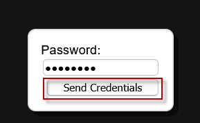

2. Inicie sesión en la máquina virtual **server0** utilizando las credenciales a continuación:

    - ID de usuario: **techzone**

    - Contraseña: **IBMDem0s!**

## Consejos para trabajar en el entorno de laboratorio

1. Puede cambiar el tamaño del área visible utilizando las opciones **de configuración de noVNC** para cambiar el tamaño del escritorio virtual para que se ajuste a su pantalla.

    a. Desde la máquina virtual del entorno, haga clic en el **icono de giro** en el panel de control noNC para abrir el menú.

    

    b. Para aumentar el área visible, haga clic en `Settings > Scaling Mode` y configure el valor en `Remote Resizing`

    

2. Puede copiar/pegar texto de la guía de laboratorio en el entorno de laboratorio utilizando el portapapeles en el visor noVNC.

    a. Copie el texto de la guía de laboratorio que desea pegar en el entorno de laboratorio.

    b. Haga clic en el icono **del Portapapeles** y **pegue** el texto en el portapapeles de noVNC.

    

    c. Pegue el texto en la máquina virtual, como en una ventana de terminal, una ventana del navegador, etc.

    d. Haga clic en el icono **del portapapeles** nuevamente para cerrarlo.

    > **NOTA:** A veces, pegar en una ventana de Terminal en la VM no funciona de manera consistente.

    > En este caso, puedes intentarlo nuevamente, o abrir otra ventana de terminal e intentarlo nuevamente, o pegar el texto en un **editor de texto** en la máquina virtual y luego pegarlo en la ventana de terminal en la máquina virtual.

3. Como alternativa a la opción "Copiar y pegar" de noVNC, puede considerar abrir la guía de laboratorio en un navegador web dentro de la máquina virtual. Con este método, puede copiar y pegar fácilmente texto de la guía de laboratorio sin tener que usar el portapapeles de noVNC.

<br>

## Laboratorio: Modernice su entorno de ejecución a WebSphere Liberty

El objetivo de este laboratorio es demostrar **la modernización del tiempo de ejecución,** lo que se refiere a mover una aplicación Java a WebSphere Liberty con la menor cantidad de esfuerzo.

Este laboratorio se centra en la modernización del servidor de aplicaciones WebSphere tradicional a WebSphere Liberty en máquinas virtuales.

En esta sección, instalará WebSphere Liberty, creará un nuevo servidor Liberty y aprovechará los artefactos generados por Transformation Advisor para configurar y ejecutar la aplicación PlantsByWebSphere en su nuevo servidor WebSphere Liberty.

Este laboratorio contiene las siguientes actividades:

- Clonar el repositorio git en la máquina virtual, que contiene los artefactos necesarios para el laboratorio

- Instalar WebSphere Liberty Kernel utilizando el “Método de archivo”

- Configurar WebSphere Liberty utilizando el server.xml generado por Transformation Advisor

- Ejecute la aplicación en el nuevo servidor WebSphere Liberty en la máquina virtual

## **Clonar el repositorio de GitHub para este taller**

Este laboratorio requiere artefactos almacenados en un repositorio de GitHub. Ejecute el siguiente comando para clonar el repositorio en la máquina virtual local utilizada para el laboratorio.

1. Si aún no lo ha hecho en un laboratorio anterior, clone el repositorio de GitHub que contiene los artefactos del laboratorio.

    a. Abra una nueva ventana de terminal en la máquina virtual “ **server0.gym.lan** ”.

    

    b. Clonar el repositorio de GitHub necesario para el laboratorio.

    ```
    git clone https://github.com/IBMTechSales/liberty_admin_pot.git
    ```

    c. Navegue al directorio “lab-scripts” en el repositorio clonado.

    ```
    cd ~/liberty_admin_pot/lab-scripts
    ```

    d. Agregue los permisos de "ejecución" a los directorios de scripts de laboratorio y a los scripts de shell.

    ```
    chmod -R 755 ./
    ```

## Instalar WebSphere Liberty mediante el método de archivo

En la configuración inicial de Liberty, lo instalará mediante el método **de archivo** . Luego, creará su primer servidor Liberty, lo iniciará y revisará los registros para garantizar que se inicie correctamente.

Utilizará el entorno de máquina virtual Linux que se ha preparado para el laboratorio e incluye el siguiente software:

- El archivo **Liberty** se ha descargado al directorio **/home/techzone/Student/LabFiles/wlp-kernel-22.0.0.8**

- El **IBM JDK 1.8** está instalado en el directorio **/opt/IBM/ibm-java-x86_64-80**

WebSphere Liberty se puede instalar a través de IBM Installation Manager, pero la forma más conveniente es utilizar una instalación de archivo.

Para instalar Liberty utilizando el “ **método de archivo** ”, realice los siguientes pasos:

1. Abra una ventana de Terminal haciendo clic en el ícono apropiado en el escritorio de la VM:

2. Navegue al directorio de inicio del usuario de techzone:

    ```
    cd /home/techzone
    ```

3. Cree un directorio llamado "lab_1010" donde instalará WebSphere Liberty. Luego, navegue hasta ese directorio.

    ```
    mkdir /home/techzone/Student/lab_1010

    cd /home/techzone/Student/lab_1010
    ```

4. Extraiga el paquete del kernel WebSphere Liberty al directorio **~/Student/lab_1010** .

    El archivo Liberty es un archivo comprimido. Para extraerlo, use el comando unzip.

    ```
    unzip ~/Student/LabFiles/wlp-kernel-22.0.0.8.zip -d ~/Student/lab_1010
    ```

    - Se extrae el archivo Liberty y ahora está instalado en **/home/techzone/Student/lab_1010/wlp** .

5. Establezca la ruta **JAVA_HOME** para indicarle a Liberty que use el SDK de Java que se instaló para el laboratorio.

    ```
    export JAVA_HOME=/opt/IBM/ibm-java-x86_64-80/jre/
    ```

<table>
<tbody>
<tr class="odd">
<td></td>
<td>
<p><strong>Información:</strong></p>
<p>En este laboratorio, la aplicación que configure para ejecutarse en WebSphere Liberty requiere Java 8, ya que la aplicación no se ha modificado para ejecutarse en versiones más nuevas de Java.</p>
</td>
</tr>
</tbody>
</table>

1. Vaya al directorio de WebSphere Liberty. Aquí es donde se instaló Liberty descomprimiendo el archivo zip.

    ```
    cd /home/techzone/Student/lab_1010/wlp
    ```

2. Mostrar la “ **información del producto”** para WebSphere Liberty

    a. Mostrar la edición y versión del producto Liberty

    ```
    bin/productInfo version
    ```

    La salida debe indicar que la edición Liberty es **BASE** y la versión del producto coincidirá con el archivo Liberty que se utilizó para instalar Liberty en el laboratorio, 22.0.0.8.

    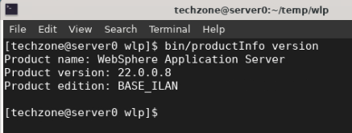

    Los paquetes de reparación Liberty se entregan en un intervalo de entrega continua de cuatro semanas.

    - La versión indica el AÑO y el MES del fixpack Liberty instalado.
    - 22.0.0.8 es el
        <sup>octavo</sup> paquete de correcciones de 2022

    b. Muestra la lista de características que están instaladas en la instalación de Liberty.

    ```
    bin/productInfo featureInfo
    ```

    La salida **de línea en blanco** indica que no hay ninguna función instalada. Esto se debe a que instaló el kernel de WebSphere Liberty.

    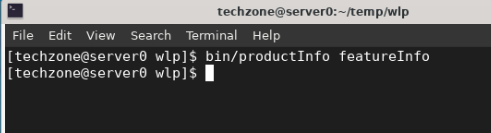

    El **kernel** contiene únicamente el kernel Liberty y ninguna función de tiempo de ejecución adicional. Se recomienda esto para que pueda instalar únicamente las funciones necesarias para una aplicación específica y sus requisitos operativos.

    Más adelante en el laboratorio, cuando implemente la aplicación PlantsByWebSphere, instalará solo las características de Liberty que se especifican en el archivo de configuración del servidor de Liberty, server.xml, que fue generado por Transformation Advisor.

    **¡Felicitaciones! Acabas de instalar Liberty mediante el método de instalación de archivo** .

## Cree un nuevo servidor Liberty que ejecutará la aplicación de muestra, “PlantsByWebSphere”

1. Desde la ventana de terminal, asegúrese de estar en el directorio de instalación del entorno de ejecución de Liberty

    ```
    cd /home/techzone/Student/lab_1010/wlp
    ```

2. Ejecute el siguiente comando para **crear** un nuevo servidor llamado “ **pbwServer** ”

    ```
    bin/server create pbwServer
    ```

    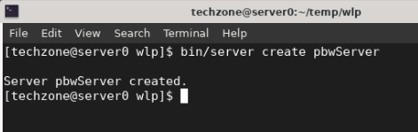

    El comando de creación de servidor crea un nuevo servidor Liberty con el nombre “pbwServer”.

    El comando del servidor también admite acciones para iniciar, detener, crear, empaquetar y volcar un servidor Liberty.

    **Puede encontrar detalles adicionales sobre el comando del servidor aquí:**

    [https://www.ibm.com/docs/es/was-liberty/base?topic=line-server-command-options](https://www.ibm.com/docs/en/was-liberty/base?topic=line-server-command-options)

3. El nuevo servidor Liberty se crea en el siguiente directorio:

    /inicio/techzone/Estudiante/laboratorio_1010/wlp/usr/servidores/pbwServer

    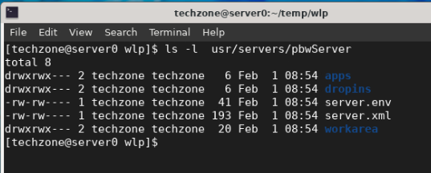

4. Abra un editor para ver el archivo de configuración del servidor.

    ```
    gedit ~/Student/lab_1010/wlp/usr/servers/pbwServer/server.xml
    ```

    El archivo **server.xml** es la configuración completa del servidor predeterminada cuando solo está instalado el kernel Liberty.

    El **server.xml** define una configuración mínima necesaria para iniciar un servidor Liberty.

    En este ejemplo, dado que instaló el kernel Liberty que no incluye ninguna característica de JAVA EE, el archivo server.xml solo incluye la definición &lt;server&gt; necesaria para poder iniciar el servidor Liberty.

    Más tarde, instalará las funciones necesarias para ejecutar la aplicación PlantsByWebSphere.

    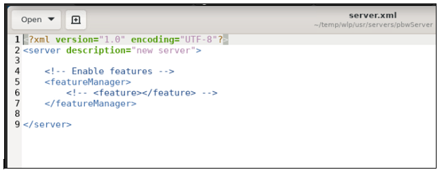

5. **Cierre** el editor gedit.

6. **Inicie** la instancia del servidor utilizando el comando **de inicio del servidor** :

    ```
    bin/server start pbwServer
    ```

    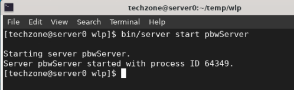

    Este comando inicia el servidor Liberty. El registro del servidor, " **messages.log** ", se guarda en el directorio **wlp/usr/servers/pbwServer/logs** .

7. Vea el archivo **messages.log** del servidor Liberty para ver los mensajes de inicio del servidor

    ```
    cat ~/Student/lab_1010/wlp/usr/servers/pbwServer/logs/messages.log
    ```

    El servidor se inicia cuando se muestra el mensaje “ **El servidor pbwServer está listo para ejecutar un planeta más inteligente”** en el archivo messages.log.

    El archivo messages.log también muestra los detalles del producto y del entorno del servidor, como se resalta en la siguiente ilustración.

    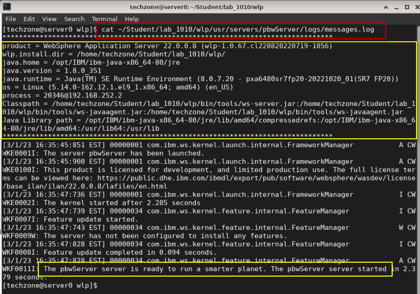

8. **Detenga** el servidor con el comando **de detención del servidor** :

    ```
    bin/server stop pbwServer
    ```

    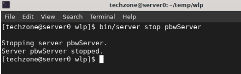

    Una vez verificada la instalación de Liberty, continuará con el laboratorio para modernizar el entorno de ejecución de la aplicación PlantsByWebSphere del servidor de aplicaciones WebSphere tradicional al nuevo servidor de aplicaciones WebSphere Liberty.

## Utilice los aceleradores de implementación de Transformation Advisor para configurar la aplicación PlantsByWebSphere para la implementación de WebSphere Liberty

En esta sección, aprovechará el archivo **server.xml** generado por Transformation Advisor para configurar y ejecutar la aplicación PlantsByWebSphere en el servidor WebSphere Liberty que instaló y creó en la sección anterior del laboratorio.

Transformation Advisor puede generar una colección de artefactos de implementación, como un archivo zip, conocido como “ **paquete de migración** ”, que incluye archivos de implementación personalizados que aceleran la implementación de su aplicación Java en WebSphere Liberty y, opcionalmente, en Liberty en contenedores.

El archivo “ **server.xml** ” generado se configura para la aplicación **PlantsByWebSphere** según la configuración de WebSphere detectada cuando el recopilador de datos de Transformation Advisor se ejecutó en el servidor de aplicaciones WebSphere que aloja la aplicación.

El archivo **server.xml** es solo uno de los aceleradores de implementación generados por Transformation Advisor e incluidos en un “paquete de migración”.

También se generaron artefactos de implementación adicionales para implementar la aplicación en contenedores, pero no es el foco de este laboratorio.

<table>
<tbody>
<tr class="odd">
<td></td>
<td>
<p><strong>Nota:</strong> El uso de la utilidad de recopilación de datos de Transformation Advisor está fuera del alcance de este laboratorio.</p>
<p>En esta serie PoT, Lab_1005 muestra cómo utilizar el recopilador de datos y generar el paquete de migración que aprovechará en este laboratorio.</p>
</td>
</tr>
</tbody>
</table>

### **Preparación para la migración a WebSphere Liberty**

Transformation Advisor es una innovadora herramienta de modernización, desarrollada a través del producto IBM WebSphere Hybrid Edition. Se utiliza para recopilar datos de configuración de aplicaciones y entornos de ejecución desde el entorno de ejecución Java de origen, como WebSphere Application Server, y generar los resultados del análisis para su revisión.

Transformation Advisor también genera automáticamente un “ **paquete de migración** ” con los artefactos que necesitará para implementar la aplicación PlantsByWebSphere que se ejecuta en Liberty para la implementación de VM y, opcionalmente, en una plataforma Kubernetes.

Entonces, después de decidir migrar la aplicación PlantsByWebSphere a WebSphere Liberty, deberá descargar el “ **paquete de migración** ” y extraer su contenido a su máquina de desarrollador para aprovechar los artefactos generados para la implementación de la aplicación en WebSphere Liberty.

### Descomprima el paquete de migración de PlantsByWebSphere generado por Transformation Advisor

En este laboratorio, le proporcionamos el “ **paquete de migración** ”, que fue generado por Transformation Advisor en función de su recopilación de datos de un servidor de aplicaciones WebSphere que aloja la aplicación PlantsByWebSphere.

Ofrecemos laboratorios prácticos adicionales que se centran en el uso de la recopilación de datos, el análisis de aplicaciones y el plan de migración de Transformation Advisors.

Para acelerar la modernización de la aplicación, los artefactos producidos por Transformation Advisor en el paquete de migración incluyen:

- **server.xml** : la configuración para el servidor Liberty

- **pom.xml** : Construye la aplicación usando Maven

- **Aplicación CR** : recurso personalizado para la aplicación que se implementará en OpenShift a través del operador Open Liberty

- **Dockerfile** : crea la imagen de Docker para la aplicación

  <br>


1. Descomprima los artefactos del paquete de migración en una nueva carpeta en la máquina virtual server0.gym.lan

    a. Desde una ventana de terminal, ejecute los siguientes comandos para descomprimir el paquete de migración en un nuevo directorio llamado " **pbw** - **bundle** ":

    ```
    mkdir /home/techzone/Student/lab_1010/pbw-bundle

    cd /home/techzone/Student/lab_1010/pbw-bundle

    unzip ~/liberty_admin_pot/pbw_migrationBundle.zip -d ~/Student/lab_1010/pbw-bundle
    ```

    b. Enumere el contenido del directorio "pbw-bundle".

    ```
    ls -l
    ```

    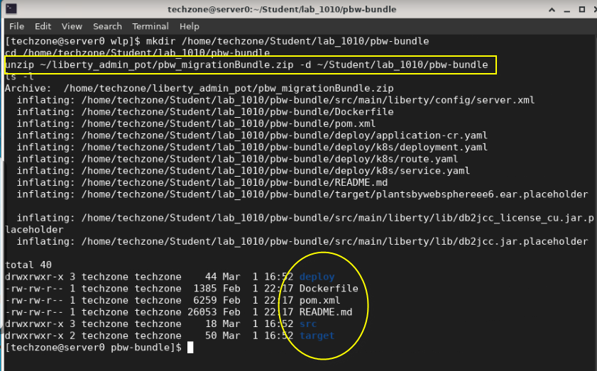

    A continuación, aprovechará el archivo **server.xml** del paquete de artefactos de migración para facilitar una mayor rentabilidad al configurar e implementar la aplicación PlantsByWebSphere en un nuevo entorno de WebSphere Liberty Server.

    - **Primero** , revisará el contenido del archivo **server.xml** que generó **Transformation Advisor** .

    - **En segundo lugar** , realizará actualizaciones menores en el archivo server.xml que se requiere para ejecutar correctamente la aplicación PlantsByWebSphere en WebSphere Liberty.

### Examine el archivo server.xml generado por Transformation Advisor

Examinemos brevemente el archivo **server.xml** que se generó para comprender el valor que Transformation Advisor proporcionó para acelerar la implementación de la aplicación PlantsByWebSphere en WebSphere Liberty.

El archivo **server.xml** está en el paquete de migración: /home/techzone/Student/lab_1010/pbw-bundle/src/main/liberty/config/server.xml

1. Abra el archivo server.xml en un editor (gedit)

    ```
    gedit /home/techzone/Student/lab_1010/pbw-bundle/src/main/liberty/config/server.xml
    ```

    - **Líneas 4-16:** Las características de Liberty requeridas por PlantsByWebSphere

        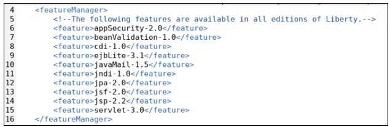

    - **Líneas 48 – 67: Se han creado variables** que a menudo difieren entre entornos.

        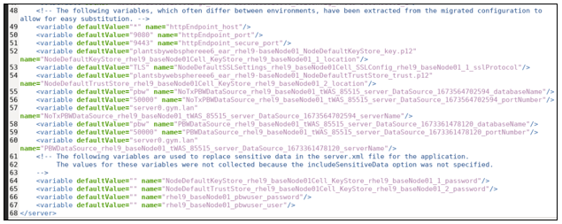

        > - Las variables se utilizan en todo el archivo server.xml para evitar valores codificados en la configuración.

        > - Se establecen valores predeterminados para muchas de las variables, pero se pueden anular de distintas maneras.

        **Las variables se pueden anular en el momento de la implementación mediante:**

        - Variables de entorno en el sistema
        - Archivos de configuración/anulaciones de Liberty
        - Archivo bootstrap.properties de Liberty
        - Secretos y mapas de configuración en implementaciones de Kubernetes

    - **Líneas 64-67:** Las variables que pueden contener información confidencial, como Usuario y Contraseña, NO contienen valores predeterminados.

        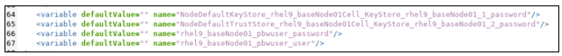

    - **Líneas 20-21:** Ubicación de la aplicación y puertos HTTP(S)

        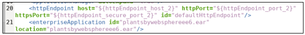

    - **Líneas 23-28** : Controladores de base de datos JDBC de DB2

        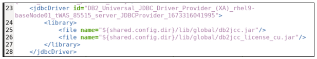

    - **Líneas 29-32:** Una de las dos fuentes de datos DB2 utilizadas por la aplicación

        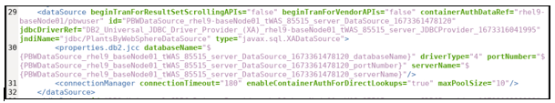

    - **Líneas 44-47:** Almacenes de claves personalizados para permitir conexiones seguras a la aplicación. (No los utilizaremos en este laboratorio).

        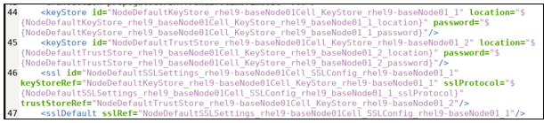

2. **Cierre** el editor al terminar de revisar el archivo server.xml. **NO GUARDE ningún cambio** en el contenido.

## Modificar el server.xml generado para nuestro entorno de laboratorio

Es necesario modificar la siguiente configuración de server.xml para que la aplicación PlantsByWebSphere se ejecute correctamente en WebSphere Liberty:

> - Las variables de nombre de usuario y contraseña de la base de datos DB2
> - Los puertos HTTP y HTTPS
> - Ubicación de las bibliotecas del controlador de base de datos DB2

1. Abra el archivo server.xml en un editor (gedit)

    ```
    gedit /home/techzone/Student/lab_1010/pbw-bundle/src/main/liberty/config/server.xml
    ```

2. Establecer valores predeterminados para las siguientes variables de usuario y contraseña de DB2

    Estas son las credenciales que utiliza la aplicación para acceder a la base de datos de la aplicación DB2.

    a. Vaya a las líneas **66** y **67**

    b. Establezca el valor predeterminado = **db2inst1-pwd** para la variable **rhel9_baseNode01_pbwuser_password.**

    c. Establezca el valor predeterminado = “ **db2inst1** ” para la variable “ **rhel9_baseNode01_pbwuser_user”.**

    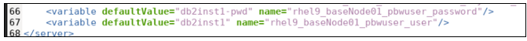

3. Modificar los puertos HTTP y HTTP de la aplicación para evitar posibles conflictos de puertos

    a. Vaya a las líneas **50** y **51.**

    b. Establezca el valor predeterminado = " **9088** " para la variable " **httpEndpoint_port".**

    c. Establezca el valor predeterminado = " **9448** " para la variable " **httpEndpoint_secure_port".**

    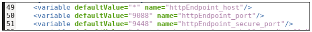

4. Modifique la ubicación de la ruta de las bibliotecas del controlador DB2 utilizadas por el controlador **"DB2_Universal_JDBC_Driver_Provider_(XA)** ".

    <table>
    <tbody>
    <tr class="odd">
    <td></td>
    <td>
    <p><strong>Consejo:</strong></p>
    <p>${shared.config.dir} es una variable integrada de Liberty. Su valor predeterminado es &lt;WLP_HOME&gt;/usr/shared/config.</p>
    <p>Más tarde, copiará las bibliotecas DB2 a esta ruta especificada en el archivo server.xml <strong>.</strong></p>
    </td>
    </tr>
    </tbody>
    </table>

    a. Vaya a las líneas **25** y **26.**

    b. En la línea 25, elimine " **/global** " de la ruta: ${shared.config.dir}/lib/db2jcc.jar

    c. En la línea 26, elimine " **/global** " de la ruta ${shared.config.dir}/lib/db2jcc_license_cu.jar

    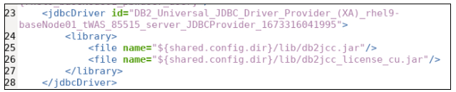

    <table>
    <tbody>
    <tr class="odd">
    <td></td>
    <td>
    <p><strong>Consejo:</strong></p>
    <p><strong>/global</strong> es generado por el Asesor de Transformación para crear imágenes de contenedor utilizando el paquete de migración.</p>
    <p>Sin embargo, hemos modificado el paquete de migración para crear JVM Liberty que se ejecuten en una VM.</p>
    </td>
    </tr>
    </tbody>
    </table>

5. Modificar la ubicación de la ruta de las bibliotecas del controlador DB2 utilizadas por el controlador " **DB2_Universal_JDBC_Driver_Provider** "

    a. Vaya a las líneas **35** y **36.**

    b. En la línea 35, elimine " **/global** " de la ruta: ${shared.config.dir}/lib/db2jcc.jar

    c. En la línea 36, elimine " **/global** " de la ruta ${shared.config.dir}/lib/db2jcc_license_cu.jar

    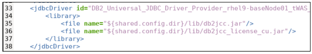

6. **Guarde** los cambios en server.xml. Luego, **cierre** el editor gedit.

    **Nota:** ignore el mensaje **Gtk-WARING** emitido desde gedit.

## Complete la configuración de WebSphere Liberty para PlantsByWebSphere

El servidor WebSphere Liberty llamado " **pbwServer** ", que creó anteriormente en el laboratorio, solo contiene la configuración mínima necesaria para iniciarlo. El archivo de configuración del servidor, las bibliotecas de bases de datos de la aplicación y la aplicación PlantsByWebSphere deben configurarse y agregarse al servidor Liberty.

En esta sección del laboratorio, realizará las siguientes actividades para completar la configuración de WebSphere Liberty para “ **pbwServer** ” para soportar y ejecutar correctamente la aplicación PlantsByWebSphere.

- Copie el archivo EAR de PlantsByWebSphere en la configuración del servidor WebSphere Liberty

- Copie las bibliotecas del controlador de base de datos DB2 en la configuración de WebSphere Liberty

- Copie el archivo server.xml del paquete de migración de Transformation Advisor en la configuración del servidor WebSphere Liberty

Las aplicaciones implementadas en WebSphere Liberty deben ubicarse en el directorio “ **apps** ” o “ **dropins** ” de Liberty.

El directorio " **dropins** " es un directorio monitoreado en Liberty, lo que significa que cuando se colocan en él archivos binarios de la aplicación, como archivos WAR y EAR JAR, Liberty la implementa e inicia automáticamente. Este directorio es ideal para desarrollo, pero no se recomienda para implementaciones en entornos de producción, mientras que el directorio " **apps** ", que no se monitorea, está diseñado para implementaciones en producción.

En este laboratorio, copiará el archivo EAR de PlantsByWebSphere en el directorio “ **apps** ”, que se implementará cuando se inicie o reinicie el servidor Liberty.

1. Instale el archivo EAR de PlantsByWebSphere en el servidor Liberty

    a. Copie el archivo **“EAR” de PlantsByWebSphere** en el directorio “ **apps** ” del servidor Liberty.

    ```
    cd /home/techzone

    cp ~/liberty_admin_pot/plantsbywebsphereee6.ear ~/Student/lab_1010/wlp/usr/servers/pbwServer/apps
    ```

    b. Verifique que el archivo plantbywebsphereee6.ear esté ahora en el directorio de configuración del servidor.

    ```
    ls ~/Student/lab_1010/wlp/usr/servers/pbwServer/apps
    ```

    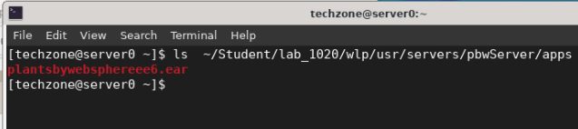

2. Copie las bibliotecas del controlador de base de datos DB2 en la configuración de WebSphere Liberty

    a. Cree la carpeta “ **lib** ” en Liberty ${shared.config.dir}

    ```
    mkdir ~/Student/lab_1010/wlp/usr/shared/config/lib
    ```

    b. Copie los archivos jar de la biblioteca DB2 a la carpeta ${shared.config.dir}/lib de Liberty

    ```
    cp /opt/IBM/db2_drivers/* ~/Student/lab_1010/wlp/usr/shared/config/lib
    ```

    c. Verifique que las dos bibliotecas de controladores de base de datos DB2 estén ahora en el directorio de configuración del servidor.

    ```
    ls ~/Student/lab_1010/wlp/usr/shared/config/lib
    ```

    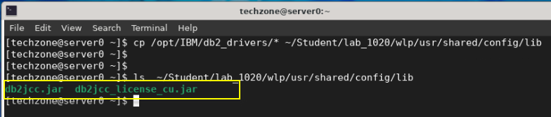

3. Reemplace el archivo de configuración del servidor Liberty utilizando el archivo server.xml personalizado del paquete de migración

    a. Copie el archivo server.xml del paquete de migración a la configuración del servidor Liberty.

    ```
    \cp ~/Student/lab_1010/pbw-bundle/src/main/liberty/config/server.xml ~/Student/lab_1010/wlp/usr/servers/pbwServer
    ```

    b. Verifique que el archivo server.xml se haya reemplazado; para ello, consulte las funciones de tiempo de ejecución que aparecen en él.

    ```
    head -16 ~/Student/lab_1010/wlp/usr/servers/pbwServer/server.xml
    ```

    **Nota:** Debería ver el conjunto de **&lt;feature&gt;** enumerado en las primeras 16 líneas del archivo server.xml, como se ilustra a continuación.

    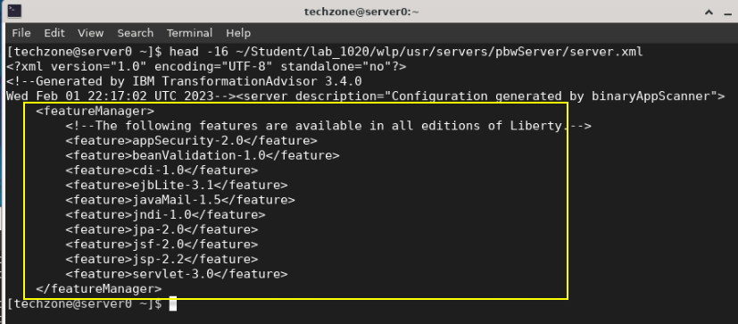

    En este punto, la configuración del servidor Liberty está completa. Sin embargo, hay un último paso que debe realizarse antes de poder iniciar correctamente el servidor Liberty y ejecutar la aplicación PlantsByWebSphere.

    El paso final es **instalar todas las características de Liberty** que figuran en el archivo server.xml, como se ilustra en el paso anterior.

    Recuerde que usted instaló solamente el “ **Liberty Kernel** ” en el entorno de laboratorio, y el kernel Liberty no tiene ninguna característica instalada.

    Liberty proporciona un sencillo comando " **installUtility** " que puede ejecutarse para garantizar que todas las funciones listadas en el archivo server.xml se instalen en el entorno de ejecución. Si una función es necesaria, pero no está instalada, la utilidad la instalará.

4. Ejecute el comando **installUtility** para instalar las funciones necesarias para la aplicación PlantsByWebSphere

    a. Desde una ventana de terminal, navegue al directorio de inicio de WebSphere Liberty para poder ejecutar comandos de Liberty.

    ```
    cd /home/techzone/Student/lab_1010/wlp
    ```

    b. Ejecute el comando de instalación

    ```
    bin/installUtility install pbwServer
    ```

    El comando installUtility instala todas las funciones de tiempo de ejecución que figuran en el archivo server.xml para “pbwServer, junto con cualquier función de dependencia adicional.

    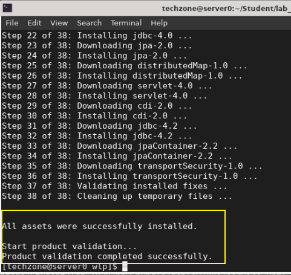

    A continuación, verifique que estén instaladas las funciones requeridas.

5. Muestra la lista de funciones instaladas en el servidor pbwServer Liberty.

    ```
    bin/productInfo featureInfo
    ```

    La salida debe indicar que las características requeridas por la aplicación PlantsByWebSphere ahora están instaladas.

    **Nota:** Es posible que recuerdes que anteriormente en el laboratorio, este comando devolvió una lista vacía, ya que no había ninguna característica instalada al instalar el kernel Liberty.

    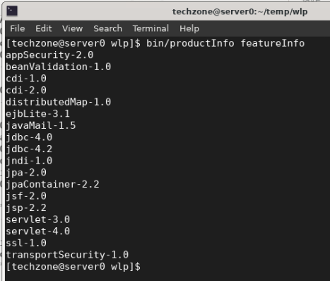

6. Mostrar el tamaño del directorio de instalación de WebSphere Liberty

    ```
     du -ch --max-depth=0 /home/techzone/Student/lab_1010/wlp
    ```

    Tenga en cuenta que el espacio de disco utilizado por WebSphere Liberty, incluidas las bibliotecas db2 y la aplicación, es de solo **113 MB** .

    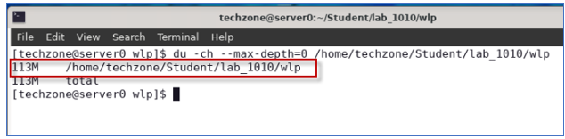

## **Inicie la base de datos de la aplicación DB2 para PlantsByWebSphere**

Ahora está listo para comenzar a ejecutar la aplicación PlantsByWebSphere utilizando el nuevo servidor WebSphere Liberty que configuró.

La aplicación PlantsByWebSphere requiere una base de datos de aplicaciones, que debe asegurarse de que esté en funcionamiento.

<table>
<tbody>
<tr class="odd">
<td><blockquote>
<p></p>
</blockquote></td>
<td>
<p><strong>Información:</strong></p>
<p>Es posible que ya haya iniciado el contenedor db2 en un laboratorio anterior.</p>
<p>Para saber si el contenedor db2 ya está en ejecución, ejecute el siguiente comando:</p>
<blockquote>
<p>docker ps | grep db2_demo_data</p>
</blockquote>
<p><strong>Para su información:</strong> está bien ejecutar el comando docker start a continuación, incluso si el contenedor ya está ejecutándose.</p>
</td>
</tr>
</tbody>
</table>

1. Inicie la aplicación PlantsByWebSphere en la base de datos DB2, que se ejecuta en

    a. Abra una nueva ventana de terminal

    b. En la ventana de terminal, ejecute el siguiente comando para iniciar la base de datos DB2. Luego, use el comando " **docker ps** " para verificar que el contenedor de la base de datos esté en ejecución.

    ```
    docker start db2_demo_data

    docker ps | grep db2_demo_data
    ```

    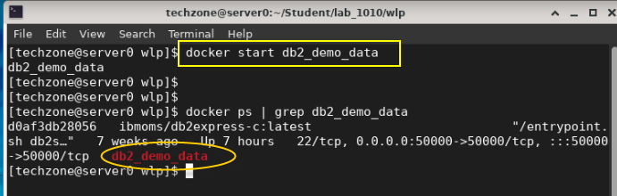

## **Iniciar y verificar el servidor pbwServer Liberty**

El servidor Liberty llamado **pbwServer** ahora debería estar completamente configurado y listo para ejecutar la aplicación PlantsByWebSphere.

En esta sección, iniciará el servidor pbwServer y revisará los registros para asegurarse de que todo se inicie limpio.

1. Desde una ventana de terminal, inicie el servidor Liberty llamado “ **pbwServer** ”

    ```
    cd ~/Student/lab_1010/wlp

    bin/server start pbwServer
    ```

    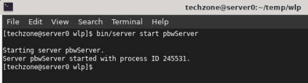

2. Vea el registro del servidor Liberty, “ **messages.log** ”, para verificar que el servidor y la aplicación PlantsByWebSphere se iniciaron correctamente.

    a. Busque el mensaje que indica que se inició la aplicación plantsbywebsphereee6

    ```
    cat usr/servers/pbwServer/logs/messages.log | grep "CWWKZ0001I: Application plantsbywebsphereee6 started"
    ```

    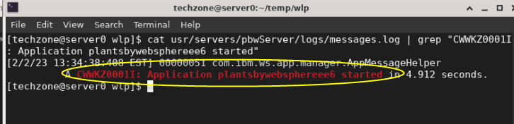

    b. Busque el mensaje que indica que pbwServer se inició correctamente.

    ```
    cat usr/servers/pbwServer/logs/messages.log | grep "CWWKF0011I: The pbwServer server is ready to run a smarter planet. The pbwServer server started"
    ```

    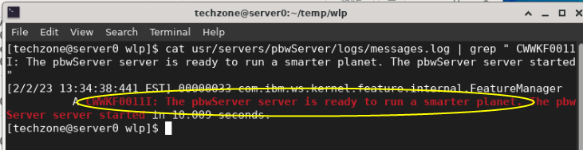

    c. Opcionalmente, ver el archivo “messages.log” completo en un editor.

    ```
    gedit usr/servers/pbwServer/logs/messages.log
    ```

3. Ejecute la aplicación PlantsByWebSphere desde el navegador **Firefox** en la VM.

    El puerto HTTP es **9088** , que está definido en el archivo **server.xml** .

    a. Inicie el navegador Firefox desde la máquina virtual.

    

    b. Vaya a la URL de la aplicación PlantsByWebSphere:

    ```
    http://server0.gym.lan:9088/PlantsByWebSphere
    ```

    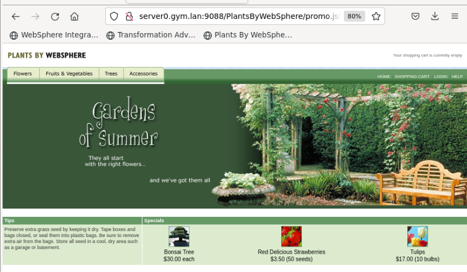

4. Verifique que la aplicación PlantsByWebSphere muestre elementos del catálogo

    La aplicación PlantsByWebSphere accede a la base de datos DB2 cuando navega a cualquiera de las pestañas para ver el catálogo de “ **Flores** ”, “ **Frutas y verduras** ” o “ **Árboles** ”.

    a. Haga clic en una de las pestañas para ver el catálogo, que se carga desde la base de datos DB2.

    

    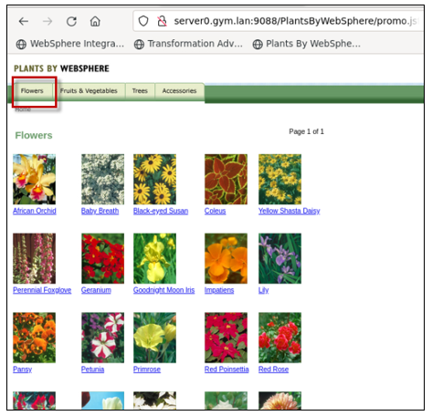

## **Resumen**

**¡Felicidades!**

**Ha completado con éxito el laboratorio “Modernice su entorno de ejecución a WebSphere Liberty”**

En este laboratorio, aprendió lo fácil que es instalar WebSphere Liberty mediante el método de instalación de archivo y lo rápido que puede crear un nuevo servidor Liberty que incluya la configuración mínima para que el servidor se inicie.

Luego aprendió a usar los aceleradores de implementación generados por Transformation Advisors desde el paquete de migración para configurar y ejecutar la aplicación migrada en WebSphere Liberty en modo independiente en una máquina virtual.

Aprendió cuánto espacio en disco requiere WebSphere Liberty cuando se dimensiona correctamente según las necesidades de la aplicación.

Transformation Advisor acelera la migración de aplicaciones a Liberty y ayuda a minimizar errores y riesgos al tiempo que acelera el tiempo de comercialización.


