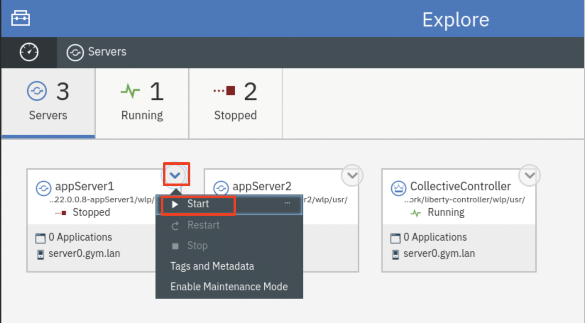

# Laboratorio 1040: Persistencia de sesiones HTTP y conmutación por error con Liberty


**Última actualización:** marzo de 2023

**Duración:** 45 minutos

¿Necesitas ayuda? Contacta con **Kevin Postreich, Yi Tang.**

<table>
<tbody>
<tr class="odd">
<td></td>
<td>
<strong>IMPORTANTE: ¡Por favor leer!</strong>
<p>Este laboratorio requiere la finalización del <strong>Laboratorio 1030 – Enrutamiento dinámico</strong> de esta serie. </p>
<p> En otras palabras, no puede realizar este laboratorio hasta que haya completado <strong>el Laboratorio 1030: Enrutamiento dinámico.</strong> </p>
</td>
</tr>
</tbody>
</table>

<br>

## **Introducción**

En muchas aplicaciones web, las elecciones o acciones del usuario determinan a dónde se envía al usuario a continuación, cómo se comporta la aplicación o qué muestra la página.

Por ejemplo, si el usuario hace clic en el botón de pago de un sitio web, la página siguiente debe contener sus opciones de compra e información. La especificación de servlets de Java proporciona un mecanismo para que las aplicaciones de servlets mantengan la información del estado del usuario. Este mecanismo se conoce como **sesión HTTP** **( **o simplemente sesión** )** .

La **sesión** permite que el motor de servlets “personalice” la experiencia del usuario al realizar un seguimiento de los usuarios individuales durante la navegación.

En un escenario de compras digitales, las sesiones pueden utilizarse para ofrecer carritos de compra en línea. Todas las compras se rastrean mediante el objeto de sesión del usuario.

Un servlet distingue a los usuarios por su ID de sesión único. En el caso de WebSphere Liberty, esto se realiza mediante un "JESSIONID". El seguimiento de sesiones se puede configurar mediante **cookies** o **reescritura de URL** . La siguiente ilustración muestra el uso de cookies para el seguimiento de sesiones.

El complemento del servidor HTTP y del servidor web está configurado para mantener la afinidad de sesiones, también conocida como "sesiones persistentes", mediante JSESSIONID, que asigna clientes a un servidor Liberty específico. Siempre reenvía las solicitudes del mismo cliente al mismo servidor.


### **Afinidad de sesión y conmutación por error**

La sesión puede ser distribuida, lo que permite distribuir la sesión a otros servidores para facilitar la conmutación por error. Existen varios mecanismos para la distribución de sesiones, pero en este laboratorio se utilizará una base de datos para proporcionar un almacenamiento de sesiones persistente común. En caso de fallo, el complemento de servidor web para WebSphere Liberty enruta las solicitudes de una sesión determinada al servidor con afinidad, como se ilustra a continuación.


Después de una falla del servidor cuando se agota el tiempo de espera de la solicitud, el complemento del servidor web redirecciona al usuario a otro miembro del clúster y la afinidad de sesión del usuario cambia a este miembro colectivo Liberty de reemplazo.

Tras la lectura inicial del almacén persistente, el miembro de reemplazo coloca el objeto de sesión del usuario en la caché en memoria. A partir de entonces, las solicitudes de esa sesión se dirigen al miembro de Liberty seleccionado. Las solicitudes de la sesión pueden volver al miembro del clúster fallido una vez recuperado.


WebSphere Liberty ofrece características que admiten la distribución de sesiones a través de un **proveedor de base de datos** como DB2 para la persistencia de la sesión, o replicación en memoria utilizando un **proveedor** JCache como Hazelcast.

<table>
<tbody>
<tr class="odd">
<td></td>
<td>
<p><strong>Información:</strong></p>
<p>A menudo se cree (erróneamente) que la replicación en memoria es más rápida que la persistencia de la sesión.</p>
<p>La realidad es que la mayor parte de la sobrecarga de la distribución de sesiones es la serialización de la sesión por parte del administrador de sesiones local y la deserialización por parte del almacén de sesiones, lo cual es común tanto a la persistencia de la base de datos como a la replicación en memoria.</p>
<p>La diferencia entre estos mecanismos de distribución de sesiones radica en la velocidad de lectura y escritura del objeto de sesión y, con décadas de experiencia en la optimización de lecturas y escrituras, las bases de datos superan en rendimiento a la replicación en memoria.</p>
</td>
</tr>
</tbody>
</table>

La configuración es sencilla y no requiere interacción programática directa. Esta configuración permite que varios servidores compartan los mismos datos de sesión, que pueden recuperarse en caso de fallo del servidor.

En este laboratorio, aprenderá a utilizar la función de persistencia de la base de datos de sesión de Liberty para mejorar la disponibilidad de su aplicación y la experiencia del usuario.

En concreto, el laboratorio demuestra la persistencia del carrito de compra de los usuarios, de modo que los artículos del carrito no se pierdan en caso de una falla del servidor.


<table>
<tbody>
<tr class="odd">
<td></td>
<td>
<p><strong>IMPORTANTE: ¡Por favor leer!</strong></p>
<p>Este laboratorio requiere la finalización del <strong>Laboratorio 1030 – Enrutamiento dinámico</strong> de esta serie.</p>
<p>En otras palabras, no puede realizar este laboratorio hasta que haya completado <strong>el Laboratorio 1030: Enrutamiento dinámico.</strong></p>
</td>
</tr>
</tbody>
</table>

## **Accediendo al entorno**

Si realiza este laboratorio como parte de un taller impartido por un instructor (virtual o presencial), ya se le ha proporcionado un entorno. El instructor le proporcionará los detalles para acceder al laboratorio.

De lo contrario, deberá reservar un entorno para el laboratorio. Puede obtenerlo aquí. Siga las instrucciones en pantalla para la opción " **Reservar ahora** ".

KLP: ENLACE A DETERMINAR PARA LA RESERVA DE ENV

El entorno de laboratorio contiene dos (2) máquinas virtuales Linux.


Se configura un servicio publicado para proporcionar acceso a la VM **server0** a través de la interfaz noVNC para el entorno de laboratorio.

1. Acceda al entorno de laboratorio desde su navegador web.

    a. Una vez aprovisionado el entorno, haga clic con el botón derecho en el enlace **"Servicio publicado"** . A continuación, seleccione " **Abrir enlace en una nueva pestaña** " en el menú contextual.

    

    b. Haga clic en el enlace **"vnc.html"** para abrir el entorno de laboratorio a través de la interfaz **noVNC** .

    

    c. Haga clic en el botón **Conectar**

    

    d. Ingrese la contraseña: **passw0rd** . Luego, haga clic en el botón **"Enviar credenciales"** para acceder al entorno de laboratorio.

    **Nota:** Ese es un cero numérico en passw0rd

    

2. Inicie sesión en la máquina virtual **server0** utilizando las credenciales a continuación:

    - ID de usuario: **techzone**

    - Contraseña: **IBMDem0s!**

## **Consejos para trabajar en el entorno de laboratorio**

1. Puede cambiar el tamaño del área visible utilizando las opciones **de configuración de noVNC** para cambiar el tamaño del escritorio virtual para que se ajuste a su pantalla.

    a. Desde la máquina virtual del entorno, haga clic en el **icono de giro** en el panel de control noNC para abrir el menú.

    

    b. Para aumentar el área visible, haga clic en `Settings > Scaling Mode` y configure el valor en `Remote Resizing`

    

2. Puede copiar/pegar texto de la guía de laboratorio en el entorno de laboratorio utilizando el portapapeles en el visor noVNC.

    a. Copie el texto de la guía de laboratorio que desea pegar en el entorno de laboratorio.

    b. Haga clic en el icono **del Portapapeles** y **pegue** el texto en el portapapeles de noVNC.

    

    c. Pegue el texto en la máquina virtual, como en una ventana de terminal, una ventana del navegador, etc.

    d. Haga clic en el icono **del portapapeles** nuevamente para cerrarlo.

    > **NOTA:** A veces, pegar en una ventana de Terminal en la VM no funciona de manera consistente.

    > En este caso, puedes intentarlo nuevamente, o abrir otra ventana de terminal e intentarlo nuevamente, o pegar el texto en un **editor de texto** en la máquina virtual y luego pegarlo en la ventana de terminal en la máquina virtual.

3. Como alternativa a la opción "Copiar y pegar" de noVNC, puede considerar abrir la guía de laboratorio en un navegador web dentro de la máquina virtual. Con este método, puede copiar y pegar fácilmente texto de la guía de laboratorio sin tener que usar el portapapeles de noVNC.

<br>

## Laboratorio: Persistencia de sesiones HTTP y conmutación por error con Liberty

En este laboratorio, se configuran los servidores Liberty con la función de persistencia de sesión mediante una base de datos DB2. Con esta configuración, los servidores Liberty persisten los datos de la sesión en la base de datos DB2, donde se pueden recuperar en caso de una conmutación por error del servidor Liberty.

La aplicación de muestra que utilizará para probar la persistencia de la sesión es **PlantsByWebSphere** .

Iniciará y detendrá miembros en el colectivo para experimentar la persistencia de la sesión y el comportamiento de conmutación por error.

**<span class="underline">Este laboratorio contiene las siguientes actividades:</span>**

- Pruebe la aplicación PlantsByWebSphere sin la persistencia de sesión habilitada

- Configurar la función de persistencia de la base de datos en WebSphere Liberty

- Vea el valor de la persistencia de la sesión y la conmutación por error de la sesión

- Resumen

<table>
<tbody>
<tr class="odd">
<td></td>
<td>
<p><strong>IMPORTANTE: ¡Por favor leer!</strong></p>
<p>Este laboratorio requiere la finalización del <strong>Laboratorio 1030 – Enrutamiento dinámico</strong> de esta serie.</p>
<p>En otras palabras, no puede realizar este laboratorio hasta que haya completado <strong>el Laboratorio 1030: Enrutamiento dinámico.</strong></p>
</td>
</tr>
</tbody>
</table>

## **Clonar el repositorio de GitHub para este taller**

Este laboratorio requiere artefactos almacenados en un repositorio de GitHub. Ejecute el siguiente comando para clonar el repositorio en la máquina virtual local utilizada para el laboratorio.

Este laboratorio requiere artefactos almacenados en un repositorio de GitHub. Ejecute el siguiente comando para clonar el repositorio en la máquina virtual local utilizada para el laboratorio.

1. Si aún no lo hizo en un laboratorio anterior, clone el repositorio de GitHub que contiene los artefactos de laboratorio necesarios para el laboratorio.

    a. Abra una nueva ventana de terminal en la máquina virtual “ **server0.gym.lan** ”.

    

    b. Clonar el repositorio de GitHub necesario para el laboratorio.

    ```
    git clone https://github.com/IBMTechSales/liberty_admin_pot.git
    ```

    c. Navegue al directorio “ **lab-scripts** ” en el repositorio clonado.

    ```
    cd ~/liberty_admin_pot/lab-scripts
    ```

    d. Agregue los permisos de " **ejecución** " a los directorios de scripts de laboratorio y a los scripts de shell.

    ```
    chmod -R 755 ./
    ```

## **Parte 1: Asegúrese de que los servidores de los miembros del colectivo Liberty estén en funcionamiento**

En esta sección, iniciará el Centro de administración de Liberty y se asegurará de que los servidores estén en funcionamiento. Inicie estos dos servidores desde el Centro de administración de Liberty.

1. Antes de iniciar los servidores Liberty, debe iniciar la base de datos db2 utilizada por la aplicación **PlantsByWebSphere** con el siguiente comando.

    <table>
    <tbody>
    <tr class="odd">
    <td></td>
    <td>
    <p><strong>Información:</strong></p>
    <p>Es posible que ya haya iniciado el contenedor db2 en un laboratorio anterior.</p>
    <p>Para saber si el contenedor db2 ya está en ejecución, ejecute el siguiente comando:</p>
    <p><strong>docker ps | grep db2_demo_data</strong></p>
    <p><strong>Para su información:</strong> está bien ejecutar el comando docker start a continuación, incluso si el contenedor ya está ejecutándose.</p>
    </td>
    </tr>
    </tbody>
    </table>

    ```
    docker start db2_demo_data
    ```

    <br>

2. Inicie sesión en el Centro de administración de Liberty

    a. Desde el navegador, abra una nueva pestaña y acceda a la URL del Centro de administración de Liberty.

    ```
    https://server0.gym.lan:9491/adminCenter
    ```

    b. Inicie sesión en el Centro de administración con las credenciales de inicio de sesión: **admin / admin**

    **Nota:** Si ve la “Advertencia: Posible riesgo de seguridad más adelante”, haga clic en **Avanzar...-&gt;Aceptar riesgo y continuar** para continuar.

    Se muestra la página del Centro de administración del colectivo Liberty.

    

    c. Haga clic en el icono **Explorar**

    

3. Enumere los servidores Liberty en el colectivo.

    a. Haga clic en la sección **Servidor** para mostrar los servidores Liberty en el colectivo

    

    En este punto, deberías tener dos miembros del colectivo Liberty en el colectivo, nombrados de la siguiente manera:

    - servidor de aplicaciones1
    - Servidor de aplicaciones2

    

<table>
<tbody>
<tr class="odd">
<td></td>
<td>
<p><strong>IMPORTANTE: ¡Por favor leer!</strong></p>
<p>Si los dos servidores ilustrados arriba NO están en tu colectivo, entonces no podrás continuar con el laboratorio.</p>
<p>Asegúrese de haber completado <strong>el laboratorio 1030</strong> de esta serie.</p>
</td>
</tr>
</tbody>
</table>

1. En la página de detalles del servidor, haga clic en el ícono del menú desplegable de **appServer1** y seleccione **Iniciar** para iniciar el servidor.

    

    **Nota:** Si se le solicita, ingrese el nombre de usuario y la contraseña del Centro de administración como: **admin / admin**

2. Haga clic **en Iniciar** para confirmar el comando de inicio del servidor **appServer1** .

    

    Se iniciará **la aplicación** del servidor Server1 y podrás ver que su estado es "En ejecución".

    

3. Repita el mismo procedimiento de inicio del servidor para el servidor **appServer2** . Una vez hecho esto, el servidor **appServer2** se inicia como se muestra a continuación:

    

## **Parte 2: Probar la aplicación SIN persistencia de sesión**

En esta sección, probará la aplicación **PlantsByWebSphere** sin persistencia de sesión. Sin persistencia de sesión, si detiene el servidor de aplicaciones donde se ejecuta la aplicación, el enrutamiento dinámico de Liberty redirigirá el tráfico a otro servidor de aplicaciones y podrá seguir accediendo a la aplicación. Sin embargo, los datos del carrito de compra se pierden porque estaban almacenados en el objeto de sesión local del servidor Liberty.

### **2.1 Probar la aplicación sin persistencia de sesión**

1. Para acceder a la aplicación **PlantsByWebSphere** a través del servidor y el complemento IHS, abra una nueva ventana del navegador e ingrese la URL de la aplicación como:

    ```
    https://server0.gym.lan:8443/PlantsByWebSphere
    ```

    Se muestra la página **de inicio** de la aplicación.

    

2. Haga clic en el enlace **Ayuda** para ir a la página de **Ayuda** de la aplicación.

    

    Se muestra la página de ayuda de la aplicación. En esta página, puede ver qué servidor Liberty gestionó la solicitud. Como se muestra en la captura de pantalla a continuación, la aplicación se ejecuta desde **appServer1** , que podría ser diferente en su caso.

    

3. Navegue a la página del Catálogo de aplicaciones, seleccione un catálogo y haga clic en uno de los productos enumerados.

    

4. En la página de detalles del producto, haga clic en “ **Agregar al carrito”** para agregar el producto a su carrito de compras.

    

    El producto se añade a su carrito de compras.

    

5. Podrás ver el mensaje que indica que tienes 1 artículo en tu carrito de compras, y puedes comprobarlo haciendo clic en el enlace **CARRITO DE COMPRAS** .

    

6. **Detenga** el servidor Liberty que se identificó en la página de Ayuda de la aplicación, como el servidor que procesa las solicitudes de PlantsByWebSphere.

    a. Ahora regrese a la página de Servidores **del Centro de administración** de Liberty Collective.

    b. **Detenga** el servidor de aplicaciones que se muestra en la página **de Ayuda** de la aplicación **PlantsByWebSphere** para simular la situación de inactividad del servidor.

    

    Si se le solicita, ingrese las credenciales del Centro de administración como: **admin / admin** .

    El servidor está detenido.

    

7. Desde la página de la aplicación PlantsByWebSphere, haga clic en el enlace **INICIO** en la página

    

8. Haga clic en el enlace **CARRITO DE COMPRAS** para ir a la página **del Carrito de compras** de la aplicación, podrá ver que la lista del carrito de compras está vacía, lo que indica que los datos del carrito de compras se perdieron debido al incidente de caída del servidor.

    

## **Parte 3: Configurar la persistencia de la sesión de Liberty con la base de datos**

WebSphere Liberty ofrece características que admiten la persistencia de sesión, que proporciona caché de sesión a través de un **proveedor de base de datos** como DB2 o un **proveedor de jcache** como Hazelcast.

En esta sección del laboratorio, analizará la persistencia de la base de datos en Liberty para garantizar que los artículos en el carrito de compras del usuario no se pierdan en caso de una interrupción del servidor Liberty.

Para habilitar la persistencia de sesiones, puede definir una configuración de administración de sesiones compartidas para los servidores Liberty. Esta configuración permite que varios servidores compartan los mismos datos de sesión y que estos se puedan recuperar en caso de conmutación por error.

Para definir una configuración de administración de sesiones compartidas para servidores Liberty, debe hacer lo siguiente:

- Añadir la función **sessionDatabase-1.0**

- Definir la fuente de datos de la sesión

- Consulte la fuente de datos desde la configuración de la base de datos de la sesión

- Consulte la ubicación de almacenamiento persistente desde la configuración de administración de sesiones.

### **Ejecute el script de automatización para configurar la persistencia de la base de datos de la sesión**

Para que la persistencia de sesión funcione, se requiere la función Liberty **sessionDatabase-1.0** en la configuración de los servidores Liberty. Esta función permite la persistencia de sesiones HTTP en una fuente de datos mediante JDBC.

En este laboratorio, la función se agrega a los servidores Liberty mediante un script de automatización que agrega la configuración para la función **sessionDatabase-1.0** a través de un archivo xml de anulación del servidor Liberty llamado " **httpSessionPersistence.xml".**

1. Ejecute los siguientes comandos para copiar **httpSessionPersistence.xml** a **appServer1**

    ```
    /home/techzone/liberty_admin_pot/lab-scripts/applyOverrides.sh -n appServer1 -v 22.0.0.8 -h server0.gym.lan SESSIONDB
    ```

2. Ejecute los siguientes comandos para copiar **httpSessionPersistence.xml** a **appServer2**

    ```
    /home/techzone/liberty_admin_pot/lab-scripts/applyOverrides.sh -n appServer2 -v 22.0.0.8 -h server1.gym.lan SESSIONDB
    ```

    La persistencia de la sesión Liberty ahora está configurada para **appServer1** y **appServer2** .

### **Revisar la configuración de la función sessionDatabase-1.0**

Se agregó la siguiente configuración a la configuración del servidor Liberty para appServer1 y appServer2 para habilitar la función sessionDatabase-1.0.

La configuración incluye lo siguiente:

- Agregue la función sessionDatabase-1.0 a la configuración del servidor

- Agrega los detalles de la fuente de datos y del controlador de la base de datos a la configuración del servidor

- Agrega los parámetros httpSessionDatabase

- Agrega los parámetros httpSession

1. Examine el archivo httpSessionPersistence.xml

    ```
    gedit /home/techzone/liberty_admin_pot/lab-scripts/scriptArtifacts/httpSessionPersistence.xml
    ```

    - La **característica** Liberty agregada es la función sessionDatabase-1.0

        

    - La **fuente de datos** contiene los detalles de conexión a la base de datos de la sesión:

        - Nombre de la base de datos de persistencia de sesión DB2: **sdb**

        - Esta base de datos se ejecuta en el mismo contenedor que db2_demo_data que aloja la base de datos pbw para la aplicación PlantsByWebSphere.

        

    - La fuente de datos está asociada con **la base de datos de sesión** como se muestra a continuación:

        

    - La **ubicación de almacenamiento persistente** se define de la siguiente manera:

        

    - El complemento del servidor HTTP utiliza el **ID de clon** que se inserta en el encabezado de respuesta/solicitud para mantener la afinidad de sesión entre solicitudes.

    - Si bien el ID del clon normalmente no cambia, en Liberty, el ID del clon se genera cuando inicia un servidor por primera vez.

    - En este laboratorio, el ID del clon es el nombre del servidor Liberty.

2. **Cierre** el editor. NO guarde ningún cambio.

## **Parte 4: Prueba de la aplicación con la persistencia de sesión configurada**

Con la persistencia de sesión habilitada, puede repetir los mismos pasos de prueba utilizados en **la Parte 2** del laboratorio para verificar el escenario de alta disponibilidad y conmutación por error de sesión.

1. Asegúrese de que los dos servidores Liberty estén en ejecución

    a. Regrese a la página de Servidores del Centro de administración de Liberty Collective.

    b. Inicie el servidor de aplicaciones que detuvo en **la Parte 2** del laboratorio.

2. Tanto **appServer1** como **appServer2** ahora deberían estar ejecutándose:

    

3. Desde el navegador, regrese a la aplicación PlantsByWebSphere

    ```
    https://server0.gym.lan:8443/PlantsByWebSphere
    ```

4. En la ventana **PlantsByWebShere** , haga clic en el enlace **INICIO** .

    

5. Haga clic en el enlace **Ayuda** para ir a la página de **Ayuda** de la aplicación.

    

    Se muestra la página de Ayuda de la aplicación y puedes ver desde qué servidor de aplicaciones se está ejecutando la aplicación.

    Como se muestra en la captura de pantalla a continuación, la aplicación se ejecuta desde **appServer1** , que puede ser diferente en su caso.

    

6. Navegue a la página **del Catálogo de** aplicaciones, seleccione un catálogo y haga clic en uno de los productos enumerados.

    

7. En la página **de detalles del producto** , haga clic en **Agregar al carrito** para agregar el producto a su carrito de compras.

    

    El producto se añade a su carrito de compras.

    

8. Podrás ver el mensaje que indica que tienes 1 artículo en tu carrito de compras, y puedes comprobarlo haciendo clic en el enlace **CARRITO DE COMPRAS** .

    

9. **Detenga** el servidor Liberty que se identificó en la página de Ayuda de la aplicación, como el servidor que procesa las solicitudes de PlantsByWebSphere.

    a. Ahora regrese a la página de Servidores **del Centro de administración** de Liberty Collective.

    b. **Detenga** el servidor de aplicaciones que se muestra en la página **de Ayuda** de la aplicación **PlantsByWebSphere** para simular la situación de inactividad del servidor.

    

    Si se le solicita, ingrese las credenciales del Centro de administración como: **admin / admin** .

    El servidor está detenido.

    

10. Desde la página de la aplicación **PlantsByWebSphere** , haga clic en el enlace **INICIO** de la página.

    

11. Haga clic en el enlace **Ayuda** para ir a la página de **Ayuda** de la aplicación.

    

    Puedes ver que la aplicación ahora se está ejecutando en el otro servidor.

    

12. Haga clic en el enlace **CARRITO DE COMPRAS** para ir a la página **del Carrito de compras** de la aplicación; podrá ver que los datos de su carrito de compras aún aparecen después del incidente de caída del servidor.

    

## **Resumen**

**¡Felicidades!**

**Ha completado con éxito el laboratorio “Persistencia de sesión HTTP y conmutación por error con WebSphere Liberty”**

En este laboratorio, aprendió el valor de configurar la función sessionDatabase-1.0 para WebSphere Liberty para habilitar la persistencia de sesión, que proporciona caché de sesión a través de un **proveedor de base de datos.**

Esta configuración permite que varios servidores compartan los mismos datos de sesión, y dichos datos se pueden recuperar de la base de datos de sesiones en caso de una falla del servidor.

Específicamente, en este laboratorio, usted pudo demostrar la persistencia del carrito de compras de los usuarios, de modo que los artículos en el carrito de compras no se pierdan en caso de una falla del servidor.


