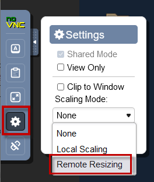

# Laboratorio 1060: Día 2: Operaciones en una implementación empresarial de WebSphere Liberty en máquinas virtuales


**Última actualización:** marzo de 2023

**Duración:** 60 minutos

¿Necesitas ayuda? Contacta con **Kevin Postreich, Yi Tang y Kevin Grigorenko.**

## Introducción

Bienvenido al laboratorio sobre operaciones del día 2 en una implementación empresarial de WebSphere Liberty en máquinas virtuales. Primero, resumiremos las principales capacidades operativas del día 2 de WebSphere Liberty y, a continuación, practicará algunas de estas funciones en el laboratorio.

## Capacidades operativas clave del día 2

La frase "Operaciones del día 2" se refiere a la ejecución, la supervisión y la investigación de aplicaciones, a diferencia del "día 1", que consiste en la instalación, la configuración y la implementación de aplicaciones. Si desea obtener más información sobre una capacidad, siga los enlaces a continuación.

**Características que demostrará este laboratorio:**

- **Laboratorio 1** : La [función <span class="underline">monitor-1.0</span>](https://www.ibm.com/docs/en/was-liberty/nd?topic=environment-monitoring-monitor-10) recopila y expone estadísticas sobre WebSphere Liberty, como la utilización del grupo de subprocesos, los tiempos de respuesta y más, a través de [Java MXBeans estandarizados](https://docs.oracle.com/javase/8/docs/api/javax/management/MXBean.html) .

    > Lo más común es que estos datos se consuman a través de productos de monitoreo como [Instana](https://www.ibm.com/docs/en/instana-observability/current?topic=technologies-monitoring-websphere-liberty) ; sin embargo, un diferenciador clave con respecto a otros servidores de aplicaciones es que WebSphere Liberty también tiene visualización básica incorporada [a través del Centro de administración](https://www.ibm.com/docs/en/was-liberty/nd?topic=center-monitoring-metrics-in-admin) .

- **Laboratorio 2:** Un diferenciador clave de WebSphere Liberty es su [detección de solicitudes lentas y bloqueadas,](https://www.ibm.com/docs/en/was-liberty/nd?topic=liberty-slow-hung-request-detection) disponible a través de la función `requestTiming-1.0` .

    > Puede especificar un umbral para lo que las partes interesadas de la aplicación definen como una solicitud web excesivamente lenta y Liberty observa las solicitudes e imprime un seguimiento de la pila y otros detalles cuando una solicitud excede dicho umbral.

- **Laboratorio 3:** WebSphere Liberty cuenta con un amplio conjunto de registros que deben supervisarse para detectar advertencias y errores. Un factor diferenciador clave, además de este registro principal, es la capacidad [de Captura de Datos del Primer Fallo](https://www.ibm.com/docs/en/was-liberty/nd?topic=liberty-generating-first-failure-data-capture-ffdc-records) (FFDC), que crea archivos separados con detalles adicionales cuando se produce un evento excepcional o no controlado en la aplicación o en el propio producto.

- **Laboratorio 4:** WebSphere Liberty proporciona una [función <span class="underline"><code>server dump</code></span>](https://www.ibm.com/docs/en/was-liberty/core?topic=line-generating-liberty-server-dump-from-command) que se puede ejecutar durante un problema para recopilar estados clave y registros, y diagnósticos opcionales como volcados de subprocesos.

**OPCIONAL: Si terminas antes, el laboratorio también tiene ejercicios adicionales:**

- **Laboratorio 5:** WebSphere Liberty tiene un [registro de acceso HTTP](https://www.ibm.com/docs/en/was-liberty/nd?topic=environment-http-access-logging) opcional que imprime una línea en un formato NCSA estandarizado para cada solicitud HTTP, incluida la URL, el código de respuesta y el tamaño, el tiempo hasta que Liberty envió el primer byte, el tiempo para enviar la respuesta completa, el puerto del cliente remoto y más.

- **Laboratorio 6:** WebSphere Liberty tiene la opción de integrarse con una solución de registro centralizada ya sea a través de un [formato de salida de registro JSON](https://www.ibm.com/docs/en/was-liberty/nd?topic=liberty-logging-trace) (por ejemplo [, Elastic Stack](https://www.ibm.com/docs/en/was-liberty/nd?topic=environment-analyzing-logs-elastic-stack) y soluciones similares) o un [conector Logstash](https://www.ibm.com/docs/en/was-liberty/nd?topic=collector-using-logstash-version-10) .

 <summary>Opcional: Revisar otras operaciones y capacidades comunes del día 2</summary>

- Un diferenciador clave de WebSphere Liberty es su [grupo de subprocesos principal con ajuste automático](https://www.ibm.com/docs/en/was-liberty/nd?topic=tuning-liberty) , que modifica dinámicamente el tamaño máximo del grupo para maximizar el rendimiento. En la mayoría de los casos, esto significa que un administrador no necesita especificar ni ajustar el grupo de subprocesos principal de la aplicación. Tenga en cuenta que otros grupos, como [los de conexiones de bases de datos](https://www.ibm.com/docs/en/was-liberty/core?topic=liberty-configuring-connection-pooling-database-connections) , los de clientes de servicios web y otros, no se ajustan automáticamente, ya que son recursos de backend que escapan al control de Liberty, por lo que deben ajustarse.
- [MicroProfile Metrics](https://www.ibm.com/docs/en/was-liberty/nd?topic=environment-monitoring-microprofile-metrics) brinda la capacidad de producir las mismas estadísticas que `monitor-1.0` pero expuestas a través de un punto final HTTP `/metrics` estilo Prometheus para su consumo por Prometheus o scripts personalizados.
- [Rastreo distribuido](https://www.ibm.com/docs/en/was-liberty/nd?topic=environment-enabling-distributed-tracing) para monitorear el flujo de llamadas al servicio web JAX-RS a través de una red de procesos Liberty.
- WebSphere Liberty ofrece un amplio conjunto de [funciones de configuración](https://www.ibm.com/docs/en/was-liberty/nd?topic=tools-creating-editing-your-server-environment-files) mediante archivos y variables XML ( `server.xml` , etc.), archivos de opciones Java ( `jvm.options` ) y variables de entorno ( `server.env` o a través del entorno de proceso). La mayoría de los cambios de configuración de WebSphere Liberty se pueden realizar dinámicamente [de forma predeterminada](https://www.ibm.com/docs/en/was-liberty/nd?topic=manually-controlling-dynamic-updates) .
- Un [caché de respuesta de servlet](https://www.ibm.com/docs/en/was-liberty/nd?topic=features-web-response-cache-10) opcional que requiere un esfuerzo significativo para configurar pero que puede tener un retorno de la inversión espectacular en una menor utilización del servidor y tiempos de respuesta mejorados.
- Considere agrupar los servidores Liberty que ejecutan la misma aplicación en [clústeres Liberty](https://www.ibm.com/docs/en/was-liberty/nd?topic=clusters-configuring-liberty-server-cluster) para facilitar la administración.
- Tenga en cuenta las [funciones de escalamiento automático](https://www.ibm.com/docs/en/was-liberty/nd?topic=collectives-setting-up-auto-scaling-liberty) para escalar dinámicamente la cantidad de servidores Liberty en función de la CPU y la memoria.
- [Las reglas de enrutamiento dinámico](https://www.ibm.com/docs/en/was-liberty/nd?topic=collectives-routing-rules-liberty-dynamic-routing) en un colectivo pueden usarse para enrutar solicitudes a servidores específicos, redirigirlas o rechazarlas. Esto incluye, por ejemplo, la capacidad de gestionar múltiples ediciones de una aplicación y [enrutar un porcentaje de las solicitudes](https://www.ibm.com/docs/en/was-liberty/nd?topic=collectives-configuring-routing-rules-liberty-dynamic-routing) a ciertas ediciones.
- Considere utilizar [el modo de mantenimiento](https://www.ibm.com/docs/en/was-liberty/nd?topic=collectives-maintenance-mode) para los clústeres durante las operaciones de diagnóstico o mantenimiento.
- Considere utilizar [políticas de salud](https://www.ibm.com/docs/en/was-liberty/nd?topic=collectives-configuring-health-management-liberty) para capturar diagnósticos y realizar otras operaciones en función de diferentes condiciones.
- Si se observa un problema de rendimiento, bloqueo o uso elevado de la CPU en producción, considere ejecutar IBM Performance MustGather ( [Linux](https://www.ibm.com/support/pages/mustgather-performance-hang-or-high-cpu-issues-websphere-application-server-linux) , [AIX](https://www.ibm.com/support/pages/mustgather-performance-hang-or-high-cpu-issues-websphere-application-server-aix) , [z/OS](https://www.ibm.com/support/pages/mustgather-gathering-data-hang-or-performance-problem-zos) , [Windows](https://www.ibm.com/support/pages/mustgather-performance-hang-or-high-cpu-issues-windows) , etc.).
- El ajuste de rendimiento más común consiste en modificar el tamaño máximo del montón de Java ( `-Xmx` o `-XX:MaxRAMPercentage` ), el tamaño máximo del vivero de Java ( `-Xmn` ) y el tamaño máximo de los grupos, como los de conexiones de bases de datos. En particular, se recomienda habilitar [la recolección de basura verbosa](https://www.ibm.com/docs/en/mon-diag-tools?topic=types-verbose-garbage-collection) ; si el tiempo dedicado a la recolección de basura supera el ~10%, probablemente sea necesario ajustar el montón o el vivero máximo. Utilice el [visualizador gratuito de recolección de basura y memoria de IBM](https://www.ibm.com/support/pages/garbage-collection-and-memory-visualizer) (GCMV) para [calcular](https://publib.boulder.ibm.com/httpserv/cookbook/Major_Tools-Garbage_Collection_and_Memory_Visualizer_GCMV.html#Major_Tools-Garbage_Collection_and_Memory_Visualizer_GCMV-Analysis) este porcentaje.
- Capacidades de seguimiento de diagnóstico flexibles con la opción de utilizar un [formato de salida binario](https://www.ibm.com/docs/en/was-liberty/nd?topic=overview-binary-logging) para reducir la sobrecarga.
- Considere integrar el [producto WebSphere Automation](https://www.ibm.com/docs/en/ws-automation) que ayuda con el inventario del servidor, la aplicación de parches de seguridad y la detección y diagnóstico automáticos de fugas de memoria.
- Para revisar OutOfMemoryErrors, utilice la herramienta gratuita [Eclipse Memory Analyzer Tool (MAT) con DTFJ e IBM Extensions](https://www.ibm.com/support/pages/eclipse-memory-analyzer-tool-dtfj-and-ibm-extensions) .
- Si ejecuta WebSphere Liberty en [IBM Java](https://www.ibm.com/docs/en/sdk-java-technology/8?topic=SSYKE2_8.0.0/welcome/welcome_javasdk_version.htm) o [IBM Semeru Runtimes](https://developer.ibm.com/languages/java/semeru-runtimes/) :
    - Un [caché de clase compartido](https://www.eclipse.org/openj9/docs/shrc/) para mejorar el tiempo de inicio.
    - Varias [políticas de recolección de basura](https://www.eclipse.org/openj9/docs/gc/) para diferentes cargas de trabajo.
    - [Volcados de subprocesos](https://www.eclipse.org/openj9/docs/dump_javadump/) más completos para diagnosticar diversos tipos de problemas. Utilice el analizador gratuito [IBM Thread and Monitor Dump Analyzer](https://www.ibm.com/support/pages/ibm-thread-and-monitor-dump-analyzer-java-tmda) (TMDA) para revisar gráficamente los volcados de subprocesos.
    - [Seguimiento de métodos](https://www.eclipse.org/openj9/docs/xtrace/) para tomar acciones de diagnóstico al ingresar o salir del método, o para cronometrar las llamadas al método.
    - Un [motor de volcado](https://www.eclipse.org/openj9/docs/xdump/) para recopilar diagnósticos sobre diversos eventos, como asignaciones de objetos grandes, excepciones lanzadas o detectadas, etc.
    - Un [JITServer](https://www.eclipse.org/openj9/docs/jitserver/) para separar la compilación Just-In-Time en un proceso separado y compartir el código compilado entre procesos.
    - El perfilador de muestreo [de IBM Java Health Center](https://www.ibm.com/docs/en/mon-diag-tools?topic=monitoring-diagnostic-tools-health-center) está disponible en IBM Java 8 e IBM Semeru Runtimes 11 en z/OS para investigar el uso de la CPU de Java y la contención de bloqueo.
    - Para un análisis de memoria más completo, considere habilitar y configurar volcados de núcleo (por ejemplo, [ulimits de núcleo y archivo](https://publib.boulder.ibm.com/httpserv/cookbook/Operating_Systems.html#core-dumps-and-ulimits) , [configuraciones de truncamiento `kernel.core_pattern`](https://publib.boulder.ibm.com/httpserv/cookbook/Troubleshooting-Troubleshooting_Java.html#ensure-core-piping-is-configured-properly-or-disabled-on-linux) , etc.) después de revisar los riesgos de [seguridad](https://publib.boulder.ibm.com/httpserv/cookbook/Operating_Systems.html#core-dump-security-implications) , [disco](https://publib.boulder.ibm.com/httpserv/cookbook/Operating_Systems.html#core-dump-disk-implications) y [rendimiento](https://publib.boulder.ibm.com/httpserv/cookbook/Operating_Systems.html#performance-implications-of-non-destructive-core-dumps) .
- Recopilar métricas básicas del sistema operativo, como CPU, memoria, disco y utilización de red, saturación y errores.
- Recopila registros del sistema operativo y observa si hay advertencias y errores.
- Monitorear problemas de red comunes como retransmisiones TCP.
- Supervise los registros de acceso y errores del servidor web para detectar advertencias y errores.
- Supervise la utilización del servidor web con herramientas como [mod_mpmstats](https://publib.boulder.ibm.com/httpserv/ihsdiag/ihs_performance.html) y [mod_status](https://publib.boulder.ibm.com/httpserv/manual24/mod/mod_status.html) .
- Para aplicaciones más recientes, se ofrecen capacidades avanzadas de [tolerancia a fallos,](https://www.ibm.com/docs/en/was-liberty/nd?topic=liberty-improving-microservice-resilience-in) como reintentos automáticos, interruptores automáticos, respaldos y mamparos. Además, se pueden habilitar [comprobaciones de estado](https://www.ibm.com/docs/en/was-liberty/nd?topic=liberty-performing-microprofile-health-checks) mediante sondas de disponibilidad y actividad.
- Revise [la guía de ajuste del rendimiento](https://www.ibm.com/docs/en/was-liberty/nd?topic=tuning-liberty) y el [libro de recetas de rendimiento de WebSphere](https://publib.boulder.ibm.com/httpserv/cookbook/) .
- Al ejecutarse en un entorno de contenedores como OpenShift:
    - Considere implementar aplicaciones utilizando el [operador WebSphere Liberty](https://www.ibm.com/docs/en/was-liberty/base?topic=operator-websphere-liberty-overview) y utilice capacidades como los recursos personalizados [WebSphereLibertyTrace](https://www.ibm.com/docs/en/was-liberty/base?topic=resources-webspherelibertytrace-custom-resource) y [WebSphereLibertyDump](https://www.ibm.com/docs/en/was-liberty/base?topic=resources-webspherelibertydump-custom-resource) .
    - [Habilite el registro JSON](https://github.com/WASdev/ci.docker#logging) y publique registros nativos de pods en [el registro centralizado de OpenShift](https://docs.openshift.com/container-platform/latest/logging/cluster-logging-deploying.html) usando, generalmente, [EFK](https://github.com/OpenLiberty/open-liberty-operator/blob/main/doc/observability-deployment.adoc#how-to-analyze-open-liberty-logs) . Luego, busque registros en el visor de registros de Kibana. Opcionalmente, instale [paneles de Kibana de ejemplo](https://github.com/WASdev/sample.dashboards) que resuman los eventos y las estadísticas de los registros de la aplicación.
    - Considere habilitar [la monitorización de aplicaciones integrada con Grafana](https://www.ibm.com/docs/en/was-liberty/nd?topic=operator-monitoring-applications-red-hat-openshift) .
    - Si tiene permisos `cluster-admin` , utilice [MustGather: Problemas de rendimiento, bloqueos o uso elevado de CPU con WebSphere Application Server en Linux en contenedores](https://www.ibm.com/support/pages/mustgather-performance-hang-or-high-cpu-issues-websphere-application-server-linux-containers) durante problemas de rendimiento, bloqueos y uso elevado de CPU.
- Puede conectar la [herramienta de monitoreo JConsole](https://docs.oracle.com/javase/8/docs/technotes/guides/management/jconsole.html) incorporada en Java y acceder a Liberty habilitado con la función `monitor-1.0` a través de las funciones [localConnector-1.0](https://www.ibm.com/docs/en/was-liberty/core?topic=jmx-configuring-local-connection-liberty) y/o [restConnector-2.0](https://www.ibm.com/docs/en/was-liberty/core?topic=jmx-configuring-secure-connection-liberty) ; sin embargo, tenga en cuenta que JConsole tiene complejidades de conexión y capacidades limitadas y el Centro de administración a menudo es suficiente para la visualización de estadísticas básicas.


## Accediendo al entorno

Si realiza este laboratorio como parte de un taller impartido por un instructor (virtual o presencial), ya se le ha proporcionado un entorno. El instructor le proporcionará los detalles para acceder al laboratorio.

De lo contrario, deberá reservar un entorno para el laboratorio. Puede obtenerlo aquí. Siga las instrucciones en pantalla para la opción " **Reservar ahora** ".

KLP: ENLACE A DETERMINAR PARA LA RESERVA DE ENV

El entorno de laboratorio contiene dos (2) máquinas virtuales Linux.


Se configura un servicio publicado para proporcionar acceso a la VM **server0** a través de la interfaz noVNC para el entorno de laboratorio.

1. Acceda al entorno de laboratorio desde su navegador web.

    a. Una vez aprovisionado el entorno, haga clic con el botón derecho en el enlace **"Servicio publicado"** . A continuación, seleccione " **Abrir enlace en una nueva pestaña** " en el menú contextual.

    

    b. Haga clic en el enlace **"vnc.html"** para abrir el entorno de laboratorio a través de la interfaz **noVNC** .

    

    c. Haga clic en el botón **Conectar**

    

    d. Ingrese la contraseña: **passw0rd** . Luego, haga clic en el botón **"Enviar credenciales"** para acceder al entorno de laboratorio.

    **Nota:** Ese es un cero numérico en passw0rd

    

2. Inicie sesión en la máquina virtual **server0** utilizando las credenciales a continuación:

    - ID de usuario: **techzone**

    - Contraseña: **IBMDem0s!**

### Consejos para trabajar en el entorno de laboratorio

1. Puede cambiar el tamaño del área visible utilizando las opciones **de configuración de noVNC** para cambiar el tamaño del escritorio virtual para que se ajuste a su pantalla.

    a. Desde la máquina virtual del entorno, haga clic en el **icono de giro** en el panel de control noNC para abrir el menú.

    

    b. Para aumentar el área visible, haga clic en `Settings > Scaling Mode` y configure el valor en `Remote Resizing`

    

2. Puede copiar/pegar texto de la guía de laboratorio en el entorno de laboratorio utilizando el portapapeles en el visor noVNC.

    a. Copie el texto de la guía de laboratorio que desea pegar en el entorno de laboratorio.

    b. Haga clic en el icono **del Portapapeles** y **pegue** el texto en el portapapeles de noVNC.

    

    c. Pegue el texto en la máquina virtual, como en una ventana de terminal, una ventana del navegador, etc.

    d. Haga clic en el icono **del portapapeles** nuevamente para cerrarlo.

    > **NOTA:** A veces, pegar en una ventana de Terminal en la VM no funciona de manera consistente.

    > En este caso, puedes intentarlo nuevamente, o abrir otra ventana de terminal e intentarlo nuevamente, o pegar el texto en un **editor de texto** en la máquina virtual y luego pegarlo en la ventana de terminal en la máquina virtual.

3. Como alternativa a la opción "Copiar y pegar" de noVNC, puede considerar abrir la guía de laboratorio en un navegador web dentro de la máquina virtual. Con este método, puede copiar y pegar fácilmente texto de la guía de laboratorio sin tener que usar el portapapeles de noVNC.

<br>

## Configurar el entorno del laboratorio

Este laboratorio requiere un Colectivo Liberty con un Controlador Colectivo y sus miembros. También requirió la implementación de la aplicación PlantsByWebSpere en los miembros del colectivo y la habilitación del Enrutamiento Dinámico de Liberty.

<table>
<tbody>
<tr class="odd">
<td></td>
<td>
<p><strong>IMPORTANTE: ¡Por favor leer!</strong></p>
<p>En esta sección, ejecutará un script, que se proporciona, para configurar el entorno de laboratorio para iniciar este laboratorio, 1060</p>
</td>
</tr>
</tbody>
</table>

### Clonar el repositorio de GitHub para este taller

Este laboratorio requiere artefactos almacenados en un repositorio de GitHub. Ejecute el siguiente comando para clonar el repositorio en la máquina virtual local utilizada para el laboratorio.

1. Clone el repositorio de GitHub que contiene los artefactos de laboratorio necesarios para el laboratorio si aún no lo ha hecho en un laboratorio anterior de esta serie.

    a. Abra una nueva ventana de terminal en la máquina virtual “ **server0.gym.lan** ”.

    

    b. Clonar el repositorio de GitHub necesario para el laboratorio.

    ```
    git clone https://github.com/IBMTechSales/liberty_admin_pot.git
    ```

    c. Navegue al directorio lab-scripts en el repositorio clonado.

    ```
    cd ~/liberty_admin_pot/lab-scripts
    ```

    d. Agregue los permisos de "ejecución" a los directorios de scripts de laboratorio y a los scripts de shell.

    ```
    chmod -R 755 ./
    ```

### Configurar el entorno de laboratorio para iniciar el laboratorio 1060

1. Ejecute el siguiente comando para garantizar que se cree un colectivo Liberty:

    ```
    /home/techzone/liberty_admin_pot/lab-scripts/resetEnvironment.sh
    ```

    a. Escriba “ `6` ” para restablecer el entorno e iniciar el laboratorio 1060.

    b. Escriba “ `y` ” cuando se le solicite continuar.

    **Nota:** El script tardará entre `5 – 7 minutes` en completarse.

    

    Nota: El script tardará entre `5 – 7 minutes` en completarse.

    c. Cuando el script se complete y vea el mensaje " `Ready to start lab 1060` ", puede continuar con la siguiente sección del laboratorio.

    

    El script **resetEnvironment.sh** realizó las siguientes tareas:

    - Elimine y limpie cualquier servidor y proceso de Liberty Collective previamente implementado.
    - Crear un nuevo Colectivo Libertad.
    - Construya y produzca un paquete de Liberty Server para implementarlo en servidores de aplicaciones Liberty.
    - Cree dos servidores Liberty, “appServer1” y “appServer2”, implemente el paquete del servidor y una los servidores al Liberty Collective.
    - Implemente las aplicaciones PlantsByWebSphere y WhereAmI en estos dos servidores Liberty.
    - Habilitar el enrutamiento dinámico de Liberty

### Inicie los servidores Liberty desde el Centro de administración de Liberty

1. Una vez completado el script, acceda al Centro de administración. Ingrese las credenciales de inicio de sesión: **admin** / **admin**

    ```
     https://server0.gym.lan:9491/adminCenter
    ```

    **Nota:** Si ve la “Advertencia: Posible riesgo de seguridad más adelante”, haga clic en **Avanzado...-&gt;Aceptar riesgo y continuar** para continuar.

    Se muestra la página del Centro de administración del colectivo Liberty.

    

2. Haga clic en el icono **Explorar**

    

    Se muestra la lista de recursos colectivos y puedes ver que tienes tres servidores.

    

3. Haga clic en la lista de **Servidores** para ver los tres servidores, appServer1, appServer2 y CollectiveController

    

4. Asegúrese de que la base de datos de la aplicación esté iniciada

    ```
    docker start db2_demo_data
    ```

5. **Inicie** los servidores Liberty “ **appServer1** ” y **ppServer2** ” si aún no se están ejecutando

    

## Laboratorio 1: Habilitar y visualizar datos de monitoreo

Este laboratorio demuestra cómo habilitar la [función `monitor-1.0`](https://www.ibm.com/docs/en/was-liberty/nd?topic=environment-monitoring-monitor-10) y visualizarla a través del Centro de administración. Tenga en cuenta que habilitar monitor-1.0 puede tener una sobrecarga de hasta un pequeño porcentaje, aunque esto se puede minimizar [filtrando estadísticas específicas, si es necesario](https://www.ibm.com/docs/en/was-liberty/nd?topic=10-multiple-components-monitoring) .

Este laboratorio contiene las siguientes actividades:

1. Configurar la función `monitor-1.0` en WebSphere Liberty

2. Visualice las estadísticas monitoreadas en el Centro de administración

3. Resumen

### Parte 1: Configurar la función monitor-1.0 en WebSphere Liberty

Para generar estadísticas de monitoreo, se requiere la función Liberty `monitor-1.0` en la configuración del servidor Liberty. Esta función permite recopilar estadísticas de monitoreo que luego pueden ser utilizadas por clientes como el Centro de Administración.

Agregará esta función a los servidores Liberty mediante un script de automatización que agrega la configuración para la función monitor-1.0 a través de un archivo XML de anulación del servidor Liberty llamado monitor.xml y perfora un agujero en el firewall para el puerto HTTPS de appServer2 para que el Centro de administración pueda sondear los datos estadísticos.

1. Ejecute el siguiente comando para copiar el `monitor.xml` a `appServer1` :

    ```
    /home/techzone/liberty_admin_pot/lab-scripts/applyOverrides.sh -n appServer1 -v 22.0.0.8 -h server0.gym.lan MONITOR
    ```

2. Ejecute el siguiente comando para copiar `monitor.xml` a `appServer2` :

    ```
    /home/techzone/liberty_admin_pot/lab-scripts/applyOverrides.sh -n appServer2 -v 22.0.0.8 -h server1.gym.lan MONITOR
    ```

La función de monitor Liberty ahora está configurada para `appServer1` y `appServer2` .

### Parte 2: Visualizar las estadísticas monitoreadas en el Centro de administración

1. Inicie sesión en el **Centro de administración** con las credenciales: **`admin`** / **`admin`** .

    

2. Haga clic en el ícono `Explore` para mostrar los servidores, las aplicaciones y los hosts en el Colectivo.

    

3. Haga clic en el cuadro `Total` en la fila `Servers` .

    

4. Haga clic en el encabezado `appServer1` .

    

5. Haga clic en el botón `Monitor` .

    

6. Ejercite un poco la aplicación Server1 yendo a [https://server0.gym.lan:9441/PlantsByWebSphere/](https://server0.gym.lan:9441/PlantsByWebSphere/) y haciendo clic en 5 páginas o más.

    **Nota:** NO haga clic en la pestaña `Accessories` ni en sus productos todavía, ya que se mostrarán en el próximo laboratorio.

7. La página `Monitor` muestra las estadísticas predeterminadas para todo el servidor de aplicaciones:

    

8. Las [estadísticas predeterminadas](https://www.ibm.com/docs/en/was-liberty/nd?topic=center-monitoring-metrics-in-admin) son:

    - **Memoria del montón usada** : Uso del montón de Java. Tenga en cuenta que la mayoría de los recolectores de basura modernos son generacionales, lo que significa que la basura tiende a acumularse en regiones antiguas y se limpia con menos frecuencia, lo que genera un patrón de diente de sierra común. En algunos casos, la elevación de dicho diente podría parecer una fuga, pero podría no serlo.

    - **Clases cargadas:** el número total de clases cargadas y descargadas.

    - **Hilos de JVM activos:** Número de hilos activos, totales y pico. Tenga en cuenta que esto muestra todos los hilos, no solo los del ejecutor predeterminado.

    - **Uso de CPU:** utilización promedio de CPU para el proceso.

9. Haga clic en el “ **botón de lápiz”** en la parte superior derecha para editar las estadísticas mostradas:

    

10. Haga clic en los botones **`+`** a la derecha de `Thread Pool` , `Connection Pool` y `Sessions`

    Tenga en cuenta que se espera que el botón `+` no se convierta en una casilla de verificación cuando haga clic en Grupo de conexiones y Sesiones; estos se marcarán después de uno de los pasos siguientes.

    

11. **Cerrar** la barra lateral de métricas:

    

12. Desplácese hacia abajo hasta los nuevos cuadros de estadísticas y seleccione las fuentes de datos que desea monitorear.

    a. Para el cuadro `In Use Connections` , utilice el menú desplegable `Select data sources...` para seleccionar `jdbc/PlantsByWebSphereDataSource` .

    

    b. Para el cuadro `Average Wait Time (ms)` , utilice el menú desplegable `Select data sources...` para seleccionar `jdbc/PlantsByWebSphereDataSource` .

    

    > **Tenga en cuenta** que si desea ver varias fuentes de datos, generalmente es mejor crear varios cuadros y elegir una fuente de datos por cuadro en lugar de marcar la casilla Todos, ya que es más difícil interpretar las estadísticas agregadas.

13. Desplácese hacia abajo hasta el cuadro `Active Sessions` y use el menú desplegable `Select sessions...` para seleccionar `default_host/PlantsByWebSphere` .

    > **Nota:** Como se mencionó anteriormente, si desea ver sesiones de múltiples aplicaciones, generalmente es mejor crear cuadros separados.

    

14. Haga clic en el botón `Save` en la parte superior derecha para que las selecciones del cuadro sean permanentes:

    

15. Con esto finaliza la sección sobre **estadísticas a nivel de servidor** .

    Las estadísticas disponibles son limitadas, pero generalmente son las más importantes para el 80 % o más de las situaciones de monitoreo. Para un monitoreo más detallado, utilice productos de monitoreo como [Instana](https://www.ibm.com/docs/en/instana-observability/current?topic=technologies-monitoring-websphere-liberty) .

    A continuación, verá **las estadísticas a nivel de aplicación** .

16. Haga clic en `Applications` en el lado izquierdo:

    

17. Haga clic en el título del cuadro de `plantsbywebsphere` :

    

18. Haga clic en el botón `Monitor` a la izquierda:

    

19. De forma predeterminada, hay cuadros para `Request Count` , que es el número total de solicitudes HTTP, y `Average Response Time (ns)` , que es el tiempo de respuesta promedio en nanosegundos.


Al igual que con las estadísticas a nivel de servidor, **las estadísticas a nivel de aplicación** disponibles en el Centro de administración son limitadas, pero generalmente estas estadísticas son las más importantes para el 80 % o más de las situaciones de monitoreo.

Para un seguimiento más detallado, utilice productos de seguimiento como [Instana](https://www.ibm.com/docs/en/instana-observability/current?topic=technologies-monitoring-websphere-liberty) .

### Resumen

Este laboratorio demostró cómo habilitar la función monitor-1.0 en servidores de aplicaciones en un colectivo y monitorear estadísticas centrales sobre las JVM del servidor de aplicaciones y sus aplicaciones a través del Centro de administración.

Las capacidades de visualización integradas del Centro de administración son muy básicas por diseño; para un monitoreo más avanzado, generalmente se recomiendan productos como [Instana](https://www.ibm.com/docs/en/instana-observability/current?topic=technologies-monitoring-websphere-liberty) .

## Laboratorio 2: Detección de solicitudes lentas y bloqueadas

Este laboratorio demuestra cómo habilitar y utilizar la función [de detección de solicitudes lentas y bloqueadas](https://www.ibm.com/docs/en/was-liberty/nd?topic=liberty-slow-hung-request-detection) .

Tenga en cuenta que habilitar requestTiming-1.0 puede tener una gran sobrecarga en entornos de gran volumen y, idealmente, su sobrecarga debería medirse en un entorno de prueba antes de aplicarlo a producción; si la sobrecarga es demasiado alta, pruebe con muestreo de solicitudes a través del [atributo <span class="underline"><code>sampleRate</code></span>](https://www.ibm.com/docs/en/was-liberty/nd?topic=configuration-requesttiming) .

Este laboratorio contiene las siguientes actividades:

1. Configurar la función `requestTiming-1.0` en WebSphere Liberty

2. Ejecute una solicitud web larga y revise los diagnósticos capturados

3. Resumen

### Parte 1: Configurar la función `requestTiming-1.0` en WebSphere Liberty

Para detectar solicitudes lentas o bloqueadas, se requiere la función Liberty `requestTiming-1.0` en la configuración del servidor Liberty. Además de habilitarla, debe configurarse con un elemento [<span class="underline"><code>requestTiming</code></span>](https://www.ibm.com/docs/en/was-liberty/nd?topic=configuration-requesttiming) que especifique los umbrales y otras opciones de configuración. En este laboratorio se utilizará lo siguiente:


La configuración clave es `slowRequestThreshold` , que especifica el tiempo después del cual una solicitud se considera “lenta” y los diagnósticos se imprimen en los registros de Liberty.

En general, este valor debe decidirse con las partes interesadas de la aplicación en función de los acuerdos de nivel de servicio.

Tenga en cuenta que si un gran volumen de solicitudes comienza a superar este umbral, habrá una sobrecarga de impresión de diagnósticos en los registros, en cuyo caso puede considerar aumentar el umbral o `sampleRate` .

La diferencia entre los umbrales de lentitud y de bloqueo radica en que, si se supera este último, Liberty recopilará tres volcados de subprocesos con un minuto de diferencia para realizar diagnósticos más exhaustivos. Esto no se demostrará en este laboratorio, pero generalmente se recomienda configurar este umbral.

Agregará esta función a los servidores Liberty mediante un script de automatización que agrega la configuración a través de un archivo XML de anulación del servidor Liberty llamado `requestTiming.xml` .

1. Ejecute el siguiente comando para copiar `requestTiming.xml` a `appServer1` :

    ```
    /home/techzone/liberty_admin_pot/lab-scripts/applyOverrides.sh -n appServer1 -v 22.0.0.8 -h server0.gym.lan TIMING
    ```

2. Ejecute el siguiente comando para copiar `requestTiming.xml` a `appServer2` :

    ```
    /home/techzone/liberty_admin_pot/lab-scripts/applyOverrides.sh -n appServer2 -v 22.0.0.8 -h server1.gym.lan TIMING
    ```

La función `requestTiming` de Liberty ahora está configurada para `appServer1` y `appServer2` .

### Parte 2: Ejercite una solicitud web larga y revise los diagnósticos capturados

Hemos incorporado un retardo simulado de " **5 segundos"** en la aplicación PlantsByWebSphere al hacer clic en cualquier producto de la categoría " **Accesorios** ". Ejecutará este retardo y luego revisará los diagnósticos generados por `requestTiming` .

1. Vaya a la aplicación PlantsByWebSphere en appServer1 en su navegador: [https://server0.gym.lan:9441/PlantsByWebSphere/](https://server0.gym.lan:9441/PlantsByWebSphere/)

2. Haga clic en la categoría `Accessories` :

    

3. Haga clic en cualquiera de los productos como el `Birdfeeder` :

    

4. Tenga en cuenta que parte de la página web se pinta, pero todavía está esperando la respuesta completa durante aproximadamente **5 segundos** :

    

5. Una vez completada la respuesta, utilice el `gedit Text Editor` y abra el archivo liberty `messages.log` .

    ```
    gedit /home/techzone/lab-work/liberty-staging/22.0.0.8-appServer1/wlp/usr/servers/appServer1/logs/messages.log
    ```

6. Busque en el registro la primera instancia del mensaje `TRAS0112W` . Por ejemplo:

    > **Consejo:** Utilice la combinación de teclas “ **Cntl-f** ” para abrir la “Barra de búsqueda” en el editor

     generado automáticamente" data-md-type="image"&gt;

7. Hay tres partes de una advertencia de solicitud lenta:

    **TRAS0112W** : La solicitud AAB3PkzwQZ9_AAAAAAAAADj ha estado ejecutándose en **el hilo 00000045** durante al menos **2001.972 ms** . El siguiente seguimiento de la pila muestra lo que este hilo está ejecutando actualmente.

    1. La primera línea de la advertencia muestra la hora de la advertencia (por ejemplo, 14/3/23 13:36:50:226 EDT) y cuánto tiempo estuvo ejecutándose en el momento en que se detectó (por ejemplo, 2001,972 ms): `[3/14/23 13:36:50:226 EDT]`

    2. El siguiente conjunto de líneas es el **seguimiento de la pila** en el momento en que se superó el umbral.

        > **Consejo:** esto es lo que normalmente se envía al equipo de desarrollo para encontrar la causa.

        En el siguiente ejemplo, `ShoppingBean.getPriceInfo` que provoca una `sleep` , es la causa del retraso:

        

    3. Después de la pila, hay una **tabla de eventos que llevaron a la solicitud lenta,** incluidos componentes como consultas de base de datos, cuánto tiempo tomaron y la consulta SQL.

        En algunos casos, los factores que contribuyeron a la desaceleración ocurrieron algún tiempo antes de lo que se representa en la pila de arriba.

        En nuestro ejemplo, hubo consultas SQL, pero no contribuyeron a la desaceleración (~2 ms), por lo que la pila es el sospechoso más probable:

        **La siguiente tabla muestra los eventos que se han ejecutado durante esta solicitud.**

        **Duración** | **Operación**
        --- | ---
        2004.102ms | servicio websphere.servlet
        0,012 ms | websphere.session.getAttribute
        0,010 ms | websphere.session.getAttribute
        2,327 ms | websphere.datasource.psExecuteQuery
        0,019 ms | 019ms websphere.session.getAttribute
        0,038 ms | websphere.session.setAttribute

8. **Cerrar** el editor

    En un escenario del mundo real, el siguiente paso más común sería enviar todos los componentes anteriores al equipo de desarrollo para que los revisen.

### Resumen

Este laboratorio demostró cómo habilitar la detección de solicitudes lentas y bloqueadas, lo cual es un diferenciador clave en comparación con otros entornos de ejecución de servidores de aplicaciones.

Esta función `requestTiming-1.0` es una forma sencilla de saber cuándo las solicitudes web superan los umbrales definidos por el equipo de aplicaciones y los acuerdos de nivel de servicio.

Cuando se detecta una solicitud de este tipo, se imprime información detallada en los registros de Liberty, incluida la hora, el seguimiento de la pila y un conjunto de eventos en esa solicitud que llevaron a que se excediera el umbral.

## Laboratorio 3: Revisar registros en busca de advertencias y errores

Uno de los primeros pasos para revisar los problemas del día 2 es revisar los registros, centrándose en las advertencias y errores, tanto de la aplicación como de Liberty. Cualquier error que experimenten los usuarios suele reflejarse en estos registros.

Además, Liberty también ofrece registros de captura de datos de primera falla (FFDC) para eventos raros que pueden ser una señal de otros problemas.

Este laboratorio contiene las siguientes actividades:

1. Detener la base de datos

2. Ejercite la aplicación PlantsByWebSphere que fallará

3. Revisar los registros de Liberty

4. Resumen

### Parte 1: Detener la base de datos

1. El primer paso es detener la base de datos para simular una falla catastrófica de dependencia de la aplicación:

    ```
    docker stop db2_demo_data
    ```

### Parte 2: Ejercite la aplicación PlantsByWebSphere que fallará

A continuación, ejercite la aplicación para simular un error de usuario:

1. Vaya a la aplicación PlantsByWebSphere en [https://server0.gym.lan:9441/PlantsByWebSphere/](https://server0.gym.lan:9441/PlantsByWebSphere/)

2. Haga clic en el botón `Flowers` :

    

3. Su navegador mostrará un **error HTTP 500** :


### Parte 3: Revisar los registros de Liberty

1. Abra el `gedit Text Editor` y vea el archivo de registro de Liberty:

    ```
    gedit /home/techzone/lab-work/liberty-staging/22.0.0.8-appServer1/wlp/usr/servers/appServer1/logs/messages.log
    ```

    **Nota:** si este archivo ya estaba abierto en el editor, es posible que deba hacer clic en el botón “Recargar” en la parte superior derecha para volver a cargar el archivo.

2. Busque `CNTR0020E` en el registro y desplácese hacia arriba. ( **Use Cntl-f** ) para abrir el campo de búsqueda en el editor.

    a. En el primer ejemplo de cuadro a continuación, debería encontrar una `FFDC exception` , ya que Liberty trata la imposibilidad de obtener una conexión a la base de datos como algo muy preocupante.

    b. En el segundo ejemplo de cuadro a continuación, debería encontrar la misma excepción que recibió el navegador.

    El error incluye información del controlador de la base de datos acerca del motivo por el cual falló el intento de conexión y esto normalmente lo revisaría el equipo de la aplicación o el administrador de la base de datos.

    c. Además, el error muestra un `stack trace` que conduce a la parte de la aplicación que genera el error y que normalmente sería revisada por el equipo de la aplicación.

    

- El `FFDC log` mencionado en el primer mensaje se encontrará en el directorio `logs/ffdc/` y puede ser útil para el desarrollador para obtener información adicional.

- En lugar de buscar registros manualmente, una cosa común es buscar "E" (un espacio, la letra mayúscula `E` y un espacio), que son errores, y "W" para advertencias.

- También vale la pena señalar que los archivos `messages.log` y `FFDC` son para problemas de Liberty y de aplicaciones, pero también hay un archivo `console.log` que muestra mensajes `C/C++ stdout/stderr` de componentes como la propia Máquina Virtual Java.

    Lo más común es que esto incluya advertencias y errores de la JVM, como OutOfMemoryErrors. Una práctica común para las JVM de IBM Java e IBM Semeru Runtimes es buscar la frase "JVM", que son mensajes de la JVM, y buscar códigos de mensaje que terminen en `W` o `E`

1. **Cerrar** el editor gedit

2. Inicie la base de datos nuevamente para futuros laboratorios:

    ```
    docker start db2_demo_data
    ```

### Resumen

Este laboratorio demostró cómo simular un error de aplicación deteniendo la base de datos y revisando el `messages.log` de Liberty para encontrar advertencias y errores que muestren detalles sobre el error. En general, revise siempre el archivo messages.log de Liberty para detectar errores y advertencias ( `E` y `W` , respectivamente), así como los registros de FFDC, y el archivo console.log para los mensajes de la JVM que terminan en `W` y `E`

## Laboratorio 4: Volcado del servidor Liberty

Si tiene un problema, en particular un problema de rendimiento, de bloqueo o de uso elevado de la CPU, una de las cosas más comunes que se pueden hacer es recopilar uno o más volcados de subprocesos y el estado de Liberty.

Un volcado de subprocesos es una salida textual de todos los subprocesos y lo que están haciendo en la JVM. En general, un volcado de subprocesos es económico (pausa la JVM solo unos cientos de milisegundos), pequeño (generalmente menos de unos pocos MB) y de bajo riesgo.

Liberty ofrece una utilidad [<span class="underline">de volcado de servidor</span>](https://www.ibm.com/docs/en/was-liberty/core?topic=line-generating-liberty-server-dump-from-command) que recopila otros estados útiles sobre el proceso de Liberty y también solicita un volcado de hilo.

En otras palabras: si tiene un problema y no sabe qué hacer, la mejor opción es `server dump` con `thread dump` . Si no sabe cómo analizarlo, considere abrir un caso de soporte de IBM.

Este laboratorio demuestra cómo recopilar un `server dump` y revisar su salida.

### Parte 1: Recopilar el volcado del servidor

1. Ejecute el siguiente comando para iniciar el `server dump` Liberty:

    ```
    /home/techzone/lab-work/liberty-staging/22.0.0.8-appServer1/wlp/bin/server dump appServer1 --include=thread
    ```

2. Una vez completado el comando, muestra la ruta al ZIP de volcado; por ejemplo:

    

3. Abra el `File Manager` y navegue hasta el directorio mencionado. Haga doble clic en el archivo ZIP para extraerlo:

    

4. Se abrirá una nueva ventana `File Manager` con la carpeta recién extraída resaltada. Haga doble clic en ella:

    

5. Esto incluirá todos los registros y la configuración de Liberty, así como un volcado de subprocesos (archivo `javacore\*.txt` ) y una carpeta `dump_*` con introspecciones adicionales de Liberty.

    

6. Puede hacer doble clic en el archivo `javacore*.txt` para revisar las pilas de subprocesos (busque `Thread Details` para conocer el inicio de las pilas) o utilizar una herramienta gráfica gratuita como [IBM Thread and Monitor Dump Analyzer](https://www.ibm.com/support/pages/ibm-thread-and-monitor-dump-analyzer-java-tmda) (TMDA).

7. Normalmente enviaría estos archivos al equipo de desarrollo para su revisión o abriría un caso de soporte con el soporte de IBM.

8. **Cerrar** las ventanas `File Explorer`

### Resumen

Este laboratorio demostró cómo recopilar un `server dump` de Liberty junto con un `thread dump` . Si tiene algún problema con Liberty y no sabe qué hacer, este es el mejor punto de partida. Si tiene dificultades para revisar la salida, considere abrir un caso de soporte de IBM. Además, suele ser útil recopilar el IBM Performance MustGather ( [Linux](https://www.ibm.com/support/pages/mustgather-performance-hang-or-high-cpu-issues-websphere-application-server-linux) , [AIX](https://www.ibm.com/support/pages/mustgather-performance-hang-or-high-cpu-issues-websphere-application-server-aix) , [z/OS](https://www.ibm.com/support/pages/mustgather-gathering-data-hang-or-performance-problem-zos) , [Windows](https://www.ibm.com/support/pages/mustgather-performance-hang-or-high-cpu-issues-windows) , etc.).

## Resumen del laboratorio

Este laboratorio resumió y demostró los diferenciadores y capacidades clave de las operaciones del día 2 de Liberty:

1. Considere usar la función `monitor-1.0` para producir estadísticas que puedan ser utilizadas por el Centro de administración o, más comúnmente, por productos de monitoreo como Instana.

2. Considere usar la función `requestTiming-1.0` para vigilar las solicitudes web que exceden un umbral definido por la aplicación e imprimir información de diagnóstico.

3. Durante un problema, revise `messages.log` de Liberty para ver si hay errores, advertencias y `FFDCs` , y revise `console.log` para ver si hay errores y advertencias de JVM.

4. Si tiene un problema y no está seguro de qué hacer, en particular si se trata de un problema de rendimiento, de bloqueo o de uso elevado de la CPU, considere recopilar `server dump` con `--include=thread` .

Si lo completaste antes, aquí tienes algunos laboratorios más:

## Laboratorio 5: Registro de acceso HTTP

Este laboratorio demuestra cómo habilitar y usar el [Registro de Acceso HTTP](https://www.ibm.com/docs/en/was-liberty/nd?topic=environment-http-access-logging) . Este registro es relativamente detallado, ya que imprime una línea por cada solicitud HTTP; sin embargo, puede ser útil para diagnosticar problemas, realizar análisis históricos, planificar la capacidad y más. En las operaciones del día 2, el registro es especialmente útil para comprender la hora y la cantidad de errores HTTP, los tiempos de respuesta detallados, la probabilidad de que las ralentizaciones se produzcan dentro/detrás de Liberty o al frente, entre otros. Tenga en cuenta que en entornos de alto volumen, la sobrecarga del Registro de Acceso HTTP puede alcanzar aproximadamente el 2 %.

Este laboratorio contiene las siguientes actividades:

1. Configurar `accessLogging` en WebSphere Liberty

2. Ejecutar una solicitud web y revisar la salida del registro de acceso

3. Resumen

### Parte 1: Configurar el acceso y el registro en WebSphere Liberty

A diferencia de los laboratorios anteriores, `accessLogging` no requiere la habilitación de una función adicional; simplemente se debe configurar el elemento `httpEndpoint` . Normalmente, el elemento `httpEndpoint` se cierra automáticamente con un `\>` al final; por ejemplo:

```html
<httpEndpoint id="defaultHttpEndpoint"

httpPort="9084"

httpsPort="9446"

host="*" \>
```

El elemento `accessLogging` es un elemento secundario de `httpEndpoint` , por lo que primero se debe convertir el elemento de cierre automático a no cierre automático reemplazando `\>` con `>` y agregando un elemento de cierre:

```html
<httpEndpoint id="defaultHttpEndpoint"

httpPort="9084"

httpsPort="9446"

host="*" >

</httpEndpoint>
```

Ahora que `httpEndpoint` puede aceptar elementos secundarios, podemos agregar el elemento `accessLogging` ; por ejemplo:

```html
<httpEndpoint id="defaultHttpEndpoint"

httpPort="9084"

httpsPort="9446"

host="*" >

    <accessLogging filepath="${server.output.dir}/logs/http_access.log" maxFileSize="100" maxFiles="4" logFormat="%h %u %t \"%r\" %s %b %D %{R}W %{remote}p %p" />

</httpEndpoint>
```

Hay [muchas opciones diferentes](https://openliberty.io/docs/latest/access-logging.html#_http_access_log_format) que se pueden especificar en el atributo logFormat. Algunos ejemplos destacados de las que utilizamos son:

- **`%t` :** Esta es la hora a la que llegó la solicitud. Esto significa que las líneas del archivo suelen estar desordenadas, ya que se imprimen al finalizar la solicitud.

- **`%r` :** Esta es la primera línea de la solicitud que incluye la URL.

- **`%s` :** Este es el código de estado de la respuesta HTTP. Suele ser útil buscar códigos mayores que 400 o 500.

- **`%b`** : Este es el tamaño del cuerpo de la respuesta HTTP. Esto puede ser útil para comprender por qué las descargas grandes pueden ser lentas.

- **`%D` :** Este es el tiempo total de procesamiento de la solicitud y la respuesta en microsegundos. Esto incluye el tiempo de red, por lo que un tiempo de respuesta lento no significa necesariamente que Liberty o algún componente detrás de Liberty sea lento.

- **`%{R}W` :** Este es el tiempo que transcurre desde que se procesa la solicitud hasta que se envían los primeros bytes de la respuesta. Esto suele aproximarse al tiempo de respuesta de Liberty y de cualquier componente posterior. Si hay una gran diferencia entre este valor y `%D` , podría haber una ralentización de la red frente a Liberty (o en el cliente), aunque no siempre es así.

- **`%{remote}p` :** El puerto efímero del cliente. Esto puede usarse para correlacionar con capturas de red.

Agregarás manualmente esta configuración:

1. Abra `gedit Text Editor` y abra el archivo `memberOverride.xml` :

    ```
    gedit /home/techzone/lab-work/liberty-staging/22.0.0.8-appServer1/wlp/usr/servers/appServer1/configDropins/overrides/memberOverride.xml
    ```

2. Reemplace este elemento:

    ```html
    <httpEndpoint id="defaultHttpEndpoint"

    httpPort="9081"

    httpsPort="9441" host="*" />
    ```

    Con:

    ```html
    <httpEndpoint id="defaultHttpEndpoint"

    httpPort="9081"

    httpsPort="9441" host="*">

       <accessLogging filepath="${server.output.dir}/logs/http_access.log" maxFileSize="100" maxFiles="4" logFormat="%h %u %t &quot;%r&quot; %s %b %D %{R}W %{remote}p %p" />

    </httpEndpoint>
    ```

3. Haga clic en `Save` . La configuración se recargará automáticamente.

### Parte 2: Ejercite una solicitud web y revise la salida del registro de acceso

1. Abra su navegador y vaya a [https://server0.gym.lan:9441/PlantsByWebSphere/promo.jsf](https://server0.gym.lan:9441/PlantsByWebSphere/promo.jsf)

2. Haga clic en la categoría `Accessories` :

    

3. Haga clic en cualquiera de los productos como el `Birdfeeder` :

    

4. Después de que la respuesta se complete en aproximadamente 5 segundos, abra `gedit Text Editor` y abra el archivo `http_access.log` :

    ```
    gedit /home/techzone/lab-work/liberty-staging/22.0.0.8-appServer1/wlp/usr/servers/appServer1/logs/http_access.log
    ```

5. Busca `shopping.jsf` y encontrarás una línea como esta:

    ```
    192.168.252.2 - [20/Mar/2023:14:59:18 -0400] "POST /PlantsByWebSphere/shopping.jsf HTTP/1.1" 200 17366 5121420 49745 56318 9441
    ```

6. A continuación se muestran algunos puntos destacados de la línea anterior:

    1. La dirección IP `192.168.252.2` envió una solicitud `POST` a `/PlantsByWebSphere/shopping.jsf` que llegó a Liberty el `20/Mar/2023:14:59:18 -0400` .

    2. Liberty respondió con un `HTTP 200` (éxito) y envió 17.366 bytes del cuerpo de una respuesta.

    3. En total, la solicitud tomó 5.121.420 microsegundos o 5.121 milisegundos, o 5,1 segundos.

    4. Liberty envió los primeros bytes de respuesta después de 49.745 microsegundos o 49,7 milisegundos, lo que sugiere un procesamiento relativamente rápido en el procesamiento inicial de la solicitud.

    5. En algunos casos, dicha diferencia podría sugerir un posible problema de red u otro problema frente a Liberty; sin embargo, en este caso, dado que Liberty eliminó parte de su respuesta antes de realizar más procesamiento (y alcanzar un sueño de 5 segundos que diagnosticamos en un laboratorio anterior), este es un buen ejemplo en el que una diferencia entre `%D` y `%{R}W` todavía puede ser causada por un problema dentro de Liberty.

7. **Cerrar** el editor `gedit`

### Resumen

En resumen, si la sobrecarga del registro de acceso HTTP es aceptable, generalmente vale la pena habilitarlo para obtener información de diagnóstico y también para ayudar a comprender lo que están haciendo los usuarios para la planificación de la capacidad y el análisis histórico.

Por ejemplo, se pueden calcular las tasas de llegada, el rendimiento y los tiempos de respuesta promedio y máximo para comprender claramente el comportamiento del usuario a lo largo del día. Existen varias opciones para controlar el formato de cada línea de la salida, que proporcionan información diferente sobre la solicitud y la respuesta.

## Laboratorio 6: Habilitación de registros JSON

WebSphere Liberty tiene la opción de integrarse con una solución de registro centralizada ya sea a través de un [formato de salida de registro JSON](https://www.ibm.com/docs/en/was-liberty/nd?topic=liberty-logging-trace) utilizando com.ibm.ws.logging.message.format (por ejemplo, [para Elastic Stack](https://www.ibm.com/docs/en/was-liberty/nd?topic=environment-analyzing-logs-elastic-stack) y soluciones similares) o un [conector Logstash](https://www.ibm.com/docs/en/was-liberty/nd?topic=collector-using-logstash-version-10) .

El registro JSON es útil para centralizar el registro y el análisis, y se usa especialmente en entornos de nube, por lo que vale la pena considerar comenzar a acostumbrarse a él en entornos colectivos empresariales.

Este laboratorio contiene las siguientes actividades:

1. Configurar WebSphere Liberty para generar mensajes en formato JSON

2. Ejercite una solicitud web y revise el resultado

3. Resumen

### Parte 1: Configurar WebSphere Liberty para generar mensajes en formato JSON

Al habilitar la salida de registro JSON, generalmente se envían mensajes (y posiblemente otros elementos) a stdout/stderr (generalmente a console.log) y luego se procesan en el entorno de registro centralizado. En entornos de contenedores, stdout/stderr ya está gestionado por componentes y solo es cuestión de conectarlos al registro centralizado.

1. Dado que la configuración del registro se procesa tan temprano, la configuraremos en un nuevo archivo llamado `bootstrap.properties` en lugar de `server.xml` .

2. Primero toque este archivo para crearlo como un archivo vacío:

    ```
    touch ~/lab-work/liberty-staging/22.0.0.8-appServer1/wlp/usr/servers/appServer1/bootstrap.properties
    ```

3. Abra `gedit Text Editor` y abra el archivo `botstrap.properties` :

    ```
    gedit /home/techzone/lab-work/liberty-staging/22.0.0.8-appServer1/wlp/usr/servers/appServer1/bootstrap.properties
    ```

4. Agregue las siguientes líneas al archivo bootstrap.properties:

    ```
    com.ibm.ws.logging.console.log.level=INFO

    com.ibm.ws.logging.console.format=JSON

    com.ibm.ws.logging.message.source=message,accessLog,ffdc,audit
    ```

5. Haga clic **`Save`**

6. **Cerrar** el `gedit editor`

    - Lo que esto ha configurado es que console.log ahora recibirá todos los mensajes mayores o iguales a `INFO` , las entradas del registro de acceso HTTP (si están configuradas), los FFDC y los eventos de auditoría. Esto se suma a cualquier salida estándar/default estándar de C/C++, como la de la propia JVM.

7. Es necesario **reiniciar** el servidor para que este cambio tenga efecto

    a. Vaya al `Admin Center` y en la **vista `Explore`** , haga clic en el menú desplegable `appServer1` y haga clic en `Restart` .

### Parte 2: Ejercite una solicitud web y revise la salida del registro de la consola

1. Abra su navegador y vaya a [https://server0.gym.lan:9441/PlantsByWebSphere/promo.jsf](https://server0.gym.lan:9441/PlantsByWebSphere/promo.jsf)

2. Abra `gedit Text Editor` y abra el archivo `console.log` :

    ```
    gedit /home/techzone/lab-work/liberty-staging/22.0.0.8-appServer1/wlp/usr/servers/appServer1/logs/console.log
    ```

3. Verá que la salida es diferente al formato `console.log` anterior y la mayoría de los mensajes están en `JSON format` , por ejemplo:

    

4. Este formato no está diseñado para ser leído por humanos, sino que es ingerido por soluciones de registro centralizadas.

5. **Cerrar** el `gedit editor`

### Resumen

En resumen, WebSphere Liberty permite el envío de mensajes y otros datos de salida en formato JSON para su ingesta mediante soluciones de registro centralizadas. JSON es un formato estructurado que se puede analizar fácilmente mediante programación.

Muchos en la industria están adoptando el registro centralizado para facilitar la búsqueda, la gestión, la retención de registros y más. Los entornos de nube como RedHat OpenShift facilitan considerablemente la configuración del registro centralizado.

## Operaciones y capacidades adicionales del día 2

Opcionalmente, revise otras operaciones y capacidades comunes del día 2:

- Un diferenciador clave de WebSphere Liberty es su [grupo de subprocesos principal con ajuste automático](https://www.ibm.com/docs/en/was-liberty/nd?topic=tuning-liberty) , que modifica dinámicamente el tamaño máximo del grupo para maximizar el rendimiento. En la mayoría de los casos, esto significa que un administrador no necesita especificar ni ajustar el grupo de subprocesos principal de la aplicación. Tenga en cuenta que otros grupos, como [los de conexiones de bases de datos](https://www.ibm.com/docs/en/was-liberty/core?topic=liberty-configuring-connection-pooling-database-connections) , los de clientes de servicios web y otros, no se ajustan automáticamente, ya que son recursos de backend que escapan al control de Liberty, por lo que deben ajustarse.
- WebSphere Liberty ofrece un amplio conjunto de [funciones de configuración](https://www.ibm.com/docs/en/was-liberty/nd?topic=tools-creating-editing-your-server-environment-files) mediante archivos y variables XML ( `server.xml` , etc.), archivos de opciones Java ( `jvm.options` ) y variables de entorno ( `server.env` o a través del entorno de proceso). La mayoría de los cambios de configuración de WebSphere Liberty se pueden realizar dinámicamente [de forma predeterminada](https://www.ibm.com/docs/en/was-liberty/nd?topic=manually-controlling-dynamic-updates) .
- Un [caché de respuesta de servlet](https://www.ibm.com/docs/en/was-liberty/nd?topic=features-web-response-cache-10) opcional que requiere un esfuerzo significativo para configurar pero que puede tener un retorno de la inversión espectacular en una menor utilización del servidor y tiempos de respuesta mejorados.
- [Métricas de MicroProfile](https://www.ibm.com/docs/en/was-liberty/nd?topic=environment-monitoring-microprofile-metrics) para producir las mismas estadísticas que `monitor-1.0` pero expuestas a través de un punto final HTTP `/metrics` estilo Prometheus para consumo por Prometheus o scripts personalizados.
- [Rastreo distribuido](https://www.ibm.com/docs/en/was-liberty/nd?topic=environment-enabling-distributed-tracing) para monitorear el flujo de llamadas al servicio web JAX-RS a través de una red de procesos Liberty.
- Considere agrupar los servidores Liberty que ejecutan la misma aplicación en [clústeres Liberty](https://www.ibm.com/docs/en/was-liberty/nd?topic=clusters-configuring-liberty-server-cluster) para facilitar la administración.
- Tenga en cuenta las [funciones de escalamiento automático](https://www.ibm.com/docs/en/was-liberty/nd?topic=collectives-setting-up-auto-scaling-liberty) para escalar dinámicamente la cantidad de servidores Liberty en función de la CPU y la memoria.
- [Las reglas de enrutamiento dinámico](https://www.ibm.com/docs/en/was-liberty/nd?topic=collectives-routing-rules-liberty-dynamic-routing) en un colectivo pueden usarse para enrutar solicitudes a servidores específicos, redirigirlas o rechazarlas. Esto incluye, por ejemplo, la capacidad de gestionar múltiples ediciones de una aplicación y [enrutar un porcentaje de las solicitudes](https://www.ibm.com/docs/en/was-liberty/nd?topic=collectives-configuring-routing-rules-liberty-dynamic-routing) a ciertas ediciones.
- Considere utilizar [el modo de mantenimiento](https://www.ibm.com/docs/en/was-liberty/nd?topic=collectives-maintenance-mode) para los clústeres durante las operaciones de diagnóstico o mantenimiento.
- Considere utilizar [políticas de salud](https://www.ibm.com/docs/en/was-liberty/nd?topic=collectives-configuring-health-management-liberty) para capturar diagnósticos y realizar otras operaciones en función de diferentes condiciones.
- Si se observa un problema de rendimiento, bloqueo o uso elevado de la CPU en producción, considere ejecutar IBM Performance MustGather ( [Linux](https://www.ibm.com/support/pages/mustgather-performance-hang-or-high-cpu-issues-websphere-application-server-linux) , [AIX](https://www.ibm.com/support/pages/mustgather-performance-hang-or-high-cpu-issues-websphere-application-server-aix) , [z/OS](https://www.ibm.com/support/pages/mustgather-gathering-data-hang-or-performance-problem-zos) , [Windows](https://www.ibm.com/support/pages/mustgather-performance-hang-or-high-cpu-issues-windows) , etc.).
- El ajuste de rendimiento más común consiste en modificar el tamaño máximo del montón de Java ( `-Xmx` o `-XX:MaxRAMPercentage` ), el tamaño máximo del vivero de Java ( `-Xmn` ) y el tamaño máximo de los grupos, como los de conexiones de bases de datos. En particular, se recomienda habilitar [la recolección de basura verbosa](https://www.ibm.com/docs/en/mon-diag-tools?topic=types-verbose-garbage-collection) ; si el tiempo dedicado a la recolección de basura supera el ~10%, probablemente sea necesario ajustar el montón o el vivero máximo. Utilice el [visualizador gratuito de recolección de basura y memoria de IBM](https://www.ibm.com/support/pages/garbage-collection-and-memory-visualizer) (GCMV) para [calcular](https://publib.boulder.ibm.com/httpserv/cookbook/Major_Tools-Garbage_Collection_and_Memory_Visualizer_GCMV.html#Major_Tools-Garbage_Collection_and_Memory_Visualizer_GCMV-Analysis) este porcentaje.
- Capacidades de seguimiento de diagnóstico flexibles con la opción de utilizar un [formato de salida binario](https://www.ibm.com/docs/en/was-liberty/nd?topic=overview-binary-logging) para reducir la sobrecarga.
- Considere integrar el [producto WebSphere Automation](https://www.ibm.com/docs/en/ws-automation) que ayuda con el inventario del servidor, la aplicación de parches de seguridad y la detección y diagnóstico automáticos de fugas de memoria.
- Para revisar OutOfMemoryErrors, utilice la herramienta gratuita [Eclipse Memory Analyzer Tool (MAT) con DTFJ e IBM Extensions](https://www.ibm.com/support/pages/eclipse-memory-analyzer-tool-dtfj-and-ibm-extensions) .
- Si ejecuta WebSphere Liberty en [IBM Java](https://www.ibm.com/docs/en/sdk-java-technology/8?topic=SSYKE2_8.0.0/welcome/welcome_javasdk_version.htm) o [IBM Semeru Runtimes](https://developer.ibm.com/languages/java/semeru-runtimes/) :
    - Un [caché de clase compartido](https://www.eclipse.org/openj9/docs/shrc/) para mejorar el tiempo de inicio.
    - Varias [políticas de recolección de basura](https://www.eclipse.org/openj9/docs/gc/) para diferentes cargas de trabajo.
    - [Volcados de subprocesos](https://www.eclipse.org/openj9/docs/dump_javadump/) más completos para diagnosticar diversos tipos de problemas. Utilice el analizador gratuito [IBM Thread and Monitor Dump Analyzer](https://www.ibm.com/support/pages/ibm-thread-and-monitor-dump-analyzer-java-tmda) (TMDA) para revisar gráficamente los volcados de subprocesos.
    - [Seguimiento de métodos](https://www.eclipse.org/openj9/docs/xtrace/) para tomar acciones de diagnóstico al ingresar o salir del método, o para cronometrar las llamadas al método.
    - Un [motor de volcado](https://www.eclipse.org/openj9/docs/xdump/) para recopilar diagnósticos sobre diversos eventos, como asignaciones de objetos grandes, excepciones lanzadas o detectadas, etc.
    - Un [JITServer](https://www.eclipse.org/openj9/docs/jitserver/) para separar la compilación Just-In-Time en un proceso separado y compartir el código compilado entre procesos.
    - El perfilador de muestreo [de IBM Java Health Center](https://www.ibm.com/docs/en/mon-diag-tools?topic=monitoring-diagnostic-tools-health-center) está disponible en IBM Java 8 e IBM Semeru Runtimes 11 en z/OS para investigar el uso de la CPU de Java y la contención de bloqueo.
    - Para un análisis de memoria más completo, considere habilitar y configurar volcados de núcleo (por ejemplo, [ulimits de núcleo y archivo](https://publib.boulder.ibm.com/httpserv/cookbook/Operating_Systems.html#core-dumps-and-ulimits) , [configuraciones de truncamiento `kernel.core_pattern`](https://publib.boulder.ibm.com/httpserv/cookbook/Troubleshooting-Troubleshooting_Java.html#ensure-core-piping-is-configured-properly-or-disabled-on-linux) , etc.) después de revisar los riesgos de [seguridad](https://publib.boulder.ibm.com/httpserv/cookbook/Operating_Systems.html#core-dump-security-implications) , [disco](https://publib.boulder.ibm.com/httpserv/cookbook/Operating_Systems.html#core-dump-disk-implications) y [rendimiento](https://publib.boulder.ibm.com/httpserv/cookbook/Operating_Systems.html#performance-implications-of-non-destructive-core-dumps) .
- Recopilar métricas básicas del sistema operativo, como CPU, memoria, disco y utilización de red, saturación y errores.
- Recopila registros del sistema operativo y observa si hay advertencias y errores.
- Monitorear problemas de red comunes como retransmisiones TCP.
- Supervise los registros de acceso y errores del servidor web para detectar advertencias y errores.
- Supervise la utilización del servidor web con herramientas como [mod_mpmstats](https://publib.boulder.ibm.com/httpserv/ihsdiag/ihs_performance.html) y [mod_status](https://publib.boulder.ibm.com/httpserv/manual24/mod/mod_status.html) .
- Para aplicaciones más recientes, se ofrecen capacidades avanzadas de [tolerancia a fallos,](https://www.ibm.com/docs/en/was-liberty/nd?topic=liberty-improving-microservice-resilience-in) como reintentos automáticos, interruptores automáticos, respaldos y mamparos. Además, se pueden habilitar [comprobaciones de estado](https://www.ibm.com/docs/en/was-liberty/nd?topic=liberty-performing-microprofile-health-checks) mediante sondas de disponibilidad y actividad.
- Revise [la guía de ajuste del rendimiento](https://www.ibm.com/docs/en/was-liberty/nd?topic=tuning-liberty) y el [libro de recetas de rendimiento de WebSphere](https://publib.boulder.ibm.com/httpserv/cookbook/) .
- Al ejecutarse en un entorno de contenedores como OpenShift:
    - Considere implementar aplicaciones utilizando el [operador WebSphere Liberty](https://www.ibm.com/docs/en/was-liberty/base?topic=operator-websphere-liberty-overview) y utilice capacidades como los recursos personalizados [WebSphereLibertyTrace](https://www.ibm.com/docs/en/was-liberty/base?topic=resources-webspherelibertytrace-custom-resource) y [WebSphereLibertyDump](https://www.ibm.com/docs/en/was-liberty/base?topic=resources-webspherelibertydump-custom-resource) .
    - [Habilite el registro JSON](https://github.com/WASdev/ci.docker#logging) y publique registros nativos de pods en [el registro centralizado de OpenShift](https://docs.openshift.com/container-platform/latest/logging/cluster-logging-deploying.html) usando, generalmente, [EFK](https://github.com/OpenLiberty/open-liberty-operator/blob/main/doc/observability-deployment.adoc#how-to-analyze-open-liberty-logs) . Luego, busque registros en el visor de registros de Kibana. Opcionalmente, instale [paneles de Kibana de ejemplo](https://github.com/WASdev/sample.dashboards) que resuman los eventos y las estadísticas de los registros de la aplicación.
    - Considere habilitar [la monitorización de aplicaciones integrada con Grafana](https://www.ibm.com/docs/en/was-liberty/nd?topic=operator-monitoring-applications-red-hat-openshift) .
    - Si tiene permisos `cluster-admin` , utilice [MustGather: Problemas de rendimiento, bloqueos o uso elevado de CPU con WebSphere Application Server en Linux en contenedores](https://www.ibm.com/support/pages/mustgather-performance-hang-or-high-cpu-issues-websphere-application-server-linux-containers) durante problemas de rendimiento, bloqueos y uso elevado de CPU.
- Puede conectar la [herramienta de monitoreo JConsole](https://docs.oracle.com/javase/8/docs/technotes/guides/management/jconsole.html) incorporada en Java y acceder a Liberty habilitado con la función `monitor-1.0` a través de las funciones [localConnector-1.0](https://www.ibm.com/docs/en/was-liberty/core?topic=jmx-configuring-local-connection-liberty) y/o [restConnector-2.0](https://www.ibm.com/docs/en/was-liberty/core?topic=jmx-configuring-secure-connection-liberty) ; sin embargo, tenga en cuenta que JConsole tiene complejidades de conexión y capacidades limitadas y el Centro de administración a menudo es suficiente para la visualización de estadísticas básicas.
