# Laboratorio 1070: Observabilidad de Liberty con Instana


**Última actualización:** marzo de 2023

**Duración:** 60 minutos

¿Necesitas ayuda? Contacta con **Kevin Postreich, Yi Tang.**

## **Introducción**

La observabilidad se está convirtiendo en una nueva disrupción para toda la industria de la monitorización. A medida que las empresas modernizan sus aplicaciones e infraestructura para satisfacer las demandas de los negocios digitales, a menudo se dan cuenta de que las rutinas operativas existentes ya no son suficientes.

El objetivo de satisfacer a los clientes mediante la rápida entrega de nuevas capacidades se ve afectado negativamente por un rendimiento deficiente y servicios poco fiables. Es mucho más difícil (si no imposible) evitar cuellos de botella en el rendimiento cuando las aplicaciones utilizan tecnologías de ejecución heterogéneas y entornos de destino que podrían estar distribuidos en múltiples nubes.

Estos pueden abarcar desde máquinas virtuales (VM) hasta contenedores y sistemas de registro heredados. Dado que los cambios en las aplicaciones se implementan a diario en lugar de mensualmente, la mayoría de las empresas están perdiendo visibilidad de lo que sucede en su espacio de aplicaciones empresariales.

IBM WebSphere Liberty es una implementación de servidor Java EE/Jakarta EE de código abierto, basada en el proyecto Open Liberty. WebSphere Liberty es compatible con los perfiles Java EE 6/7/8 y Java EE 7 Web Profile.

Instana WebSphere Liberty Monitoring proporciona una monitorización completa de la configuración, el rendimiento y el estado de este componente crucial de las infraestructuras basadas en servidores de aplicaciones. Para optimizar el rendimiento de las aplicaciones e implementar flujos de trabajo de gestión del rendimiento, la monitorización automática de Instana WebSphere Liberty Monitoring ofrece un conjunto completo de funciones de gestión y monitorización que van más allá de la recopilación de métricas estándar:

- Descubrimiento de JVM, instancias de WebSphere Liberty y servicios implementados

- Instrumentación automática de código para la JVM y aplicaciones Java

- Creación y visualización de mapas de dependencias de servicios

- Rastreo de extremo a extremo de solicitudes en todos los sistemas, desde el sitio web hasta los servicios backend

- JVM, supervisión del rendimiento y el estado del servidor de aplicaciones y servicios

La supervisión integral de WebSphere Liberty requiere visibilidad del rendimiento del host físico o virtual, los contenedores potenciales, la JVM, las instancias de WebSphere Liberty y cualquier aplicación y servicio que utilice la instancia.

Para obtener una visión completa de la aplicación, Instana detecta todas las instancias de WebSphere Liberty y las aplicaciones o servicios implementados, configura los sensores de monitorización necesarios y comienza a rastrear la plataforma, las aplicaciones y las solicitudes. Además, Instana determina el estado de todos los componentes. Esto convierte a Instana en la forma más rápida y sencilla de monitorizar WebSphere Liberty y las tecnologías de soporte, como las aplicaciones JVM y Java EE.

Una vez implementado, el Agente de Instana identifica automáticamente todas las instancias de WebSphere Liberty en ejecución y, a continuación, implementa y configura automáticamente el sensor de monitorización de Instana. La base de conocimiento de Instana, cuidadosamente seleccionada, ya sabe qué métricas de rendimiento son relevantes para la recopilación y cómo hacerlo. Para supervisar el estado de WebSphere Liberty, también se recopilan métricas adicionales. Dado que la configuración automática de Instana recopila toda la información relevante, la monitorización de las instancias es facilísima.

Como se ilustra en el diagrama a continuación, este entorno de laboratorio utiliza tres máquinas virtuales.

- **VM1** contiene un servidor IBM HTTP (IHS), un servidor Liberty y un servidor DB2

- **VM2** aloja un servidor Liberty

- **VM3** tiene instalado Instana

Los agentes de Instana se implementan en las máquinas virtuales 1 y 2. Instana monitoriza y observa las infraestructuras de las máquinas virtuales 1 y 2, así como sus componentes de aplicación, con los agentes implementados.

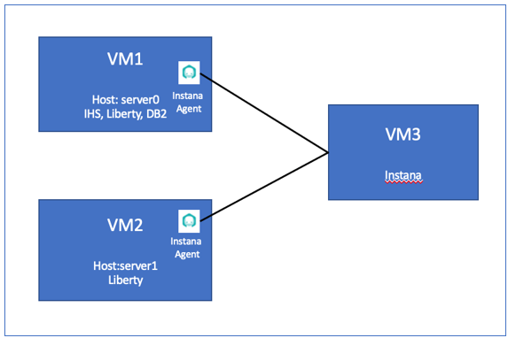

## **Accediendo al entorno**

Si realiza este laboratorio como parte de un taller impartido por un instructor (virtual o presencial), ya se le ha proporcionado un entorno. El instructor le proporcionará los detalles para acceder al laboratorio.

De lo contrario, deberá reservar un entorno para el laboratorio. Puede obtenerlo aquí. Siga las instrucciones en pantalla para la opción " **Reservar ahora** ".

KLP: ENLACE A DETERMINAR PARA LA RESERVA DE ENV

El entorno de laboratorio contiene tres (3) máquinas virtuales Linux.

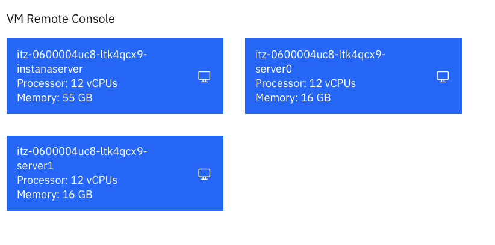 datos generados por "md-type="image"&gt;

Se configura un servicio publicado para proporcionar acceso a la VM **server0** a través de la interfaz noVNC para el entorno de laboratorio.

1. Acceda al entorno de laboratorio desde su navegador web.

    a. Una vez aprovisionado el entorno, haga clic con el botón derecho en el enlace **"Servicio publicado"** . A continuación, seleccione " **Abrir enlace en una nueva pestaña** " en el menú contextual.

    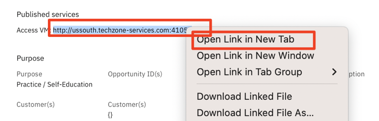 generado automáticamente" data-md-type="image"&gt;

    b. Haga clic en el enlace **"vnc.html"** para abrir el entorno de laboratorio a través de la interfaz **noVNC** .

    

    c. Haga clic en el botón **Conectar**

    

    d. Ingrese la contraseña: **passw0rd** . Luego, haga clic en el botón **"Enviar credenciales"** para acceder al entorno de laboratorio.

    **Nota:** Ese es un cero numérico en passw0rd

    

    Se muestra el escritorio de la máquina virtual **del servidor0** .

     datos generados por "md-type="image"&gt;

## **Consejos para trabajar en el entorno de laboratorio**

1. Puede cambiar el tamaño del área visible utilizando las opciones **de configuración de noVNC** para cambiar el tamaño del escritorio virtual para que se ajuste a su pantalla.

    a. Desde la máquina virtual del entorno, haga clic en el **icono de giro** en el panel de control noNC para abrir el menú.

    

    b. Para aumentar el área visible, haga clic en `Settings > Scaling Mode` y configure el valor en `Remote Resizing`

    

2. Puede copiar/pegar texto de la guía de laboratorio en el entorno de laboratorio utilizando el portapapeles en el visor noVNC.

    a. Copie el texto de la guía de laboratorio que desea pegar en el entorno de laboratorio.

    b. Haga clic en el icono **del Portapapeles** y **pegue** el texto en el portapapeles de noVNC.

    

    c. Pegue el texto en la máquina virtual, como en una ventana de terminal, una ventana del navegador, etc.

    d. Haga clic en el icono **del portapapeles** nuevamente para cerrarlo.

    > **NOTA:** A veces, pegar en una ventana de Terminal en la VM no funciona de manera consistente.

    > En este caso, puedes intentarlo nuevamente, o abrir otra ventana de terminal e intentarlo nuevamente, o pegar el texto en un **editor de texto** en la máquina virtual y luego pegarlo en la ventana de terminal en la máquina virtual.

3. Como alternativa a la opción "Copiar y pegar" de noVNC, puede considerar abrir la guía de laboratorio en un navegador web dentro de la máquina virtual. Con este método, puede copiar y pegar fácilmente texto de la guía de laboratorio sin tener que usar el portapapeles de noVNC.

<br>

## Laboratorio: Observabilidad de Liberty con Instana

En este laboratorio, aprenderá cómo IBM Instana ayuda a identificar y resolver rápidamente un incidente en una aplicación basada en web.

La aplicación en este laboratorio se llama **PlantsByWebSphere** y es una aplicación de tres niveles con servidor web, servidor de aplicaciones y servidor de base de datos.

**Este laboratorio contiene las siguientes actividades:**

- Construir entorno de laboratorio
- Inicie los servidores miembros de Liberty desde el Centro de administración de Liberty.
- Instalar y configurar el agente Instana.
- Crear perspectiva de aplicación Instana.
- Trabajar con la perspectiva de la aplicación Instana
- Resumen.

## **Parte 1: Configuración del entorno de laboratorio**

Este laboratorio requiere un Colectivo Liberty con un Controlador Colectivo y sus miembros. También requirió la implementación de la aplicación **PlantsByWebSpere** en los miembros del colectivo y la habilitación del Enrutamiento Dinámico de Liberty.

<table>
<tbody>
<tr class="odd">
<td></td>
<td>
<p><strong>IMPORTANTE: ¡Por favor leer!</strong></p>
<p>En esta sección, ejecutará un script, que se proporciona, para configurar el entorno de laboratorio para iniciar este laboratorio, 1070.</p>
</td>
</tr>
</tbody>
</table>

### Clonar el repositorio de GitHub para este taller

Este laboratorio utiliza artefactos almacenados en un repositorio de GitHub. Ejecute el siguiente comando para clonar el repositorio en la máquina virtual local utilizada para el laboratorio.

1. Clonar el repositorio de GitHub que contiene los artefactos de laboratorio necesarios para el laboratorio.

    a. Abra una nueva ventana de terminal en la máquina virtual “ **server0.gym.lan** ”.

    

    b. Clonar el repositorio de GitHub necesario para el laboratorio.

    ```
    git clone https://github.com/IBMTechSales/liberty_admin_pot.git
    ```

    c. Navegue hasta el directorio “ **lab-scripts** ” en el archivo clonado.

    ```
    cd ~/liberty_admin_pot/lab-scripts
    ```

    d. Agregue los permisos de “ **ejecución** ” a los directorios lab-scripts y a los scripts de shell.

    ```
    chmod -R 755 ./
    ```

### Configurar el entorno de laboratorio para iniciar el laboratorio 1070

1. Ejecute el siguiente comando para configurar el entorno de laboratorio

    ```
    /home/techzone/liberty_admin_pot/lab-scripts/resetEnvironment.sh
    ```

    a. Escriba “ **`7` ”** para restablecer el entorno e iniciar el laboratorio 1070.

    b. Escriba “ **`y`** ” cuando se le solicite continuar.

    **Nota:** El script tardará entre **`5 – 7 minutes`** en completarse.

    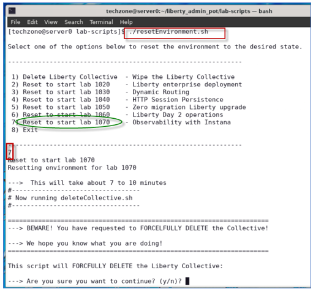

    **Nota:** El script tardará entre **`5 – 7 minutes`** en completarse.

    c. Cuando el script se complete y vea el mensaje " **`Ready to start lab 1070`** ", puede continuar con la siguiente sección del laboratorio.

    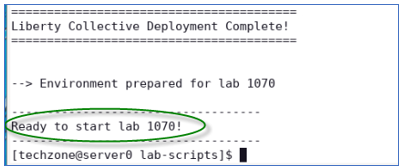

    El script **resetEnvironment.sh** realizó las siguientes tareas:

    - Elimine y limpie cualquier servidor y proceso de Liberty Collective previamente implementado.
    - Crear un nuevo Colectivo Libertad.
    - Construya y produzca un paquete de Liberty Server para implementarlo en servidores de aplicaciones Liberty.
    - Cree dos servidores Liberty, “appServer1” y “appServer2”, implemente el paquete del servidor y una los servidores al Liberty Collective.
    - Implemente las aplicaciones **PlantsByWebSphere** y **WhereAmI** en estos dos servidores Liberty.
    - Habilitar el enrutamiento dinámico de Liberty

### **Iniciar servidores miembros de Liberty**

Ha creado y configurado dos servidores Liberty como miembros del colectivo. En esta sección, los iniciará desde el Centro de administración de Liberty.

1. Antes de iniciar los servidores Liberty, debe iniciar la base de datos db2 utilizada por la aplicación **PlantsByWebSphere** con el siguiente comando.

    ```
    docker start db2_demo_data
    ```

2. Para iniciar los miembros colectivos desde la página **del Explorador** del Centro de administración de Liberty, haga doble clic en el ícono del navegador web en el escritorio de la máquina virtual.

     generado automáticamente" data-md-type="image"&gt;

3. Haga clic en el marcador del Centro de administración de Liberty para abrir su página de interfaz de usuario.

    

    **Nota:** Si ve la “Advertencia: Posible riesgo de seguridad más adelante”, haga clic en **Avanzar...-&gt;Aceptar riesgo y continuar** para continuar.

    Se muestra la página de inicio de sesión del Centro de administración del colectivo Liberty.

4. **Inicie sesión** en el Centro de administración. Las credenciales de inicio de sesión son: **`admin` / `admin`**

    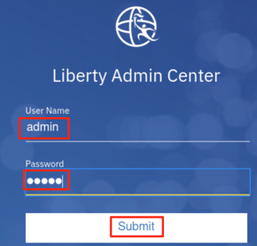

    Se muestra la página de inicio del Centro de administración de Liberty.

    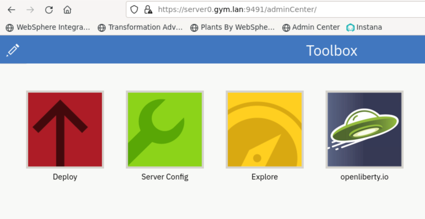

5. Haga clic en el icono **Explorar** .

    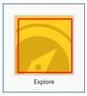

Se muestra la lista de recursos colectivos y puedes ver que tienes tres servidores y dos hosts en el colectivo.

1. Haga clic en el ícono **`SERVERS`** para ir a su página de detalles.

    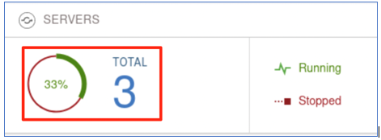

2. En la página de detalles del servidor, haga clic en el ícono del menú desplegable de **`appServer1`** y seleccione **`Start`** para iniciar el servidor.

    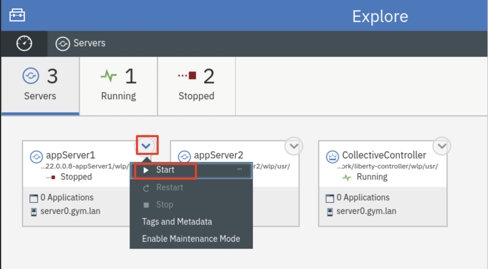

    **Nota:** Si se le solicita, ingrese el nombre de usuario y la contraseña del Centro de administración como: **`admin`** / **`admin`** .

3. Haga clic **`Start`** para confirmar el comando de inicio del servidor **`appServer1`** .

    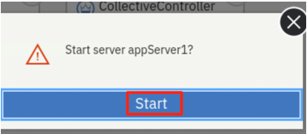

    Se iniciará la aplicación Server **`appServer1`** y podrás ver que está en estado **`Running`** con 2 aplicaciones y ahora tienes 2 servidores en estado de Ejecución.

    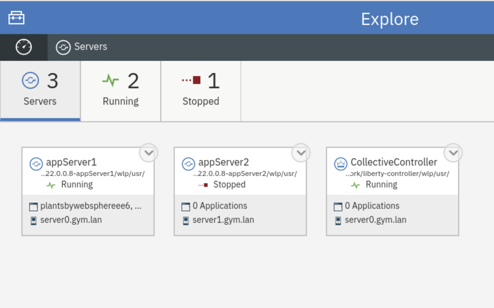

4. Repita el mismo procedimiento de inicio del servidor para el servidor **`appServer2`** . Una vez hecho esto, el servidor **appServer2** se inicia como se muestra a continuación:

    

5. Haga clic en el ícono **`Explorer dashboard`** para volver a la vista del panel de control.

    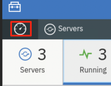

    Verá que las dos aplicaciones en ambos servidores miembros están en funcionamiento.

    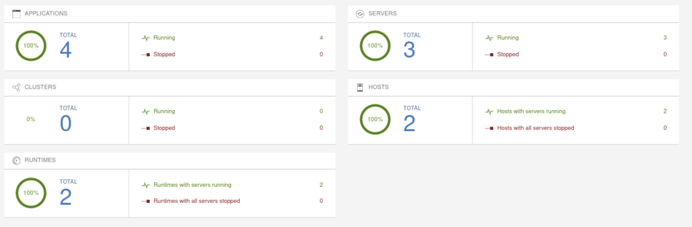

## **Parte 2: Configurar Liberty Server para Instana Monitor**

Instana utiliza su Agente para supervisar y observar la infraestructura de Liberty. Una vez instalado el Agente, el **`Instana WebSphere Liberty sensor`** se implementa e instala automáticamente. El sensor comienza a supervisar lo siguiente:

- Recopilación de métricas
    - Datos de configuración
        - Nombre
        - Versión
        - Directorio de instalación
        - Puertos
        - Estados de aplicación
    - Métricas de rendimiento
        - Grupo de subprocesos
        - Servlets
            - Nombre
            - Solicitudes
            - Tiempo promedio de respuesta
        - Grupos de conexiones de bases de datos
        - Sesiones
- Rastreo (con JMX habilitado)

En esta sección, configurará los dos servidores Liberty habilitando la **`monitor feature`** de Liberty (habilitando JMX), para que Instana pueda monitorearlos.

También agregará etiquetas Instana a los servidores Liberty para que puedan identificarse fácilmente en la infraestructura de Instana.

Para habilitar la función de monitor Liberty, solo necesita agregar la siguiente línea al **server.xml** .

`<feature>monitor-1.0</feature>`

Para agregar etiquetas Instana, configure una variable de entorno de servidor Liberty: `INSTANA_SERVICE_NAME=<Your App Server Name>` en el archivo **`server.env`** .

En este laboratorio, se proporcionan scripts para realizar estas tareas de configuración.

1. Desde la ventana de Terminal, ejecute los siguientes comandos para agregar la función de monitoreo a los servidores Liberty **appServer1** y **appServer2**

    ```
    /home/techzone/liberty_admin_pot/lab-scripts/applyOverrides.sh -n appServer1 -v 22.0.0.8 -h server0.gym.lan MONITOR

    /home/techzone/liberty_admin_pot/lab-scripts/applyOverrides.sh -n appServer2 -v 22.0.0.8 -h server1.gym.lan MONITOR
    ```

    El script **`applyOverrides.sh`** agrega `<feature>monitor-1.0</feature>` a los archivos server.xml de **appServer1** y **appServer2.**

2. Ejecute el siguiente comando para agregar las “etiquetas Instana” al archivo **server.env** en Liberty:

    ```
    /home/techzone/liberty_admin_pot/lab-scripts/instanaAddServerTags.sh
    ```

    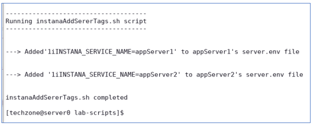

    El script **instanaAddServerTags.sh** hace lo siguiente:

    - agrega " **INSTANA_SERVICE_NAME=appServer1** al archivo **server.env** de **appServer1**
    - agrega " **INSTANA_SERVICE_NAME=appServer2** al archivo **server.env** de **appServer2**

3. Después de los cambios, **`restart`** ambos servidores Liberty en el Centro de administración de Liberty Collective.

    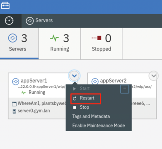

    Si se le solicita, ingrese las credenciales del Centro de administración como: **`admin`** / **`admin`** .

    Se ha completado la configuración del servidor Liberty para Instana.

## Parte 3: Instalar y configurar el agente de Instana

Para utilizar Instana para monitorear y observar su infraestructura de TI y sus aplicaciones, necesita instalar un agente de Instana en su entorno.

Dado que está utilizando dos máquinas virtuales, **server0.gym.lan** y **server1.gym.lan** , para brindar soporte al colectivo Liberty en este laboratorio, el agente Instana debe instalarse en estas dos máquinas virtuales.

Para simplificar, se ha instalado y configurado un agente Instana en la máquina virtual **server1.gym.lan** .

En esta sección, aprenderá cómo instalar y configurar el agente Instana en la máquina virtual **server0.gym.lan** .

1. Desde el navegador web, abra una nueva ventana y haga clic en el **`Instana bookmark`** para iniciar la consola Instana.

    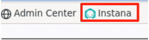

    Cuando se le solicite, ingrese las credenciales de inicio de sesión como:

    Nombre de usuario: **`admin@instana.local`**

    Contraseña: **`Kwn19Rrnz2`**

    Se muestra la página de inicio de Instana.

    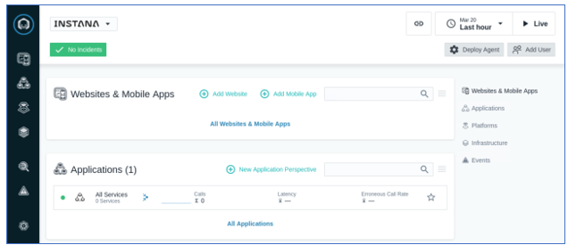

2. Haga clic en `More > Agents` para abrir la página **Agentes** de Instana.

    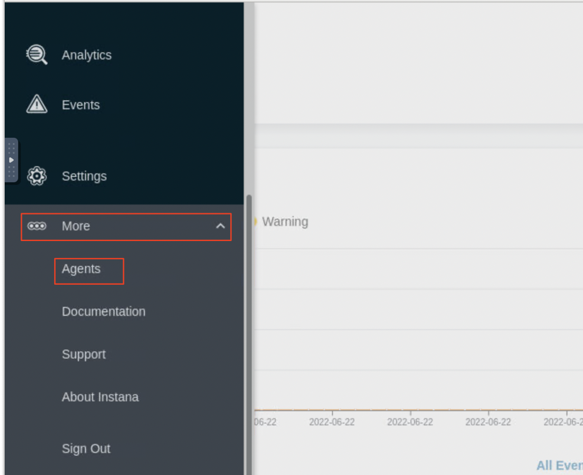

3. Haga clic en **`Installing Instana Agents`** .

> 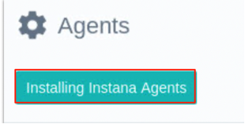 Descripción generada automáticamente "data-md-type="image"&gt;

1. Instalar un agente **“dinámico” de Linux** en la máquina virtual

    a. En la sección **SO** , seleccione **`Linux`**

    b. En el encabezado " **Empaquetado del agente** ", seleccione el botón de opción **`Dynamic`**

    c. En el encabezado " **Tiempo de ejecución del agente** ", seleccione **`Eclipse OpenJ9 11`**

    d. En el encabezado " **Modo de instalación** ", seleccione el modo **`Interactive`** .

    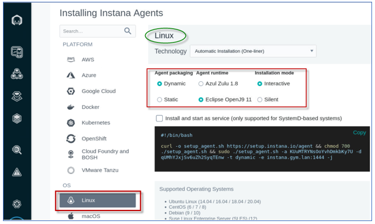

    e. Haga clic en **`Copy`** para copiar el script (al portapapeles) para instalar el agente Instana.

    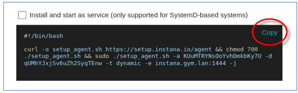

    El agente de host de Instana tiene dos tipos, **`dynamic`** y **`static`** , según si puede actualizarse o no.

    Un `dynamic host agent` descarga al iniciarse el conjunto de sensores más reciente de los repositorios. De forma predeterminada, un agente dinámico se actualiza diariamente con las últimas y mejores capacidades disponibles.

    Un `static host agent` es un agente de host autónomo que incluye todos los últimos componentes disponibles en el momento de su lanzamiento y no tiene capacidades de actualización dinámica.

2. Ejecute el script para instalar el agente Instana en la máquina virtual

    a. Regrese a la ventana Terminal, haga clic derecho y seleccione **`Paste`** para pegar el script de instalación del agente Instana.

    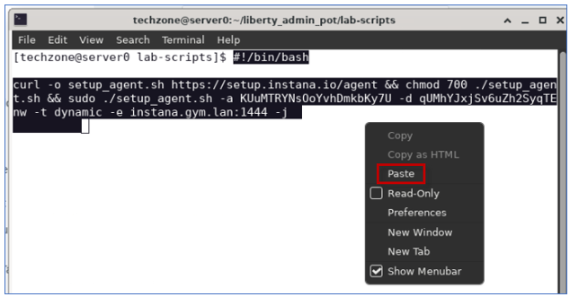

    b. Presione **`Enter`** para iniciar la instalación del agente.

    c. Escriba “ **`y`** ” cuando se le pregunte “¿Está seguro?” y presione **`Enter`** .

    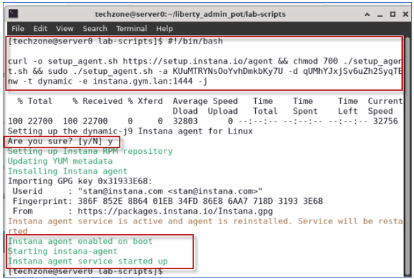

    El script instala Instana Agent en el directorio **/opt/instana/agent** , crea un servicio de agente e inicia el agente.

3. Una vez instalado el Agente, debe configurarlo para el entorno de la aplicación **PlantsByWebSphere** . En este laboratorio, se proporciona un script para realizar la tarea de configuración. Ejecute el siguiente comando:

    ```
    /home/techzone/liberty_admin_pot/lab-scripts/updateInstanaAgentConfiguration.sh
    ```

    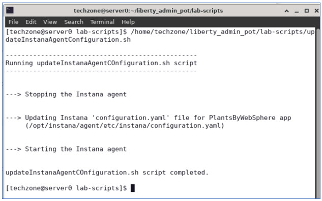

    El script **`updateInstanaAgentConfiguration.sh`** realizó las siguientes actualizaciones en su archivo **`configuration.yaml`** , ubicado en: **/opt/instana/agent/configuration.yaml**

    1. Defina **`Infrastructure Zone`** de Instana configurando el **`Hardware & Zone`**

    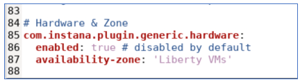

    1. Habilite **`tracing`** para Apache httpd ( **servidor IHS** ), en la sección **`Apache Httpd`**

    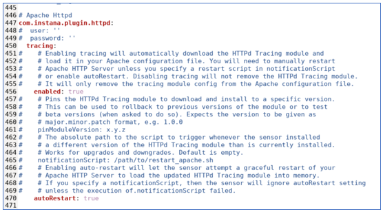

    1. Habilite **`tracing`** para la **base de datos PlantsByWebSphere DB2** , en la sección `DB2`

    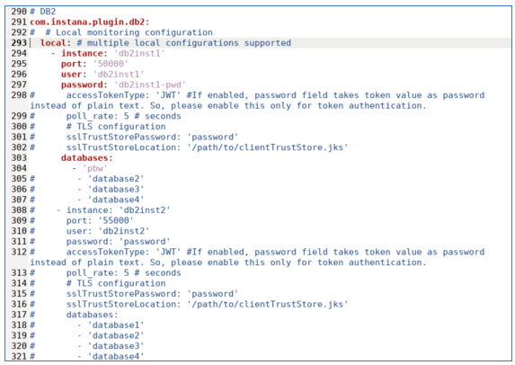

    1. El script **reinicia** el servicio del Agente Instana

    El agente Instana ahora está configurado e iniciado.

4. Verificar la instalación del agente Instana

    **Nota:** Una vez iniciado el agente, es posible que tarde unos minutos en sincronizarse con el servidor Instana.

    a. Regrese a la página `More -> Instana Agents` en el navegador web.

    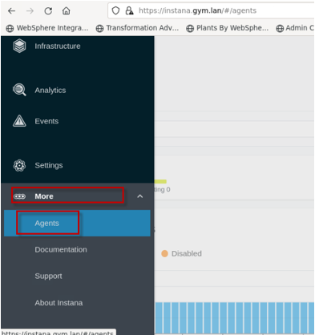

    b. Cambie el **`Time Range`** a **`Last 5 minutes`** , esto configura la función básica del monitor Instana para monitorear las máquinas virtuales Liberty y mostrarlas en intervalos de 5 minutos.

    

    Puedes ver que hay dos agentes informando, incluido el que acabas de instalar y configurar.

    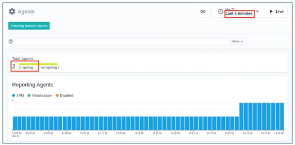

    c. Desplácese hasta la parte inferior de la página; podrá ver que estos dos agentes aparecen en la sección **`Agent Details`** .

    **Nota:** Hay un **`Linux VM agent`** en cada una de las dos máquinas virtuales en el entorno de laboratorio: ( **server0.gym.lan** y **server1.gym.lan** )

    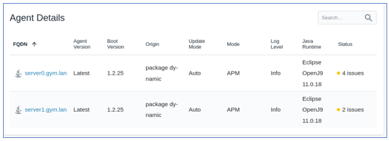

5. Ver los detalles en Instana **`Infrastructure Zone`** .

    a. Desde el panel de navegación izquierdo, haga clic en el ícono **`Infrastructure`** .

    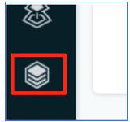

    Verá que se muestra la zona de infraestructura que definió. Muestra las dos máquinas virtuales Liberty en la zona " **Máquinas virtuales Liberty** ", configurada mediante el script que ejecutó hace unos momentos.

    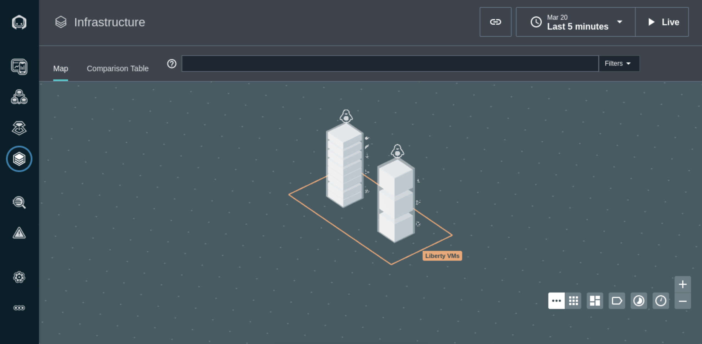

    En cada VM Liberty, verá diferentes bloques de capas que representan todos los procesos que Instana detectó en la VM, incluidos los **`Java processes`** para el **`collective controller`** y **`collective members`** , los procesos de Python y de nodo, y el proceso **`Apache Httpd`** y el proceso **`container`** , etc.

    b. Pase el mouse sobre cada uno de los cuadros de **`Liberty VM`** y sus bloques de capa; podrá ver todos los procesos que se ejecutan en esa VM.

    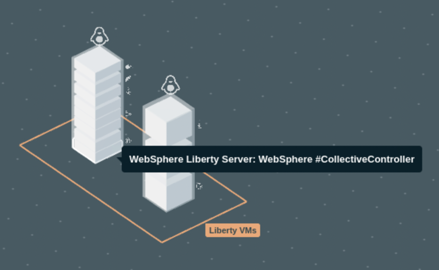

    Como puedes ver, Instana ha detectado los siguientes procesos en ejecución:

    En la máquina virtual **`server0.gym.lan`**

    - Controlador colectivo de WebSphere Liberty
    - Aplicación del servidor WebSphere Liberty, servidor1
    - Python3
    - /usr/bin/python3
    - Agente de Instana en el servidor 0
    - Apache HTTPd
    - Contenedor Docker: ibmoms/db2express-c

    En la máquina virtual **`server1.gym.lan`**

    - Aplicación del servidor WebSphere Liberty, servidor 2
    - /usr/bin/python3
    - Agente de Instana en el servidor 1

6. Visualizar la recopilación de métricas de rendimiento del servidor Liberty “appServer1”

    a. Haga clic en el bloque **`WebSphere Liberty server appServer1`** en la máquina virtual **server0.gym.lan.**

    b. Haga clic **`Open Dashboard`** para acceder a la recopilación de métricas de rendimiento **de appServer1** .

    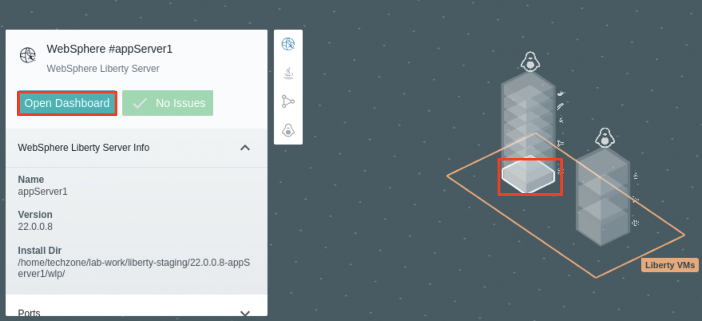

    Se muestra la página de recopilación de métricas de rendimiento **de appServer1** .

    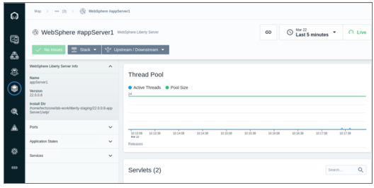

## **Parte 4. Crear la perspectiva de la aplicación Instana**

**Las perspectivas de aplicación** en Instana permiten a cualquier usuario, desde DevOps hasta desarrollador, organizar la información en las visualizaciones y el contexto exactos que necesita para monitorear, examinar y optimizar las aplicaciones y/o servicios de los que es responsable.

Cada Perspectiva de Aplicación genera automáticamente un panel de monitoreo con múltiples funciones para las [señales clave](https://www.ibm.com/links?url=https%3A%2F%2Flanding.google.com%2Fsre%2Fsre-book%2Fchapters%2Fmonitoring-distributed-systems%2F%23xref_monitoring_golden-signals) y más. Organiza a un equipo para que se concentre en los servicios que le interesan y no se distraiga. Las alertas, errores y registros se asignan a un punto de acceso para enfocar la resolución de problemas. Una Perspectiva de Aplicación logra esto al permitirle ajustar dinámicamente la visibilidad al tamaño justo para satisfacer sus necesidades.

Las perspectivas de aplicación se aplican en cada aspecto de la Plataforma de Observabilidad Empresarial, lo que crea una personalización en toda la plataforma de Instana: mapas de servicios e infraestructura, paneles, alertas, seguimientos, perfiles, incidentes e incluso análisis.

**`Application Perspectives templates` listas para usar** brindan formas rápidas y sencillas de crear su vista personal en una de las formas estándar que tengan sentido para su carga de tareas.

Las plantillas le permiten seleccionar el tipo de perspectiva que desea crear junto con los medios para seleccionar las etiquetas para la información de la aplicación que se va a monitorear.

En esta sección, creará una **`application perspective`** para la aplicación **`PlantsByWebSphere`** . Dado que se trata de una aplicación heredada de tres niveles, con servidor web, servidor de aplicaciones y servidor de bases de datos, seguirá los siguientes pasos para crearla.

Se pueden encontrar detalles adicionales sobre la perspectiva de aplicación de Instana en la documentación en línea: [https://www.ibm.com/docs/en/instana-observability/current?topic=applications-application-perspectives](https://www.ibm.com/docs/en/instana-observability/current?topic=applications-application-perspectives)

Ahora, cree una perspectiva de aplicación personalizada para observar la aplicación PlantsByWebSphere.

1. Haga clic en el ícono **`Applications`** en el menú de navegación de la consola Instana a la izquierda.

    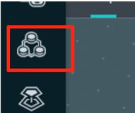

Se muestra la página **Perspectivas de la aplicación** .

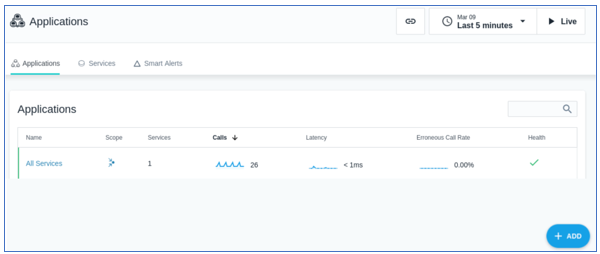

1. Haga clic en **`+ADD`** y seleccione **`New Application Perspective`** para crear una nueva perspectiva de aplicación.

    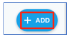

    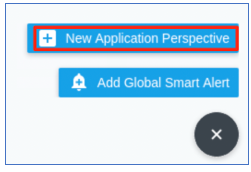

2. Asegúrese de que el modelo **`Services and Endpoints`** esté seleccionado. Haga clic en **`Next`** para continuar.

    Instana incluye varios **`blueprints`** preconfigurados que admiten muchos casos de uso comunes para la observabilidad. En este laboratorio, se utiliza el modelo de **`Services and Endpoint`** , que permite construir fácilmente una Perspectiva de Aplicación (PA) seleccionando directamente el conjunto de **servicios** o **puntos de conexión** .

    Puede encontrar información adicional sobre los planos de AP aquí: [https://www.ibm.com/docs/en/instana-observability/current?topic=applications-application-perspectives#step-1-select-a-blueprint](https://www.ibm.com/docs/en/instana-observability/current?topic=applications-application-perspectives#step-1-select-a-blueprint)

    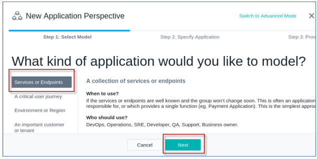

    A continuación, definirá los `filters` para la aplicación PlantsByWebSphere y su componente.

    **Nota:** los `filters` que defina seleccionarán los siguientes componentes:

    - los servidores Liberty ( **appServer1** y **appServer2** )
    - el servidor IHS ( **server0.gym.lan** )
    - Servidor de base de datos DB2 ( **db2express-c** ) utilizado por la aplicación **PlantsByWebSphere** .

3. Cree los **filtros** para seleccionar solo los **componentes de servicio** utilizados por la aplicación PlantsByWebSphere. Para ello, haga clic en **`Add filter`** .

    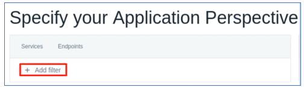

4. Seleccione el primer filtro como **`Agent`** &gt; **`Zone`** .

    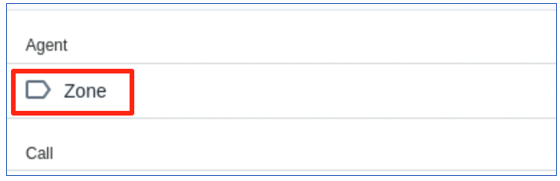

5. Establezca el filtro como **`Agent > Zone = Liberty VMs`** .

    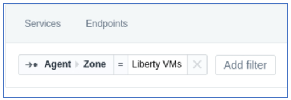

6. Haga clic en el botón **`Add Filter`** y agregue el siguiente filtro

    a. Busque **`service`** y seleccione el siguiente filtro como **`Service > Name`** .

    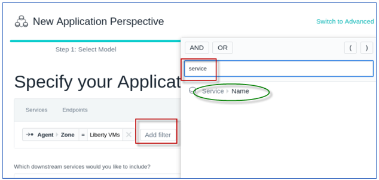

    b. Escriba **`appServer`** como filtro de nombre de servicio y seleccione **`contains`** como **operando** , como se ilustra a continuación:

    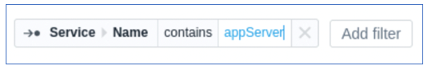

    **Nota:** este filtro “ **appServer** ” coincidirá con Liberty **appServer1** y **appServer2** tal como lo definió en el entorno de Liberty Collective.

7. Agregue el siguiente filtro como **`Service > Name = server0.gym.lan`**

    

8. Agregue el siguiente filtro como **`Service > Name = db2express-c`**

    

    En este punto, los filtros primarios están en su lugar como se muestra a continuación.

    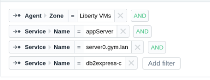

    A continuación, debe insertar los **`Operands`** adecuados y **`parenthesis`** para definir el filtro apropiado.

    La definición **del archivador de la aplicación pbw** debe coincidir cuando:

    - La “zona” es “Liberty VMs” **Y** cualquiera de las siguientes:
        - **(** el nombre del servicio **CONTIENE** appServer **O**
        - nombre del servicio = server0.gym.lan **O**
        - nombre del servicio = db2express-c **)**

9. Cambie los ****`CONTAINS`**** `AND` / `OR` , el operando CONTAINS y la agrupación de paréntesis **`(` `)`** de la siguiente manera para completar los filtros de perspectiva de la aplicación.

    **Consejo:** Para insertar el operando y el paréntesis, simplemente coloque el ratón entre los filtros y seleccione el operando o el paréntesis que desea insertar o modificar. El filtro final de la aplicación pbw debería verse como en la ilustración a continuación.

    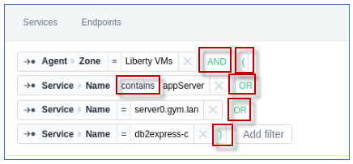

    Aquí se pueden encontrar **sugerencias** para configurar filtros para el **modelo de servicio o punto final** :

    [https://www.ibm.com/docs/es/instana-observability/current?topic=applications-application-perspectives#tips-on-using-the-services-or-endpoints-blueprint](https://www.ibm.com/docs/en/instana-observability/current?topic=applications-application-perspectives#tips-on-using-the-services-or-endpoints-blueprint)

10. Desplácese hacia abajo y seleccione **`All downstream services`** y haga clic **`Next`** .

    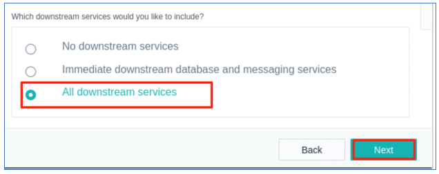

11. Complete la nueva configuración de la perspectiva de la aplicación

    a. Agregue **`pbw app`** como **nombre de la perspectiva de la aplicación.**

    b. Seleccionar la opción **`All Calls`**

    c. Haga clic **`Create`** .

    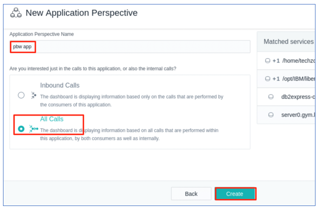

    Se crea la perspectiva de la aplicación.

    

    **Consejo:** Siempre puede **actualizar** la configuración de Perspectiva de la aplicación, según sea necesario

    1. En la barra lateral, haga clic **en Aplicaciones** y luego seleccione la perspectiva de su aplicación.
    2. Seleccione la pestaña **Configuración** .
    3. Haga clic en el botón **Guardar** cuando esté listo para guardar sus actualizaciones.

    [https://www.ibm.com/docs/es/instana-observability/current?topic=applications-application-perspectives#update-an-application-perspective](https://www.ibm.com/docs/en/instana-observability/current?topic=applications-application-perspectives#update-an-application-perspective)

    Actualmente no verá ningún dato para la **página Resumen de** perspectiva de la aplicación **de la aplicación pbw** porque no hay carga de trabajo que realice solicitudes a la aplicación PlantsByWebSphere.

    En la siguiente sección del laboratorio, ejercitarás la aplicación PlantsByWebSphere.

## Parte 5: Trabajar con la perspectiva de la aplicación Instana

En esta sección, agregará algo de carga de trabajo a la aplicación **PlantsByWebSphere** y utilizará la **`Application Perspective`** Instana para monitorear y observar el estado de salud de la aplicación.

1. Haga clic en la pestaña **`Dependences`** en la perspectiva de **`pbw app`** ; verá el mensaje “Aún no hay servicios” en la página.

    

2. Abra una nueva ventana del navegador web e ingrese la URL de la aplicación **PlantsByWebSphere** :

    ```
    https://server0.gym.lan:8443/PlantsByWebSphere
    ```

    Se muestra la **página “Inicio”** de la aplicación.

    

3. Navegue y visite diferentes páginas de la aplicación para agregar algo de carga a la aplicación.

    

4. Regrese a la perspectiva de la aplicación **`pbw app`** en `Instana` y haga clic en **`Live`** para obtener los datos más recientes. Espere unos minutos a que se muestren los `dependency graphs`

    a. Seleccione `Last 5 minutes` de datos para mostrar

    b. Espere unos minutos hasta que se muestren los gráficos de dependencia.

    

5. Puedes ver que Instana ha seleccionado automáticamente los componentes de la aplicación, como se muestra en el `Dependencies diagram` . También empieza a mostrar los datos del monitor en la página **Resumen** .

    

    

### 5.1 Ejecute una prueba de carga para ver la observabilidad de Liberty con Instana

En la última sección, ejecutó algunas solicitudes para la aplicación PlantsByWebSphere para verificar que la `pbw app` en la perspectiva de aplicación de Instana esté configurada para observar los siguientes servicios para la aplicación PlantsByWebSphere.

- `Http server` en server0.gym.lan
- `Liberty application servers` appServer1 y appServer2
- Base de datos de la aplicación `DB2`

En esta sección, utilizará la herramienta JMeter para generar una carga de trabajo simulada de múltiples usuarios utilizando la aplicación PlantsByWebSphere.

Luego, producirá una interrupción de la base de datos DB2 y observará la detección de incidentes de Instana para aplicaciones WebSphere Liberty, utilizando capacidades listas para usar.

1. Ahora agregue más carga de trabajo a la aplicación PlantsByWebSphere con el siguiente comando, que inicia una prueba de carga de JMeter:

    ```
    /home/techzone/liberty_admin_pot/lab-scripts/pbwLoadTest.sh
    ```

    Este script ejecuta una prueba de carga **`Jmeter`** en la aplicación **PlantsByWebSphere** con `500 loops` y `5 simultaneous threads` (usuarios)

2. En Instana, vea los detalles de la aplicación **pbw** en la página **“Resumen” de la perspectiva de la aplicación.**

    a. Una vez que se esté ejecutando el script de carga de trabajo, regrese a **la página Resumen** de la perspectiva de la aplicación Instana **pbw** para ver los detalles.

    b. Asegúrese de que la perspectiva **`pbw app`** esté configurada para mostrar `last 5 minutes` de datos `Live` .

    

    c. Desplácese hacia abajo por la página.

    d. Pase el puntero del ratón sobre cada diagrama y verá los resúmenes detallados.

    

    

3. Vaya a la pestaña **`Dependencies`** en la **perspectiva de la aplicación** **`pbw`**

    Observará las dependencias del servicio que se descubrieron en función de la configuración de la perspectiva de la aplicación que proporcionó en la sección anterior.

    

4. Ahora vas a crear una **`situation`** en la que la **base de datos DB2 está inactiva** y verás cómo Instana supervisa, observa e identifica dicho incidente.

    a. Mantenga el script de JMeter ejecutándose en la ventana del terminal.

    b. Abra una nueva ventana de Ternal y ejecute el siguiente comando para `stop the DB2 database` .

    ```
    docker stop db2_demo_data
    ```

5. En la ventana de terminal que ejecuta la prueba de carga de JMeter, comenzará a ver el `Error` para las solicitudes que dependen de la base de datos del backend.

    

6. En Instana, en unos minutos, verá que el diagrama de flujo de trabajo en la vista **`Dependencies`** de Instana se actualiza como se ilustra a continuación.

    Esto se debe a que, durante este tiempo, Instana está intentando observar la base de datos utilizando el servicio **`jdbc`** .

    Como Instana detectó que la aplicación no puede acceder a la base de datos, plantea un **`issue`** y continúa **`investigate`** como se muestra en el diagrama a continuación.

    

    Inicialmente, Instana descubre que el problema afectará a todos los componentes del flujo de trabajo y marca estos componentes con un color de ADVERTENCIA **`yellow`** como se muestra en el diagrama a continuación.

    

    Finalmente, Instana identifica que la **`root cause`** del problema proviene del componente `database server` y lo marca **`red`** indicando problemas, como se muestra en el diagrama a continuación.

    

7. Desde la pestaña **`Summary`** , también puede ver el mensaje de error y los informes relacionados con este problema.

    

8. Regrese a la pestaña **`Dependencies`** , haga clic en el componente **`db2express-c`** y haga clic en **`Go to Dashboard`** .

    

9. En el panel de control **`db2express-c`** , haga clic en el diagrama **`Calls`** y seleccione **`View in Analyze`** .

    

10. En la página **`Analyze`** , haga clic en **`CONNECT`** punto final. Luego, haga clic en la primera llamada **`CONNECT`** .

    

    En la página de detalles `CONNECT Calls` , Instana ha identificado claramente que el problema está en la conexión a la base de datos DB2.

    

    Como puede ver en este ejemplo, Instana puede ayudarlo a identificar rápidamente la causa raíz de un problema en su entorno y brindarle la oportunidad de resolverlo.

11. `Restart` la base de datos DB2 con el comando:

    ```
    docker start db2_demo_data
    ```

12. Espera unos minutos y vuelve a la consola de Instana, verás que el problema está resuelto.

    a. En la perspectiva de **`pbw app`** , asegúrese de configurar `last 5 minutes` y el modo `Live` .

    b. Verá que los errores y códigos de respuesta han vuelto a la normalidad ahora que la base de datos está nuevamente en línea.

    

13. `Exit` la prueba de carga de JMeter utilizando la combinación de teclas **`Ctrl_c`**

## **Resumen**

En este laboratorio, aprendió a integrar Instana con Liberty Collective para proporcionar una solución de Monitoreo del rendimiento de aplicaciones (APM) con capacidad de observación.

Instana puede observar y monitorear automáticamente cualquier aplicación, servicio o solicitud, y ayudar a identificar rápidamente la causa raíz de cualquier problema de rendimiento de la aplicación.

**¡Felicidades!**

**Has completado con éxito el laboratorio “Observabilidad de Liberty con Instana”**
