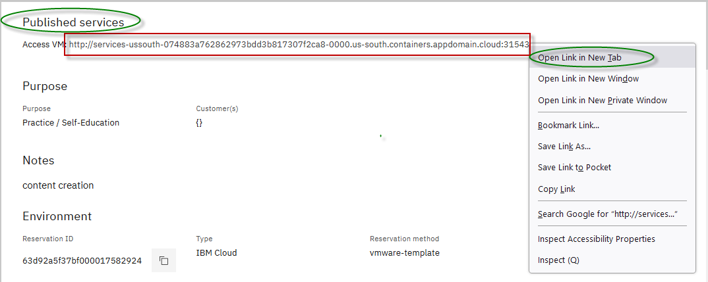

# Laboratorio 4311:

## Prácticas recomendadas para implementaciones de WebSphere Liberty y actualizaciones sin migración en máquinas virtuales

El objetivo de este laboratorio es brindar experiencia práctica utilizando prácticas recomendadas para implementar aplicaciones Java en Liberty en colectivos en máquinas virtuales, utilizando automatización y metodologías de implementación flexibles.

Aprenderá cómo la función de enrutamiento dinámico de Liberty permite el enrutamiento de solicitudes HTTP a todos los miembros de los colectivos de Liberty sin regenerar el archivo de configuración del complemento WebSphere cuando se agregan, eliminan, inician, detienen o modifican servidores, miembros del colectivo, aplicaciones o hosts virtuales.

También aprenderá que Liberty sigue un modelo de entrega continua de flujo único. Liberty solo tiene un flujo, por lo que no es necesario actualizar versiones. Simplemente instale la nueva versión (o los fixpacks, si lo prefiere) para obtener las últimas mejoras de rendimiento, funciones y correcciones de errores. A continuación, utilice su proceso de compilación actual para generar un nuevo paquete de Liberty Server que contenga los binarios de Liberty actualizados, su aplicación y configuración existentes, y luego impleméntelo en una ubicación de instalación dual. Esto elimina uno de los mayores problemas para gestionar la deuda técnica de sus aplicaciones: mantenerse al día con las actualizaciones de software.

Siguiendo estas metodologías, comprenderá cómo puede aplicar sus propios procesos o automatización de DevOps para lograr una agilidad y flexibilidad significativas al administrar las implementaciones de Liberty con procesos automatizados repetibles que reducen significativamente el riesgo para su negocio.

Después de completar el laboratorio, deberías poder apreciar lo sencillo que es administrar Liberty a través de la automatización, lo que también se aplica a la integración con tus propias herramientas de DevOps.

**Este laboratorio contiene las siguientes actividades prácticas:**

- Cree paquetes de servidor Liberty utilizando el modelo de implementación flexible de Liberty

- Crear un colectivo Liberty-ND

- Implementar paquetes de Liberty Server en el colectivo Liberty-ND

- Configurar el enrutamiento dinámico de Liberty-ND en el controlador colectivo

- Actualice Liberty utilizando la arquitectura de migración cero de Liberty

## El entorno del laboratorio

El entorno de laboratorio consta de dos máquinas virtuales host:

- servidor0.gym.lan

- servidor1.gym.lan

Utilizará los scripts de shell de Linux proporcionados para el laboratorio para crear paquetes de servidor Liberty, construir un Liberty-ND Collective que abarque dos máquinas virtuales host e implementar el paquete de servidor en ambas máquinas virtuales host.

El Colectivo Liberty-ND que crearás se ilustra a continuación:


La máquina virtual host “ **server0.gym.lan** ”, que es la máquina virtual principal, contiene los siguientes componentes:

- **Compilaciones de Liberty y paquetes de servidor:** Piense en esto como una "máquina de compilación" donde un proceso de compilación compila las aplicaciones, ejecuta pruebas y genera un paquete de servidor listo para implementarse. Un paquete de servidor contiene los binarios de Liberty, la aplicación y las configuraciones predeterminadas del servidor, que se implementan como una unidad para alojar las máquinas virtuales.

- **Controlador colectivo:** el controlador colectivo es un servidor Liberty que está configurado con la función “ **collectualController-1.0** ”, que permite que el servidor actúe como servidor de administración para el colectivo.

    > **Nota:** En la mayoría de los casos, el controlador colectivo probablemente se colocaría en un host dedicado, pero para minimizar el tamaño de este entorno de demostración, se ubica junto con el host utilizado para las compilaciones.

- **Miembro del Colectivo:** Los miembros del colectivo son servidores Liberty que ejecutan su aplicación y se conectan al colectivo mediante la función " **CollectualMember-1.0** ". Pueden administrarse centralmente y aprovechar funciones como el enrutamiento dinámico sin necesidad de licencias de Liberty ND.

    > **Nota:** En la mayoría de los casos, los miembros del colectivo Liberty no están ubicados en el mismo host que los controladores colectivos, pero para minimizar el tamaño de este entorno de demostración, un miembro del colectivo se ubica junto a un controlador colectivo.

- **Servidor HTTP:** El servidor HTTP de IBM se utiliza en algunos laboratorios para mostrar las capacidades de Liberty, como enrutamiento dinámico, persistencia de sesión y escenarios de conmutación por error.

    **Nota:** En la mayoría de los casos, el servidor HTTP se ubica en un host dedicado ubicado en la DMZ, pero para minimizar el tamaño de este entorno de demostración, se ubica junto con los procesos Liberty.

La máquina virtual “ **server1.gym.lan** ” contiene los siguientes componentes:

- **Miembro colectivo:** Los miembros colectivos son servidores Liberty que ejecutan su aplicación y están unidos al colectivo con la función “ **collectualMember-1.0** ”.


<br>


## Accediendo al entorno

Si realiza este laboratorio como parte de un taller impartido por un instructor (virtual o presencial), ya se le ha proporcionado un entorno. El instructor le proporcionará los detalles para acceder al laboratorio.

El entorno de laboratorio contiene dos (2) máquinas virtuales Linux.


Se configura un servicio publicado para proporcionar acceso a la VM **server0** a través de la interfaz noVNC para el entorno de laboratorio.

1. Acceda al entorno de laboratorio desde su navegador web.

    a. Una vez aprovisionado el entorno, haga clic con el botón derecho en el enlace **"Servicio publicado"** . A continuación, seleccione " **Abrir enlace en una nueva pestaña** " en el menú contextual.

    

    b. Haga clic en el enlace **"vnc.html"** para abrir el entorno de laboratorio a través de la interfaz **noVNC** .

    

    c. Haga clic en el botón **Conectar**

    

    d. Ingrese la contraseña: **passw0rd** . Luego, haga clic en el botón **"Enviar credenciales"** para acceder al entorno de laboratorio.

    **Nota:** Ese es un cero numérico en passw0rd


1. Inicie sesión en la máquina virtual **server0** utilizando las credenciales a continuación:

    - ID de usuario: **techzone**

    - Contraseña: **IBMDem0s!**

## **Consejos para trabajar en el entorno de laboratorio**

1. Puede cambiar el tamaño del área visible utilizando las opciones **de configuración de noVNC** para cambiar el tamaño del escritorio virtual para que se ajuste a su pantalla.

    a. Desde la máquina virtual del entorno, haga clic en el **icono de giro** en el panel de control noNC para abrir el menú.

    

    b. Para aumentar el área visible, haga clic en `Settings > Scaling Mode` y configure el valor en `Remote Resizing`

    

2. Puede copiar/pegar texto de la guía de laboratorio en el entorno de laboratorio utilizando el portapapeles en el visor noVNC.

    a. Copie el texto de la guía de laboratorio que desea pegar en el entorno de laboratorio.

    b. Haga clic en el icono **del Portapapeles** y **pegue** el texto en el portapapeles de noVNC.

    

    c. Pegue el texto en la máquina virtual, como en una ventana de terminal, una ventana del navegador, etc.

    d. Haga clic en el icono **del portapapeles** nuevamente para cerrarlo.

    > **NOTA:** A veces, pegar en una ventana de Terminal en la VM no funciona de manera consistente.

    > En este caso, puedes intentarlo nuevamente, o abrir otra ventana de terminal e intentarlo nuevamente, o pegar el texto en un **editor de texto** en la máquina virtual y luego pegarlo en la ventana de terminal en la máquina virtual.

3. Como alternativa a la opción "Copiar y pegar" de noVNC, puede considerar abrir la guía de laboratorio en un navegador web dentro de la máquina virtual. Con este método, puede copiar y pegar fácilmente texto de la guía de laboratorio sin tener que usar el portapapeles de noVNC.

<br>

## Revisar las prácticas comunes de implementación de Liberty

Un servidor Liberty es ligero gracias a su arquitectura modular, lo que permite empaquetar fácilmente la instalación del servidor y sus aplicaciones en un paquete comprimido (zip o jar). Posteriormente, puede almacenar este paquete y usarlo para implementar la instalación en diferentes nodos o máquinas de su Colectivo Liberty.

En este laboratorio, implementará Liberty y aplicaciones de muestra en un colectivo Liberty-ND, siguiendo varias prácticas comunes como se ilustra a continuación.


- **Práctica recomendada:** Producir paquetes de servidor como salida de compilación

    Se recomienda crear una compilación inmutable utilizando paquetes de servidor que incluyan los binarios de Liberty, la configuración del servidor, la aplicación y la configuración compartida como salida de la compilación.

    El resultado de la compilación, " **paquete de servidor** ", es la unidad que se puede implementar para los miembros del colectivo Liberty. Esta práctica es muy similar a las prácticas recomendadas para la implementación de imágenes de contenedor en plataformas Kubernetes.

- **Práctica recomendada:** Automatizar la creación y la implementación de paquetes de servidor en el colectivo

    Siempre se recomienda automatizar la instalación, la implementación y la configuración para lograr una mayor agilidad, repetibilidad y productividad.

- **Práctica recomendada:** agregue anulaciones de configuración al servidor después de descomprimir el paquete del servidor.

    Los scripts de automatización utilizados en el laboratorio siguen esta práctica. El paquete del servidor se crea como una plantilla que contiene la aplicación, las bibliotecas y la configuración predeterminada.

    Luego, al implementar y descomprimir el paquete del servidor en la máquina de destino, se agregan las modificaciones de configuración. Estas modificaciones pueden anular cualquier configuración predeterminada del paquete del servidor.

<table>
<tbody>
<tr class="odd">
<td></td>
<td>
<p><strong>Nota:</strong> existen varias alternativas para aplicar las anulaciones al servidor después de expandir el archivo.</p>
<p>Algunos clientes eligen anular el uso de variables de entorno del sistema operativo que anulan los valores predeterminados en server.xml, otros clientes aplican las anulaciones en la configuración de Liberty creando el archivo usando las anulaciones en el directorio configDropins o a través de un archivo xml externo include(d) en server.xml para un entorno específico.</p>
</td>
</tr>
</tbody>
</table>

## Parte 1: Clonar el repositorio de GitHub para este taller

Este laboratorio requiere artefactos almacenados en un repositorio de GitHub. Ejecute el siguiente comando para clonar el repositorio en la máquina virtual local utilizada para el laboratorio.

1. Abra una nueva ventana de terminal en la máquina virtual “ **server0.gym.lan** ”.


    

2. Copie los siguientes comandos en la ventana del terminal para clonar el repositorio de GitHub requerido para el laboratorio.

    ```
    git clone https://github.com/IBMTechSales/liberty_admin_pot.git

    cd /home/techzone/liberty_admin_pot/lab-scripts

    chmod -R 755 ./
    ```

     datos generados por "md-type="image"&gt;

## Parte 2: Producir “paquetes de servidor” de Liberty como salida de compilación

Siguiendo las prácticas recomendadas para la implementación flexible de aplicaciones Liberty, producirá un paquete de servidor como salida de compilación, que incluye el entorno de ejecución de Liberty, la configuración del servidor y la aplicación, como un archivo zip.

Producir la salida de la compilación en forma de un archivo zip del paquete del servidor Liberty proporciona la flexibilidad de implementar y actualizar su versión de Liberty y sus aplicaciones como un paquete inmutable, de manera similar a como se implementan las imágenes de contenedores en las plataformas de contenedores de Kubernetes.

En el laboratorio, el script **`mavenBuid.sh`** proporciona las siguientes capacidades para producir paquetes de servidor para su implementación en un colectivo Liberty.

- Extraiga el código fuente de la aplicación desde el repositorio de código fuente (GitHub)

- Construya la aplicación y produzca un paquete de Liberty Server

- Guarde el paquete del servidor Liberty en un “directorio de trabajo” para el laboratorio.

<table>
<tbody>
<tr class="odd">
<td></td>
<td>
<p><strong>El script mavenBuild.sh NO es una herramienta oficial de IBM.</strong></p>
<p>Se trata de un script sencillo que proporcionamos para este PoT para demostrar la facilidad de automatización de tareas comunes de Liberty. Se pueden utilizar otras herramientas como Gradle, Jeknins, UCD, etc., según las preferencias y prácticas de la empresa.</p>
</td>
</tr>
</tbody>
</table>

En esta sección del laboratorio, utilizará el script de shell proporcionado que automatiza las tareas para producir un paquete de servidor para su implementación en el colectivo.

**Utilice el script Maven Build para producir un paquete de servidor**

1. Ejecute el script de shell **Maven Build** para compilar las aplicaciones y producir un paquete Liberty Server, que utilizará el kernel WebSphere Liberty, versión 22.0.0.8

    ```
    /home/techzone/liberty_admin_pot/lab-scripts/mavenBuild.sh -v 22.0.0.8
    ```

    **Nota:** hay pasos adicionales que se realizan además de lo que se muestra en el resultado anterior, que solo muestra la finalización.

     datos generados por "md-type="image"&gt;

2. Usando el visor de archivos en el escritorio de la máquina virtual, verifique que se haya producido el paquete del servidor.

    a. Haga doble clic con el mouse en la carpeta “ **Inicio”** en la máquina virtual de escritorio.


    

    b. Desde el explorador de archivos, navegue hasta **`Home > lab-work > packagedServers`** .

    **SUGERENCIA:** el paquete del servidor se nombra según la versión de Liberty en el paquete y el nombre del servidor de marcador de posición; “ **22.0.0.8-pbwServerX.zip** ”.


    

**¿Qué hizo la compilación Maven?**

La actividad principal del script es ejecutar Maven para compilar las aplicaciones y generar un paquete de servidor Liberty. Este paquete está ligeramente personalizado para incluir artefactos adicionales y modificaciones de configuración necesarias para ejecutar las aplicaciones en Liberty.

El proceso de compilación de Maven aprovecha el “ **complemento Liberty Maven** ”, que proporciona la capacidad de recuperar binarios de Liberty del repositorio de Maven, compilar la aplicación y crear un paquete de servidor Liberty.

Como se ilustra a continuación, Maven configura Liberty utilizando los artefactos proporcionados en los proyectos y producidos por la compilación.

- Maven agrega el archivo server.xml y los binarios de la aplicación (WAR, EAR)

- Maven agrega los configDropins/overrides según sea necesario para el entorno:

> 

**A continuación se muestra una lista de alto nivel de tareas que el proceso de compilación de Maven realiza en este laboratorio:**

- Descargue el kernel Liberty según la versión especificada en el comando; por ejemplo, versión 22.0.0.8

- Construya los artefactos implementables de la aplicación para las aplicaciones **PlantsByWebSphere** y **WhereAmI** : EAR, WAR, JAR

- Cree un servidor Liberty llamado “ **pbwServerX** ” como servidor de plantilla que se utilice para múltiples implementaciones en el colectivo.

- Agregue las dos aplicaciones de ejemplo a la configuración del servidor

- Agregue las bibliotecas DB2 necesarias al servidor

- Reemplace el archivo de configuración del servidor server.xml con el server.xml generado por Transformation Advisor

- Agregue el archivo de configuración/anulaciones “ **memberOverrides.xml** ”

- Instale todas las funciones de Liberty según lo requiera el archivo **server.xml**

- Instalar la función Miembro Colectivo para que los servidores puedan incluirse como miembros en un Colectivo Liberty

- Instale la función de base de datos de sesión para que la aplicación funcione con persistencia de sesión con conmutación por error

- Produzca el paquete Liberty Server como un archivo zip, que contiene los binarios de Liberty, las aplicaciones y las configuraciones predeterminadas

El resultado del script « **mavenBuild** » es un paquete de Liberty Server. Este paquete se encuentra en el siguiente directorio de trabajo.

> /inicio/techzone/laboratorio/servidoresempaquetados

  <br>


**¡Felicitaciones!** Has usado Maven y has creado con éxito un paquete de servidor Liberty que cumple con las prácticas recomendadas para la implementación flexible.

<br>

Ahora que tiene un paquete de servidor, se puede implementar en hosts locales o remotos (VM/máquinas) donde los miembros del colectivo Liberty alojarán las aplicaciones de muestra.

En las siguientes secciones del laboratorio, continuará con la práctica recomendada de usar la automatización para crear un `Liberty Collective` e implementar el paquete del servidor en dos hosts (VM), y agregar los servidores implementados al Liberty Collective, donde el colectivo puede administrar los servidores de manera centralizada.

## Parte 3: Crear un controlador colectivo Liberty

Un **`Liberty-ND Collective`** es un conjunto de servidores Liberty en un único dominio de administración.

Un colectivo consta de al menos un servidor con la función **collectiveController-1.0** habilitada, que se denomina ***controlador colectivo*** .

**SUGERENCIA:** Los servidores Liberty que funcionan como controladores colectivos DEBEN tener licencias Liberty ND, ya que estos servidores utilizan la función **collectiveController-1.0** que solo está disponible con Liberty-ND.

<table>
<tbody>
<tr class="odd">
<td></td>
<td>
<p>El controlador colectivo proporciona un punto de control administrativo centralizado para realizar operaciones como enrutamiento de MBean, transferencia de archivos, control operativo y monitoreo.</p>
<p>Una función fundamental de los controladores colectivos es recibir información, como atributos MBean y estado operativo, de los miembros dentro del colectivo para que los datos se puedan recuperar fácilmente sin tener que invocar una operación en cada miembro individual.</p>
</td>
</tr>
</tbody>
</table>

Un colectivo puede tener muchos servidores con la función **`collectiveMember-1.0`** habilitada en servidores de aplicaciones que se denominan ***miembros colectivos.***


En esta sección del laboratorio, creará el **`Collective`** y el **`Collective Controller`** utilizando automatización, a través del script de shell **`createController.sh`** .

El script “ **createController.sh** ” proporciona las siguientes capacidades

- Crear el Colectivo y el Controlador Colectivo

- Instalar la aplicación **Liberty Admin Center** en el servidor del controlador

- Iniciar el servidor del controlador colectivo

1. Ejecute los siguientes comandos en el mismo shell de comandos que utilizó para crear el serverPackage, para crear un controlador colectivo Liberty:

    ```
    /home/techzone/liberty_admin_pot/lab-scripts/createController.sh
    ```

    El script createController.sh crea un servidor Liberty llamado **CollectiveController.**

    El servidor CollectiveController está en el siguiente directorio:

    > /inicio/techzone/laboratorio/controlador-liberty/wlp/usr/servidores

    - El servidor CollectiveController está configurado con la función **`collectiveController-1.0`** que le permite actuar como servidor administrador para un colectivo.

    - El servidor CollectiveController también está configurado con la función **`adminCenter-1.0`** , que instala la aplicación de interfaz de usuario “Liberty Admin Center”.

    - El servidor CollectiveController se ejecuta en el puerto HTTPS **9491** en este laboratorio

    

2. Una vez que se inicia el controlador colectivo, haga clic en la **URL del Centro de administración** para iniciarlo en una ventana del navegador, luego ingrese las credenciales de inicio de sesión como: **admin** / **admin** .

    **Nota:** Si ve la “Advertencia: Posible riesgo de seguridad más adelante”, haga clic en **Avanzado… -&gt; desplácese hacia abajo y -&gt; Aceptar riesgo y continuar** para continuar.

     datos generados por "md-type="image"&gt;

3. Inicie sesión en el **Centro de administración** con las credenciales: **admin** / **admin** .

    

    Se muestra la interfaz de usuario del “ **Centro de administración”** de Liberty Collective.

    

4. Haga clic en el ícono **`Explore`** para mostrar los servidores, las aplicaciones y los hosts en el Colectivo.

     datos generados por "md-type="image"&gt;

    Se muestra la lista de recursos colectivos y puedes ver que tienes:

    - un servidor – El servidor controlador colectivo

    - un host: el host local en el que se ejecuta el controlador

    - un tiempo de ejecución – tiempo de ejecución de Liberty

     datos generados por "md-type="image"&gt;

## Parte 4: Crear miembros del colectivo Liberty

Los miembros del colectivo son los servidores Liberty que ejecutan sus aplicaciones. Para que los servidores Liberty se unan a un colectivo, deben tener habilitada la función **`collectiveMember-1.0`** .

La membresía en un colectivo Liberty es opcional. Los servidores Liberty se unen a un colectivo registrándose con un controlador colectivo para hacerse miembros. Los miembros comparten información personal con el controlador a través del repositorio operativo del controlador.


En esta sección del laboratorio, unirás servidores Liberty como miembros colectivos al colectivo, utilizando el paquete de servidor que produciste previamente en el laboratorio.

El paquete de servidor que usted creó incluye los binarios de Liberty, las aplicaciones de muestra y las anulaciones de la configuración predeterminada del servidor.

La función **collectiveMember-1.0** se instaló y habilitó para el servidor Liberty que está en el paquete del servidor.

En este laboratorio, utilizará el script “ **`addMember.sh`** ” para implementar los paquetes del servidor en los nodos, crear los miembros del colectivo y unir los miembros al colectivo.

**El script addMember.sh realiza las siguientes tareas:**

- Registre la máquina host si es una máquina virtual remota desde el controlador

- Copie o envíe el paquete del servidor a la máquina host donde se implementará Liberty

- Descomprima el paquete del servidor, que es una instalación de archivo de Liberty en las máquinas host (VM).

- Aplicar anulaciones de configuración del servidor para el miembro colectivo específico

- Únete al colectivo miembro del colectivo

- Abrir el puerto de la aplicación y el puerto del controlador colectivo para hosts remotos

Este script agrega miembros colectivos, uno a la VM del host local, server0.gym.lan, y otro a la VM del host remoto, server1.gym.lan.

Utilice el script de automatización para implementar los servidores Liberty desde el paquete de servidor que creó anteriormente y unirlos como miembros del colectivo.

1. En el mismo shell de comandos que antes, ejecute el script addMember.sh dos veces con diferentes parámetros de entrada como se muestra para crear dos servidores Liberty.

    ```
    /home/techzone/liberty_admin_pot/lab-scripts/addMember.sh -n  appServer1 -v 22.0.0.8 -p 9081:9441 -h server0.gym.lan


    /home/techzone/liberty_admin_pot/lab-scripts/addMember.sh -n  appServer2 -v 22.0.0.8 -p 9082:9442 -h server1.gym.lan
    ```

Cuando se completa el script, se crean la aplicación de servidor **appServer1** y la aplicación de servidor **appServer2** y se agregan al colectivo.

1. Regrese a la página **del Centro de administración** colectivo Liberty y podrá ver que el número total de servidores ahora es 3 con **appServer1** y **appServer2** agregados.

     con baja confianza" data-md-type="image"&gt;

2. Haga clic en el ícono **SERVIDORES** para ir a su página de detalles.

     generado automáticamente" data-md-type="image"&gt;

    Verá que **appServer1** y **appServer2** se han agregado a la lista de servidores y están en estado **Detenido** .

     datos generados por "md-type="image"&gt;

## Parte 5: Verificar la implementación de la aplicación en el colectivo

Ha implementado dos servidores Liberty como miembros del colectivo. En esta sección, iniciará estos dos servidores desde el Centro de administración de Liberty y ejecutará las aplicaciones de ejemplo en cada uno de ellos para garantizar su correcto funcionamiento.

1. Inicie la base de datos de la aplicación DB2 para PlantsByWebSphere

    La aplicación PlantsByWebSphere requiere una base de datos de aplicaciones, que debe asegurarse de que esté en funcionamiento.

    a. Antes de iniciar los servidores Liberty, debe iniciar la base de datos db2 utilizada por la aplicación **PlantsByWebSphere** con el siguiente comando.

    ```
     docker start db2_demo_data
    ```

2. Inicie los servidores Liberty desde el Centro de administración

    a. En la página de detalles del servidor, haga clic en el ícono del menú desplegable de **`appServer1`** y seleccione **`Start`** para iniciar el servidor.

     datos generados por "md-type="image"&gt;

    **Nota:** Si se le solicitan credenciales, ingrese el nombre de usuario y la contraseña del Centro de administración como: **admin** / **admin** .

    c. Haga clic **`Start`** para confirmar el comando de inicio del servidor **appServer1** .

     confianza media" data-md-type="image"&gt;

    Se iniciará la aplicación Server **appServer1** y podrás ver que ahora está en estado **de ejecución** .

    El servidor appServer1 ahora muestra que tiene dos aplicaciones `running` , las cuales se utilizan en los laboratorios de este taller.

    - Plantas por WebSphere

    - ¿Quién soy yo?

     datos generados por "md-type="image"&gt;

3. Repita el mismo procedimiento de inicio del servidor para el servidor **`appServer2`** . Una vez hecho esto, el servidor **appServer2** se inicia como se muestra a continuación:

     confianza media" data-md-type="image"&gt;

### 5.1 - Pruebe las dos aplicaciones de ejemplo utilizadas en el laboratorio

En esta sección, probará las dos aplicaciones que están implementadas en el colectivo.

**Pruebe la aplicación PlantsByWebSphere:**

1. Para acceder a la aplicación **PlantsByWebSphere** en **appServer1**

    a. Abra una nueva pestaña en el navegador Firefox e ingrese la siguiente URL para probar **PlantsByWebSphere** en **appServer1** , que se encuentra en **server0.gym.lan.**

    ```
    https://server0.gym.lan:9441/PlantsByWebSphere
    ```

    **Nota:** Si ve la “Advertencia: Posible riesgo de seguridad más adelante”, haga clic en **Avanzado… -&gt; desplácese hacia abajo y -&gt; Aceptar riesgo y continuar** para continuar.

     baja confianza" data-md-type="image"&gt;

    b. En la aplicación, haga clic en la pestaña " **Flores** " para ver el catálogo de flores. Esta acción recupera los detalles del catálogo de la base de datos DB2 de la aplicación.

     confianza media" data-md-type="image"&gt;

2. Repita los pasos para acceder a la aplicación **PlantsByWebSphere** en **appServer2** en el host **server1.gym.lan**

    a. Abra una nueva pestaña en el navegador Firefox y pruebe **PlantsByWebSphere** en **appServer2** , que está en **server1.gym.lan**

    ```
    https://server1.gym.lan:9442/PlantsByWebSphere
    ```

    **Nota:** Si ve la “Advertencia: Posible riesgo de seguridad más adelante”, haga clic en **Avanzado… -&gt; desplácese hacia abajo y -&gt; Aceptar riesgo y continuar** para continuar.

     baja confianza" data-md-type="image"&gt;

**Pruebe la aplicación WhereAmI:**

1. Para acceder a la aplicación **WhereAmI** en **appServer1.**

    a. Abra una nueva pestaña en el navegador Firefox e ingrese la siguiente URL para probar **WhereAmI** en **appServer1** , que está en **server0.gym.lan**

    ```
    https://server0.gym.lan:9441/WhereAmI
    ```

     datos generados por "md-type="image"&gt;

2. Repita los pasos para acceder a la aplicación **WhereAmI** en **appServer2** en el host **server1.gym.lan.**

    a. Abra una nueva pestaña en el navegador Firefox y pruebe **WhereAmI** en **appServer2** , que está en **server1.gym.lan**

    ```
    https://server1.gym.lan:9442/WhereAmI
    ```

     datos generados por "md-type="image"&gt;

3. **Cierre** las ventanas/pestañas del navegador que muestran las aplicaciones **PlantsByWebSphere** y **WhereAmI** .

## Parte 6: Configurar la alta disponibilidad de la aplicación de enrutamiento dinámico

En esta sección, configurará la función de "Enrutamiento dinámico" para enrutar solicitudes HTTP a miembros de colectivos Liberty sin tener que regenerar el archivo de configuración del complemento WebSphere cuando cambia el entorno.

La función de enrutamiento dinámico, **`dynamicRouting-1.0`** , proporciona el servicio de enrutamiento dinámico, que recupera dinámicamente información de enrutamiento del repositorio colectivo y entrega esta información al complemento WebSphere.

Para configurar el enrutamiento dinámico para un colectivo Liberty, debe realizar las siguientes tareas:

- **Agregue la función dynamicRouting-1.0 al controlador colectivo**

    Esta función debe agregarse al archivo server.xml del controlador colectivo.

- **Crear un archivo de configuración de complemento para el servidor HTTP**

    El comando “dynamicRouting setup” genera el “almacén de claves” y los “archivos de configuración del complemento” necesarios para el enrutamiento dinámico.

- **Establecer una conexión segura entre el complemento y el controlador colectivo**

El archivo de configuración del complemento generado y las claves deben copiarse en las ubicaciones adecuadas para establecer la conexión segura.

### 6.1 - Configurar el enrutamiento dinámico en WebSphere Liberty

En esta sección, utilizará un script de automatización, que proporcionamos en el entorno de laboratorio, para realizar los pasos descritos anteriormente para configurar el enrutamiento dinámico.

1. Ejecute el script `setupDynamicRouting.sh` que se muestra a continuación en el mismo shell de comandos que utilizó anteriormente, para configurar el complemento para el enrutamiento dinámico.

    El script **setupDynamicRouting.sh** realiza todas las tareas descritas anteriormente que configuran el enrutamiento dinámico en el colectivo.

    ```
    /home/techzone/liberty_admin_pot/lab-scripts/setupDynamicRouting.sh
    ```

    Una vez que se completa el comando, se crean los archivos de configuración pug-in y se configuran para el servidor IHS.

     datos generados por "md-type="image"&gt;

**¡El enrutamiento dinámico en Liberty Collective ya está listo para usar!**

### 6.2 - Examinar el archivo “plugin-cfg.xml” generado

El archivo **`plugin-cfg.xml`** contiene información de configuración que determina cómo el complemento del servidor web reenvía solicitudes a los servidores Liberty en el colectivo.

El complemento solo necesita conectarse al controlador colectivo para obtener información topológica. No necesita conocer el host ni el puerto de los servidores de aplicaciones.

El archivo plugin-cfg.xml se encuentra en el siguiente directorio:

> **/opt/IBM/WebSphere/Plugins/config/webserver1**

1. Examine el **plugin-cfg.xml** generado

    ```
    gedit /opt/IBM/WebSphere/Plugins/config/webserver1/plugin-cfg.xml
    ```

    Con el enrutamiento dinámico, las solicitudes HTTP se envían a los miembros de los colectivos Liberty sin regenerar el archivo de configuración del complemento WebSphere cuando cambia el entorno.

    **Nota:** El archivo plugin-cfg.xml no contiene la información del host y el puerto de los servidores de aplicaciones ni la URL de la aplicación, etc., como ocurre con el complemento de servidor HTTP estático. En su lugar, el archivo plugin-cfg.xml contiene la información del host y el puerto del controlador colectivo, que proporciona dinámicamente la información de la aplicación y del servidor de aplicaciones al complemento.

    Cuando se agregan, eliminan, inician, detienen o modifican servidores, miembros del clúster, aplicaciones o hosts virtuales, la nueva información se envía dinámicamente al complemento WebSphere desde Liberty Collective Controller.

    En esta configuración, las solicitudes se enrutan en función de información actualizada.

     generado con baja confianza" data-md-type="image"&gt;

2. **Cierre** el editor **gedit** . ¡NO GUARDE NINGÚN CAMBIO!

### 6.3 - Examinar el archivo “httpd.conf” del servidor web

El archivo **`httpd.conf`** contiene la configuración del servidor HTTP.

El módulo de complemento WebSphere se carga agregando la configuración al archivo httpd.conf en el servidor web.

El archivo httpd.conf del servidor web se encuentra en el siguiente directorio:

> **/opt/IBM/HTTPServer/conf**

1. Examine el archivo **httpd.conf** generado

    ```
    gedit /opt/IBM/HTTPServer/conf/httpd.conf
    ```

    a. Desplácese hasta la última línea del archivo httpd.conf, que es la configuración para cargar el módulo de complemento de WebSphere.

    b. Observe que la configuración apunta al archivo **plugin-cfg.xml** , que se utiliza para determinar cómo dirigir las solicitudes http a los servidores Liberty en el colectivo.

     generado automáticamente" data-md-type="image"&gt;

2. **Cierre** el editor **gedit** . **¡NO GUARDE NINGÚN CAMBIO** !

## Parte 7: Prueba de las funciones de enrutamiento dinámico

En esta sección, probará el enrutamiento dinámico que configuró para el colectivo Liberty.

Realizarás dos escenarios de prueba:

- En el primer caso de prueba, utiliza la aplicación **PlantsByWebSphere** para probar la alta disponibilidad de la aplicación y verificar que siempre puede acceder a la aplicación directamente desde el servidor IHS si al menos uno de los servidores miembros está en ejecución.

    Cuando se detiene uno de los servidores de aplicaciones, el enrutamiento dinámico redirige automáticamente el tráfico a otro servidor de aplicaciones sobreviviente sin ninguna intervención del usuario ni interrupción de la aplicación.

- El segundo caso de prueba demuestra el equilibrio de carga round robin y el enrutamiento dinámico distribuye el tráfico a los miembros colectivos en función de sus cargas de trabajo.

    La aplicación **WhereAmI** se utiliza en esta prueba porque NO utiliza sesiones persistentes, mientras que la aplicación PlantsByWebSphere sí lo hace.

    Cuando actualiza el enlace URL de la aplicación en la ventana del navegador web, puede ver que el enrutamiento dinámico realiza un enrutamiento de estilo round-robin entre los servidores.

**Caso de prueba 1:**

Este caso de prueba utiliza la aplicación PlantsByWebSphere. El diseño de esta aplicación utiliza sesiones HTTP para almacenar el estado de la aplicación en el objeto de sesión HTTP interno. De forma predeterminada, el objeto de sesión HTTP es local en el servidor Liberty y no se almacena en ningún almacenamiento externo.

En este caso, WebSphere tradicional y WebSphere Liberty utilizan un JSESSIONID, que identifica al servidor que procesa la solicitud que utiliza una sesión HTTP. En las transacciones o solicitudes posteriores, el complemento del servidor web lee el JSESSIONID y las solicitudes se siguen enrutando al mismo servidor.

Si el servidor que procesa las solicitudes falla, el complemento del servidor web redirigirá las solicitudes a cualquier servidor restante.

Sin embargo, si no se configura la persistencia de sesión, se pierden todos los datos de la sesión, como los artículos de un carrito de compras o las cookies de inicio de sesión, etc.

1. Para acceder a la aplicación **PlantsByWebSphere** a través del servidor y el complemento **IHS** , abra una nueva ventana del navegador e ingrese la URL de la aplicación como:

    ```
    https//server0.gym.lan:8443/PlantsByWebSphere
    ```

    Se muestra la página “ **Inicio”** de la aplicación.

     datos generados por "md-type="image"&gt;

2. Puede navegar y visitar diferentes páginas de la aplicación. Puede observar que, aunque la aplicación se ejecuta en dos servidores Liberty con diferentes puertos HTTP/HTTPS, la función de enrutamiento dinámico del colectivo Liberty puede dirigir el tráfico entrante a través del puerto HTTPS del servidor IHS especificado (8443) hacia la aplicación.

     confianza media" data-md-type="image"&gt;

3. Haga clic en el enlace **Ayuda** para ir a la página de **Ayuda** de la aplicación.

     generado automáticamente con baja<br>confianza" data-md-type="image"&gt;

    Se muestra la página de ayuda de la aplicación. En esta página, puede ver a qué servidor Liberty se dirigió la solicitud.

    Como se muestra en la captura de pantalla a continuación, la aplicación se ejecuta desde **appServer2,** que puede ser diferente en su caso.

     confianza media" data-md-type="image"&gt;

4. **Detenga** el servidor Liberty identificado como el que maneja la solicitud, como se muestra en la página de **“Ayuda”** de la aplicación PlantsByWebSphere.

    a. Regrese a la página **de Servidores del Centro de administración** de Liberty Collective.

    b. **Detenga** el servidor identificado en la página de ayuda de la aplicación, como se ilustra a continuación:

     datos generados por "md-type="image"&gt;

    Si se le solicita, ingrese las credenciales del Centro de administración como: **admin / admin** .

    El servidor está detenido.

     generado automáticamente" data-md-type="image"&gt;

5. Desde la página de la aplicación **PlantsByWebSphere** , haga clic en la pestaña “ **Flores** ” para mostrar el catálogo de flores.

     generado automáticamente" data-md-type="image"&gt;

6. Haga clic en el enlace **Ayuda** para ir a la página **de Ayuda** de la aplicación; ahora podrá ver que la aplicación se está ejecutando desde un servidor de aplicaciones diferente.

     confianza media" data-md-type="image"&gt;

    Esto demuestra que el enrutamiento dinámico de Liberty detecta que el servidor de aplicaciones está inactivo y dirige el tráfico a otro servidor de aplicaciones automáticamente.

    **Se ha completado la prueba de alta disponibilidad de la aplicación.**

**Caso de prueba 2:**

En este caso de prueba, se utiliza la aplicación **WhereAmI** . Esta aplicación no utiliza sesiones http, por lo que el complemento del servidor web puede dirigir las solicitudes a los servidores Liberty mediante un sistema de procesamiento por turnos.

1. **`Start`** ambos servidores de aplicaciones ( **`appServer1`** y **`appServer2`** ) desde el Centro de administración colectivo de Liberty.

2. Abra una nueva ventana del navegador e ingrese la URL de la aplicación **`WhereAmI`** como:

    ```
    https://server0.gym.lan:8443/WhereAmI
    ```

    La salida muestra que actualmente la aplicación se está ejecutando desde el servidor **appServer1** .

    En su prueba, es posible que vea que **appSever2** maneja la solicitud inicial.

     generado automáticamente" data-md-type="image"&gt;

3. Actualice la página de la aplicación haciendo clic en el **icono de actualización** en el navegador.

    Puede ver el resultado que muestra que la función de enrutamiento dinámico de Liberty dirige el tráfico de solicitud a otro servidor de aplicaciones de manera rotatoria.

     datos generados por "md-type="image"&gt;

4. Actualice el navegador nuevamente unas cuantas veces más y vea que las solicitudes se enrutan a **appServer1** y **appServer2** según corresponda.

    **Se ha completado la prueba de equilibrio de carga round robin.**

## Parte 8: Producir un nuevo «paquete de servidor» utilizando Liberty 22.0.0.12

En esta sección del laboratorio, utilizará el mismo script **`mavenBuild`** automatizado que se usó en laboratorios anteriores para producir un NUEVO paquete de servidor Liberty, con solo una diferencia notable: el paquete del servidor incluirá Liberty `22.0.0.12` en lugar de 22.0.0.8.

Producir la salida de la compilación en forma de un archivo zip del paquete del servidor Liberty proporciona la flexibilidad de implementar y actualizar su versión de Liberty y sus aplicaciones como un paquete inmutable, de manera similar a como se implementan las imágenes de contenedores en las plataformas de contenedores de Kubernetes.

En esta sección del laboratorio, utilizará el script de shell proporcionado que automatiza las tareas para producir un paquete de servidor para su implementación en el colectivo.

**Utilice el script Maven Build para producir un paquete de servidor con Liberty 22.0.0.12**

1. Ejecute el siguiente comando para compilar las aplicaciones y producir un paquete de servidor, que utilizará el kernel WebSphere Liberty, versión 22.0.0.12

    ```
    /home/techzone/liberty_admin_pot/lab-scripts/mavenBuild.sh -v 22.0.0.12
    ```

    Tenga en cuenta que se creó un nuevo paquete de servidor Liberty con el nombre: **`22.0.0.12-pbwServerX.zip`**

     datos generados por "md-type="image"&gt;

    La salida del script “ **mavenBuild** ” es un paquete de Liberty Server.

    El paquete del servidor está en el siguiente directorio de trabajo.

    > **/inicio/techzone/laboratorio/servidoresempaquetados**

2. Usando el visor de archivos en el escritorio de la máquina virtual, verifique que se haya producido el paquete del servidor.

    a. Haga doble clic con el ratón en la carpeta " **Inicio"** de la máquina virtual de escritorio.


    

    b. Desde el explorador de archivos, navegue hasta **`Home > lab-work > packagedServers`** .

    **SUGERENCIA:** el paquete del servidor se nombra según la versión de Liberty en el paquete y el nombre del servidor de marcador de posición; “ **22.0.0.12-pbwServerX.zip** .

     datos generados por "md-type="image"&gt;

**¡Felicitaciones!** Ha utilizado Maven y ha generado con éxito un nuevo paquete de servidor Liberty que contiene sus aplicaciones y WebSphere Liberty 22.0.0.12.

<br>

En las siguientes secciones del laboratorio, continuará con la mejor práctica de usar la automatización para implementar el paquete del servidor en dos hosts (VM) y unir los servidores implementados a Liberty Collective.

## Parte 9: Implementar el nuevo paquete de servidor en el Colectivo

En esta sección del laboratorio, implementará nuevos servidores Liberty como miembros colectivos del colectivo, utilizando el paquete de servidor que produjo en la sección anterior del laboratorio.

Ese paquete de servidor que usted creó incluye los binarios de Liberty para 22.0.0.12 y las MISMAS aplicaciones de muestra que utilizan la MISMA configuración de servidor predeterminada que la implementación anterior en Liberty 22.0.0.8.

En este laboratorio, utilizará el mismo script **`addMember.sh`** utilizado en laboratorios anteriores para implementar los paquetes del servidor en los nodos, implementar el paquete del servidor, crear los miembros del colectivo y unir los miembros al colectivo.

**Inicie el Centro de administración de Liberty en el navegador web**

1. Si el Centro de Administración Liberty aún no está abierto en el navegador web, ábralo ahora utilizando la siguiente URL:

    ```
    https://server0.gym.lan:9491/adminCenter/
    ```

2. Inicie sesión en el **Centro de administración** con las credenciales: **admin** / **admin** .

    

    Se muestra la interfaz de usuario del “ **Centro de administración”** de Liberty Collective.

    

3. Haga clic en el ícono **`Explore`** para mostrar los servidores, las aplicaciones y el Colectivo.

     datos generados por "md-type="image"&gt;

4. Haga clic en la vista **`Servers`** para mostrar los servidores en el Colectivo.

    **Nota:** Ya deberías ver dos servidores implementados en el colectivo.

    Los servidores ejecutan **Liberty 22.0.0.8** . El servidor debería estar en estado " **En ejecución** ".

5. **Si los servidores appServer1 o appServer2 NO están en ejecución, continúe e inícielos ahora.**

    Estos servidores se implementaron en los laboratorios anteriores.

    

### 9.1 - Implementar miembro colectivo en la máquina virtual del host local, server0.gym.lan

Utilice el script de automatización para implementar el servidor Liberty desde el paquete de servidor que creó anteriormente y unir al miembro al colectivo.

**El siguiente script realiza lo siguiente:**

- Implementar el paquete del servidor para Liberty versión 22.0.0.12

- Aplicar anulaciones para los puertos HTTP y HTTPS con “9081 / 9441”

- Cambie el nombre del servidor predeterminado a “appServer1”

- Unir el servidor al colectivo

1. Desde la misma ventana de terminal en la VM, ejecute el siguiente comando para crear un miembro colectivo Liberty local en la VM **server0.gym.lan** usando el paquete de servidor 22.0.0.12.

    ```
    /home/techzone/liberty_admin_pot/lab-scripts/addMember.sh -n appServer1 -v 22.0.0.12 -p 9081:9441 -h server0.gym.lan
    ```

     datos generados por "md-type="image"&gt;

    Cuando se completa el script, se crea la aplicación del servidor **appServer1** con Liberty 22.0.0.12 y se agrega al colectivo.

    El script **addMember.sh** creó un servidor Liberty local llamado **appServer1** en el siguiente directorio en la VM **server0.gym.lan** :

    > **/inicio/techzone/laboratorio/liberty-staging/22.0.0.12-appServer1/wlp/usr/servers**

2. Regrese a la página de servidores del Centro de administración del colectivo Liberty. Puede ver que el servidor **`appServer1`** , en el directorio **`22.0.0.12-appServer1`** se agregó al colectivo como nuevo servidor.

    El servidor está en estado “ **Detenido** ”.

    

### 9.2 - Implementar un miembro colectivo en la máquina virtual del host remoto, server1.gym.lan

Ahora, ejecute el script de nuevo, con parámetros ligeramente diferentes, para implementar Liberty en la máquina virtual remota, **server1.gym.lan** . A continuación, una el miembro remoto al colectivo.

Unir miembros remotos a un colectivo requiere un par de pasos adicionales que el script realiza por usted en el entorno de laboratorio y que se identifican a continuación.

1. Ejecute el siguiente comando para crear un miembro colectivo Liberty remoto en la máquina virtual **server1.gym.lan** , especificando un nombre de servidor y puertos diferentes.

    ```
    /home/techzone/liberty_admin_pot/lab-scripts/addMember.sh -n  appServer2 -v 22.0.0.12 -p 9082:9442 -h server1.gym.lan
    ```

     datos generados por "md-type="image"&gt;

- Cuando se completa el script, se crea la **`appServer2`** del servidor Server2 con Liberty `22.0.0.12` y se agrega al colectivo.

- El script **addMember.sh** creó un servidor Liberty local llamado **appServer2** en el siguiente directorio en la VM **server1.gym.lan** :

    > **/opt/IBM/liberty-staging/22.0.0.12-appServer2/wlp/usr/servers**

- El servidor utiliza **9082** y **9442** como sus puertos HTTP/HTTPS, tal como se define en los parámetros de entrada del script.

1. Regrese a la vista " **Servidores** " del Centro de Administración del Colectivo Liberty. Puede ver que el nuevo miembro, **`appServer2`** , se ha agregado a la lista de servidores y se encuentra en estado **`Stopped`** .

     confianza media" data-md-type="image"&gt;

### 9.3 - Ripple inicia los nuevos servidores 22.0.0.12

Ahora que los nuevos servidores Liberty con la versión 22.0.0.12 de Liberty se han implementado en el colectivo, todo lo que necesita hacer es iniciar los servidores.

Al iniciar los servidores Ripple se permitirá que los nuevos servidores de aplicaciones acepten solicitudes entrantes sin provocar una interrupción de la aplicación.

El inicio de la ondulación se realizará manualmente en el Centro de Administración en este laboratorio. Sin embargo, al igual que con otros scripts automatizados que ha utilizado, este proceso también se puede automatizar fácilmente.

**Pasos para iniciar la propagación del nuevo servidor:**

- Detener 22.0.0.8-appServer1

- Iniciar 22.0.0.12-appServer1

- Detener 22.0.0.8-appServer2

- Iniciar 22.0.0.12-appServer2

1. Antes de iniciar los servidores Liberty, debe asegurarse de que la base de datos db2 utilizada por la aplicación **PlantsByWebSphere** esté en ejecución.

    ```
    docker start db2_demo_data
    ```

2. **`Stop`** el miembro colectivo **`22.0.0.8-appServer1`** desde el Centro de administración de Liberty.

    a. En la página de detalles **del servidor** , haga clic en el icono del menú desplegable " **22.0.0.8-appServer1"** y seleccione **"Detener"** para detener el servidor.

    

    **Nota:** Si se le solicitan credenciales, ingrese el nombre de usuario y la contraseña del Centro de administración como: **admin / admin** .

    b. Haga clic **`Stop`** para confirmar la detención del servidor **22.0.0.8-appServer1.**

     con confianza media" data-md-type="image"&gt;

    La aplicación Server **appServer1** se detendrá y podrás ver que ahora está en estado **Detenido** .

     confianza media" data-md-type="image"&gt;.

3. **Inicie** el miembro colectivo “ **22.0.0.12-appServer1** ” desde el Centro de administración de Liberty.

    a. En la página de detalles **del servidor** , haga clic en el ícono del menú desplegable " **22.0.0.12-appServer1"** y seleccione **"Iniciar"** para iniciar el servidor.

    

    b. Haga clic **`Start`** para confirmar la detención del servidor **22.0.0.12-appServer1** .

     confianza media" data-md-type="image"&gt;

    Se iniciará el servidor **22.0.0.12-appServer1** y podrás ver que ahora está en estado **de ejecución** .

     baja confianza" data-md-type="image"&gt;.

**Punto de control del estado actual**

En este punto, debería ver los siguientes estados del servidor:

**En el servidor VM server0.gym.lan:**

- 22.0.0.8-appServer1 - **Detenido**

- 22.0.0.12-appServer1 - **En ejecución**

     confianza media" data-md-type="image"&gt;

**En el servidor VM server1.gym.lan:**

- 22.0.0.8-appServer2 - **En ejecución**

- 22.0.0.12-appServer2 - **Detenido**

     confianza media" data-md-type="image"&gt;

A continuación, inicie el servidor **22.00.12-appServer2** en la VM **server1.gym.lan** siguiendo los mismos pasos indicados anteriormente.

1. **`Stop`** el miembro colectivo **`22.0.0.8-appServer02`** desde el Centro de administración de Liberty.

2. **`Start`** el miembro colectivo **`22.0.0.12-appServer02`** desde el Centro de administración de Liberty.

    El estado final debe reflejar que los servidores 22.0.0.12 están EN EJECUCIÓN y los servidores 22.0.0.8 están DETENIDOS.

    

    **¡Felicitaciones!** Acaba de completar la actualización de Liberty 22.0.0.8 a 22.0.0.12 utilizando la arquitectura de migración cero de WebSphere Liberty y las prácticas comunes para implementaciones que utilizan paquetes de servidor inmutables para implementaciones flexibles.


    La actividad final de este laboratorio es demostrar que las aplicaciones continúan ejecutándose como están después de la actualización.

## Parte 10: Probar las aplicaciones después de la actualización de Liberty

Has iniciado con éxito los nuevos servidores 22.0.0.12 en el colectivo.

En esta sección, probará las aplicaciones PlantsByWebSphere y WhereAmI y se asegurará de que se ejecuten correctamente después de la actualización a Liberty 22.0.0.12.

### 10.1 - Probar la aplicación PlantsByWebSphere:

1. Para acceder a la aplicación **PlantsByWebSphere** en appServer1

    a. Abra una nueva pestaña en el navegador Firefox y pruebe PlantsByWebSphere en **appServer1** , que está en **server0.gym.lan**

    ```
    https://server0.gym.lan:9441/PlantsByWebSphere
    ```

    **Nota:** Probablemente verá la "Advertencia: Posible riesgo de seguridad". Haga clic en "Avanzado" -&gt; "Aceptar riesgo" y "Continuar". Esta advertencia se produce porque se crearon nuevos certificados autofirmados al implementar la nueva versión del servidor de aplicaciones.

    

    b. En la aplicación, haga clic en el enlace “ **Ayuda** ”, ubicado en la esquina superior derecha de la página.

    

    c. En la página " **Ayuda** ", verá el nombre del servidor y la versión de Liberty que se ejecuta en el servidor que gestionó esta solicitud específica.

     confianza media" data-md-type="image"&gt;

    d. En la aplicación, haga clic en el enlace “ **Inicio** ” para regresar a la página de inicio de PlantsByWebSphere.

    

2. OPCIONAL: Repita los pasos para acceder a la aplicación **PlantsByWebSphere** en appServer2 en el host server1.gym.lan

    ```
     https://server1.gym.lan:9442/PlantsByWebSphere
    ```

    **Nota:** Si ve la “Advertencia: Posible riesgo de seguridad más adelante”, haga clic en Avanzado...-&gt;Aceptar riesgo y continuar para continuar.

    

### 10.2 - Probar la aplicación WhereAmI:

1. Para acceder a la aplicación **WhereAmI** en appServer1

    a. Abra una nueva pestaña en el navegador Firefox y pruebe WhereAmI en **appServer1** , que está en **server0.gym.lan**

    ```
    https://server0.gym.lan:9441/WhereAmI
    ```

    b. Tenga en cuenta que la aplicación se ejecuta en la versión 22.0.0.12 de Liberty.

    

2. OPCIONAL: Repita los pasos para acceder a la aplicación **WhereAmI** en appServer2 en el host server1.gym.lan

    ```
    https://server1.gym.lan:9442/WhereAmI
    ```

    

### 10.3 - Probar el enrutamiento dinámico después de la actualización de Liberty

En esta parte del laboratorio, demostrará que las capacidades de enrutamiento dinámico de Liberty ahora dirigen automáticamente las solicitudes entrantes del servidor HTTP a los nuevos servidores Liberty 22.0.0.12, después de la actualización.

1. Para acceder a la aplicación **WhereAmI** a través del servidor HTTP de IBM y el complemento, abra una nueva ventana del navegador e ingrese la URL de la aplicación como:

    ```
    https://server0.gym.lan:8443/WhereAmI
    ```

    La salida muestra la aplicación ejecutándose en **appServer1** en la solicitud inicial.

    **Nota:** es posible que la solicitud se dirija a **appServer2** en lugar de a appServer1.

    Es importante tener en cuenta que la versión de Liberty es **22.0.0.12** , lo que valida que la capacidad de enrutamiento dinámico ha detectado automáticamente los nuevos servidores Liberty y está dirigiendo las solicitudes entrantes a los nuevos servidores Liberty 22.0.0.12 después de la actualización.

    

2. Actualice la página de la aplicación haciendo clic en el ícono **de actualización** del navegador en la página.

    Puede ver la salida que muestra que la función de enrutamiento dinámico de Liberty dirige el tráfico de solicitud al servidor **appServer2** .

    

3. Actualice el navegador nuevamente unas cuantas veces más y vea que las solicitudes se enrutan a **appServer1** y **appServer2** según corresponda.

    Se ha completado la prueba de equilibrio de carga round robin.

**¡Felicidades!**

**Has completado con éxito el laboratorio “Implementación de Liberty en máquinas virtuales”**

## Resumen

En el laboratorio, siguió las mejores prácticas para implementar y configurar Liberty Collective y actualizar la versión de Liberty en Collective.

Siguiendo esta metodología, usted adquirió una comprensión de cómo podría aplicar sus propios procesos de construcción o automatización para lograr una agilidad y flexibilidad significativas al administrar los colectivos Liberty con procesos automatizados repetibles que reducen significativamente el riesgo para su negocio.

Ha adquirido una idea de la arquitectura de “ **migración cero** ” de Liberty y de lo sencillo que es actualizar Liberty siguiendo las prácticas comunes descritas en el laboratorio.

**En este laboratorio, ha completado las siguientes actividades administrativas en la implementación de Liberty Collective en máquinas virtuales:**

- Crear paquetes de servidor Liberty

- Crear un Colectivo de Libertad

- Implementar paquetes de Liberty Server en el colectivo

- Configurar y trabajar con Liberty Dynamic Routing para la alta disponibilidad de aplicaciones

- Actualice la versión de Liberty utilizando las capacidades de la arquitectura de migración cero de Liberty
